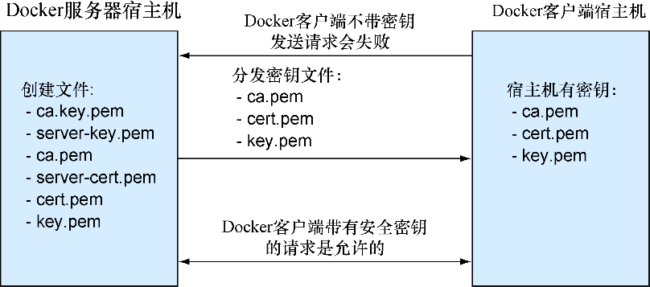

### 技巧96　保护Docker API

在本技巧中我们会展示如何通过TCP端口向其他人开放自己的Docker服务器，同时确保只有受信任的用户才能连接。这是通过创建一个只有受信任的宿主机才能得到的密钥来实现的。只要受信任的密钥在服务器和客户端之间保持秘密，那么Docker服务器应当就是安全的。

#### 问题

想要Docker API能通过端口安全地服务。

#### 解决方案

创建一个自签名的证书并且带上 `--tls-verify` 标志来运行Docker守护进程。

本安全方法依赖于服务器上创建的所谓 **密钥文件** （key file）。这些文件是通过一些特殊工具来创建的，确保了如果没有 **服务器密钥** （server key），就很难复制。图14-2大体介绍了这种方法是如何工作的。


<center class="my_markdown"><b class="my_markdown">图14-2　创建密钥以及分发</b></center>


**提示**

服务器密钥是一个保存有仅服务器知道的秘密数字的文件，读取被服务器的主人分发出去的密钥（所谓客户端密钥）加密过的信息，它是必不可少的。一旦这些密钥创建并分发完毕，就可以用它们来建立客户端和服务器之间的安全连接。


##### 1．设置Docker服务器证书

先要创建证书和密钥。

产生密钥需要使用OpenSSL包，并且可以在终端执行 `openssl` 命令来检查它是否已经安装好了。如果没有安装，在使用代码清单14-3所示的代码来产生证书和密钥之前需要进行安装。

代码清单14-3　使用OpenSSL来创建证书和密钥

```c
$ sudo su　　⇽---　确保你是root用户
 $ read -s PASSWORD　　⇽---　
 $ read SERVER　　⇽---　输入你证书的密码和你将用来连接Docker服务器的服务器名称
 $ mkdir -p /etc/docker　　⇽---　
 $ cd /etc/docker　　⇽---　如果docker配置目录不存在，创建它，并进入该目录
 $ openssl genrsa -aes256 -passout pass:$PASSWORD \
-out ca-key.pem 2048　　⇽---　使用2048位安全码产生证书授权（CA）.pem文件
 $ openssl req -new -x509 -days 365 -key ca-key.pem -passin pass:$PASSWORD \
-sha256 -out ca.pem -subj "/C=NL/ST=./L=./O=./CN=$SERVER"　　⇽---　用你的密码和地址给CA密钥签名一年期
 $ openssl genrsa -out server-key.pem 2048　　⇽---　用2048位安全码产生服务器密钥
 $ openssl req -subj "/CN=$SERVER" -new -key server-key.pem \
-out server.csr　　⇽---　用你宿主机的名字处理服务器密钥
 $ openssl x509 -req -days 365 -in server.csr -CA ca.pem -CAkey ca-key.pem
-passin "pass:$PASSWORD" -CAcreateserial \
-out server-cert.pem　　⇽---　使用你的密码给密钥签名一年期
 $ openssl genrsa -out key.pem 2048　　⇽---　用2048位安全码产生一个客户端密钥
 $ openssl req -subj '/CN=client' -new -key key.pem\
-out client.csr　　⇽---　把这个密钥处理成客户端密钥
 $ sh -c 'echo "extendedKeyUsage = clientAuth" > extfile.cnf'
 $ openssl x509 -req -days 365 -in client.csr -CA ca.pem -CAkey ca-key.pem \
-passin "pass:$PASSWORD" -CAcreateserial -out cert.pem \
-extfile extfile.cnf　　⇽---　用你的密码给密钥签名一年期
 $ chmod 0400 ca-key.pem key.pem server-key.pem　　⇽---　把服务器文件的权限改为对root只读
 $ chmod 0444 ca.pem server-cert.pem cert.pem　　⇽---　把客户端文件的权限改为对所有人只读
 $ rm client.csr server.csr　　⇽---　删除剩余文件
```


**提示**

一个叫CA.pl的脚本在你的系统里可能已经安装好了，它可以简化这个过程。我们在这里公开了原始的 `openssl` 命令，因为这样更富有指导性。


##### 2．设置Docker服务器

接下来需要在Docker守护进程配置文件里设置Docker选项，来指定使用哪个密钥来为通信加密（想了解如何配置以及重启Docker守护进程，参考附录B），如代码清单14-4所示。

代码清单14-4　使用新的密钥和证书的Docker选项

```c
DOCKER_OPTS="$DOCKER_OPTS --tlsverify"　　⇽---　告诉Docker守护进程你想要通过TLS加密的方式来保障连接的安全
DOCKER_OPTS="$DOCKER_OPTS \
 --tlscacert=/etc/docker/ca.pem"　　⇽---　为Docker服务器指定CA文件
DOCKER_OPTS="$DOCKER_OPTS \
 --tlscert=/etc/docker/server-cert.pem"　　⇽---　为服务器指定证书
DOCKER_OPTS="$DOCKER_OPTS \
 --tlskey=/etc/docker/server-key.pem"　　⇽---　指定服务器使用的私钥
DOCKER_OPTS="$DOCKER_OPTS -H tcp://0.0.0.0:2376"　　⇽---　在2376端口把Docker守护进程通过TCP开放给外部客户端
DOCKER_OPTS="$DOCKER_OPTS \
 -H unix:///var/run/docker.sock"　　⇽---　按照一般的做法，通过一个Unix套接字来在本地开放Docker守护进程
```

##### 3．分发客户端密钥

接下来需要把密钥发送到客户端宿主机上以便其能连接到服务器并且交换信息。我们不希望向其他人展示自己的密钥，所以这些过程也需要安全地传送给客户端。一种相对安全的做法是通过SCP（安全复制）从服务器直接复制到客户端。SCP组件总体上是使用了与我们在这里展示的技巧相同的技巧来安全地传输数据的，只是使用的是不同的密钥。

在客户端宿主机上，如同之前做的那样在/ect下创建Docker配置文件夹：

```c
user@client:~$ sudo su
root@client:~$ mkdir -p /etc/docker
```

然后通过SCP把文件从服务器传输到客户端。确保在接下来的命令中把 `client` 替换为了你的客户端的宿主机名。同时要保证对于要在客户端执行 `docker` 命令的用户来说，这些文件都是可读的。

```c
user@server:~$ sudo su
root@server:~$ scp /etc/docker/ca.pem client:/etc/docker
root@server:~$ scp /etc/docker/cert.pem client:/etc/docker
root@server:~$ scp /etc/docker/key.pem client:/etc/docker
```

##### 4．测试

为了测试你的设置，首先不带任何凭证向Docker服务器发起请求，应该被拒绝才对：

```c
root@client~: docker -H myserver.localdomain:2376 info
FATA[0000] Get http://myserver.localdomain:2376/v1.17/info: malformed HTTP >
response "\x15\x03\x01\x00\x02\x02". Are you trying to connect to a >
TLS-enabled daemon without TLS?
```

接下来使用凭证来连接，应该会返回一些有用的输出：

```c
root@client~: docker --tlsverify --tlscacert=/etc/docker/ca.pem \
--tlscert=/etc/docker/cert.pem --tlskey=/etc/docker/key.pem \
-H myserver.localdomain:2376 info
243 info
Containers: 3
Images: 86
Storage Driver: aufs
Root Dir: /var/lib/docker/aufs
Backing Filesystem: extfs
Dirs: 92
Execution Driver: native-0.2
Kernel Version: 3.16.0-34-generic
Operating System: Ubuntu 14.04.2 LTS
CPUs: 4
Total Memory: 11.44 GiB
Name: rothko
ID: 4YQA:KK65:FXON:YVLT:BVVH:Y3KC:UATJ:I4GK:S3E2:UTA6:R43U:DX5T
WARNING: No swap limit support
```

#### 讨论

本技巧带来了两方面的好处—— 一个开放给其他人使用的Docker守护进程，以及只有受信任的用户可以访问的Docker守护过程。一定要保证密钥的安全！

对大型IT管理系统来说，密钥管理是一个重要的部分。它无疑是一种成本，所以当我们实现Docker平台时，它可能会成为聚焦点。对于大多数Docker平台设计来说，将密钥安全部署到容器中都会是一项需要仔细考量的挑战。

