### 技巧99　OpenShift—— 一个应用程序平台即服务

OpenShift是一个由Red Hat管理的产品，它允许一个组织运行应用程序平台即服务（aPaaS）。它为开发团队提供了一个不需要关心硬件细节就可以运行代码的平台。这个产品的第3版用Go语言进行了彻头彻尾的重写，使用Docker作为容器技术，并用Kubernetes和etcd进行编排。不仅如此，Red Hat还加入了一些企业级特性，使其能够简单地部署到企业及关注安全的环境中。

尽管我们可以讨论OpenShift的很多特性，但在这里我们只把它作为一种安全管理的方式，去除用户直接运行Docker的能力，同时又保持使用Docker的好处。

OpenShift 有企业支持的商业产品，也有开源项目名为Origin。

#### 问题

想要管理不受信任的用户调用 `dockerrun` 的安全风险。

#### 解决方案

使用aPaaS工具通过代理接口管理和调节与Dockers的交互。

aPaaS有很多优点，我们在这里关注的是它管理用户权限和代表用户运行Docker容器的能力，这为运行Docker容器的用户提供了安全审计点。

为什么这一点很重要？使用这一aPaaS的用户没有调用 `docker` 命令的直接权限，因此，除非他们颠覆OpenShift提供的安全性，否则他们不能做出任何破坏。例如，默认来说容器是由非root用户部署的，想要克服这一点需要由管理员授权。如果不能信任用户，那么使用aPaaS是给他们Docker访问权限的高效方式。

**提示**

aPaaS为用户提供了为开发、测试乃至生产环境按需快速启动应用程序的能力。Docker对这些服务天然适用，因为它提供了一种可靠而隔离的应用交付格式，让运维团队去处理部署细节。

简而言之，OpenShift在Kubernetes基础上构建（见技巧88），但是增加了一些合格的aPaaS的特性。这些额外的特性包括：

+ 用户管理；
+ 权限管理；
+ 限额；
+ 安全上下文；
+ 路由。

##### 1．安装OpenShift

对OpenShift的安装做一个完全介绍超出了本书的范围。

如果想要我们维护的使用Vagrant的自动安装，参见https://github.com/docker-in-practice/ shutit-openshift-origin。如果在安装Vagrant时需要帮助，参考附录C。

其他选项，如一个仅限Docker的安装（仅限单节点）或者完全手工的构建，在OpenShift Origin的代码库上都可以找到，而且还有文档。

**提示**

OpenShift Origin是OpenShift的上游版本。上游这里是指它是由Red Hat同步了代码，为OpenShift定制了一些功能，它是OpenShift官方支持的作品。Origin是开源的，任何人都可以使用，也接受任何人的贡献。但它由Red Hat管理的版本是收费的，并且作为OpenShift项目受到支持。上游版本通常更加先进但是不那么稳定。

##### 2．OpenShift应用程序

在本技巧中我们要使用OpenShift网络接口展示一个创建、构建、运行和访问应用程序的简单的例子。这个应用程序是一个提供简单Web页面的基本NodeJS应用程序。

这个应用程序会在底层用到Docker、Kubernetes和S2I。Docker用来封装构建和部署环境。从源代码到镜像（S2I）的构建方法被Red Hat在OpenShift中用于构建Docker容器，Kubernetes被用于在OpenShift集群上运行应用程序。

##### 3．登录

要开始登录，先在shutit-openshift-origin文件夹执行 `./run.sh` ，然后导航到https://localhost: 8443，忽视所有的安全警告。

我们会看到图14-3所示的登录页面。注意，如果是使用Vagrant安装的，那么需要在虚拟机里启动一个Web浏览器。（要了解如何给虚拟机添加图形用户界面，参见附录C。）

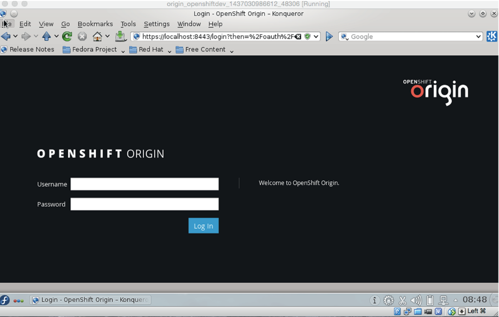

<b class="my_markdown">图14-3　OpenShift登录页面</b>

使用任意密码以 `hal-1` 登录。

##### 4．构建一个NodeJS应用

现在以开发者的身份登录到了OpenShift（见图14-4）。

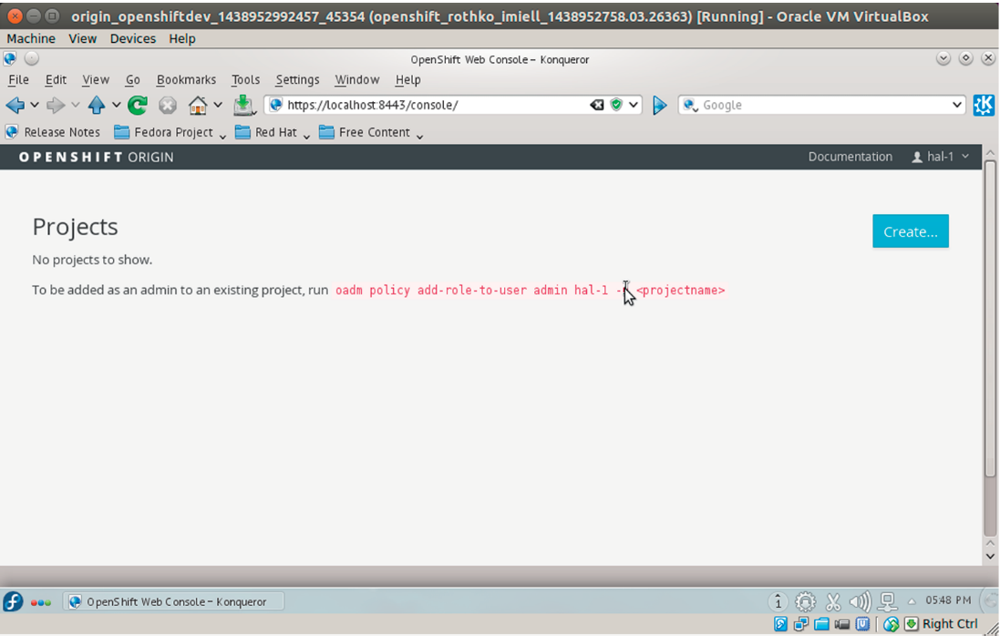

<b class="my_markdown">图14-4　OpenShift项目页面</b>

点击“Create”按钮来创建一个项目。如图14-5所示这样填写表单。然后再次点击“Create”按钮。

<b class="my_markdown">图14-5　OpenShift项目创建页面</b>

一旦项目创建完成，再次点击“Create”按钮，输入推荐的GitHub仓库，如图14-6所示。

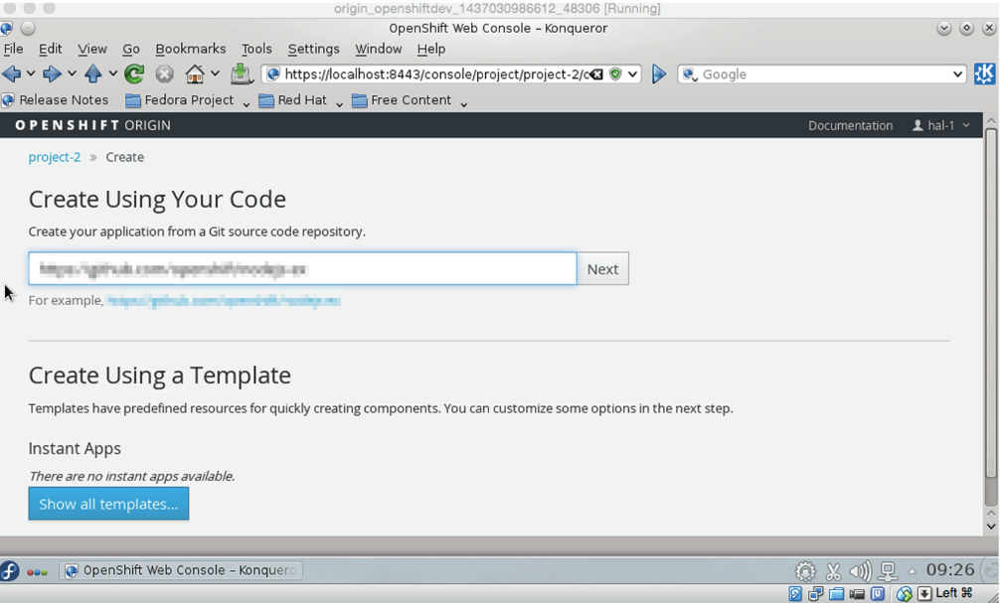

<b class="my_markdown">图14-6　OpenShift项目源页面</b>

点击“Next”按钮，要在众多创建镜像中选择一个，如图14-7所示。创建镜像定义了代码构建的上下文。选择NodeJS构建镜像。

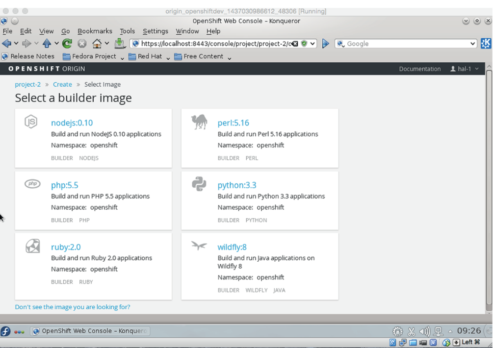

<b class="my_markdown">图14-7　OpenShift构建镜像选择页面</b>

现在像图14-8所示这样填写表单，滚动到表单下方，点击页面底部的“Create on NodeJS”。

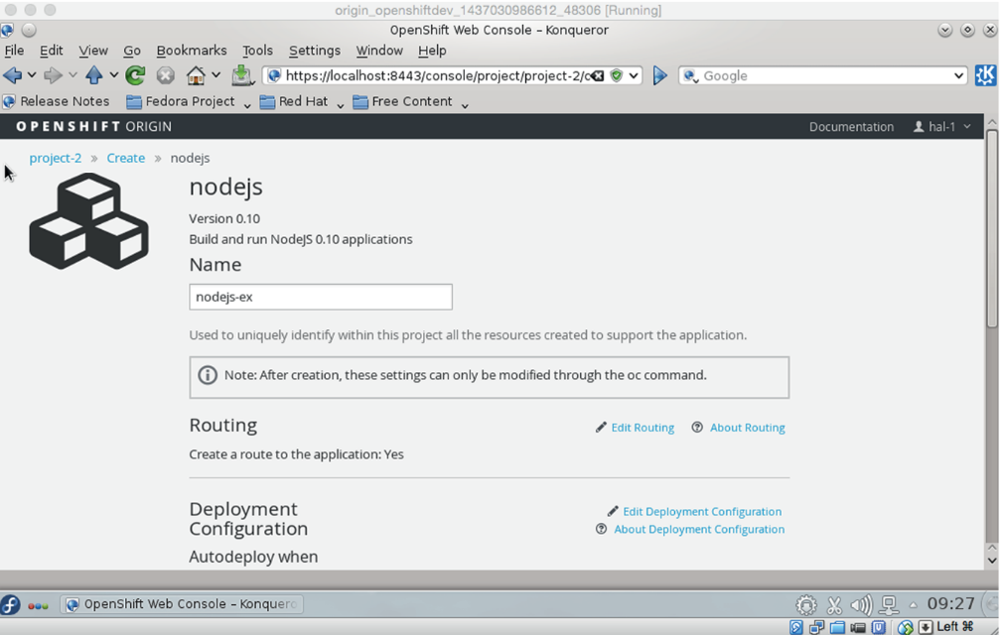

<b class="my_markdown">图14-8　OpenShift NodeJS模板表单</b>

几分钟后，屏幕应该如图14-9所示。

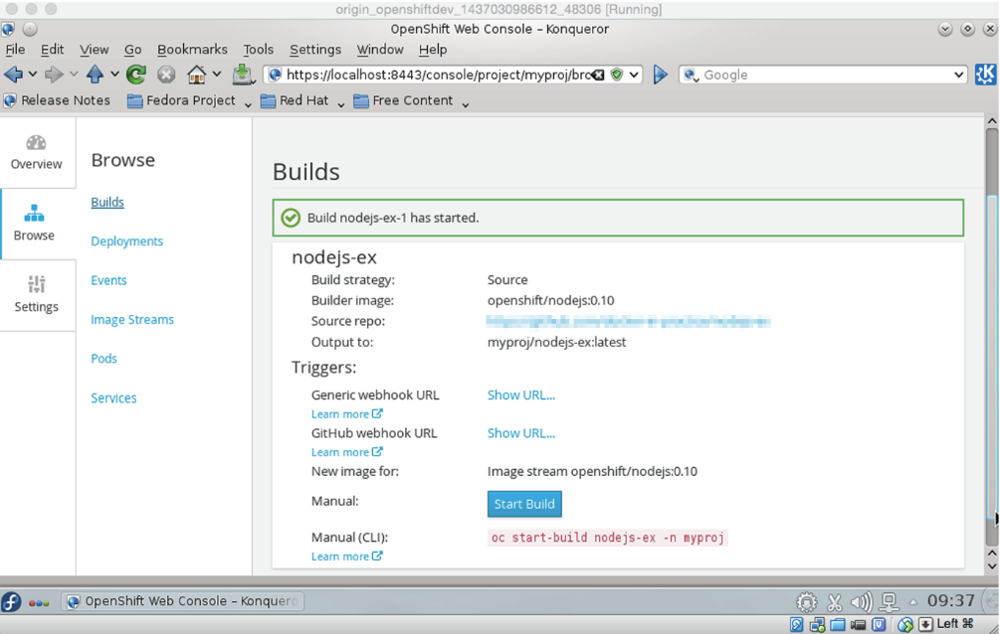

<b class="my_markdown">图14-9　OpenShift构建开始页面</b>

过一会儿，如果向下滚动屏幕，就会看到构建已经开始，如图14-10所示。

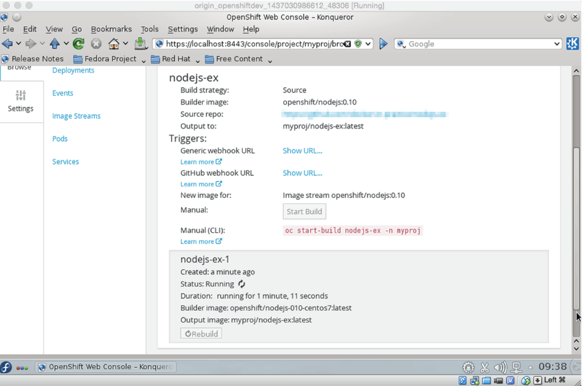

<b class="my_markdown">图14-10　OpenShift构建信息窗口</b>

**提示**

构建没有开始？在OpenShift早期版本中，构建有时不会自动开始。如果发生这种情况，几分钟后点击“Start Build”按钮即可。

过一会儿就能看到应用程序正在运行，如图14-11所示。

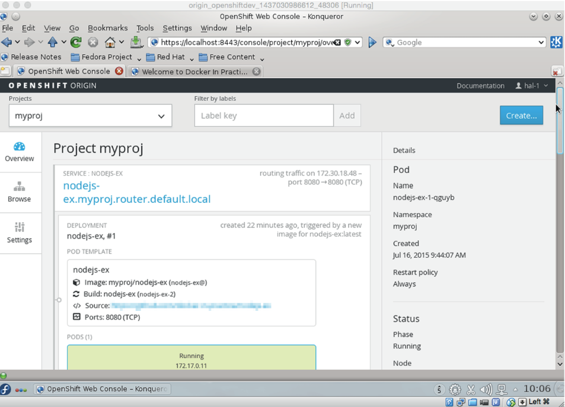

<b class="my_markdown">图14-11　应用程序运行页面</b>

通过点击“Browse”和“Pods”按钮，可以发现pod已经部署上去了，如图14-12所示。

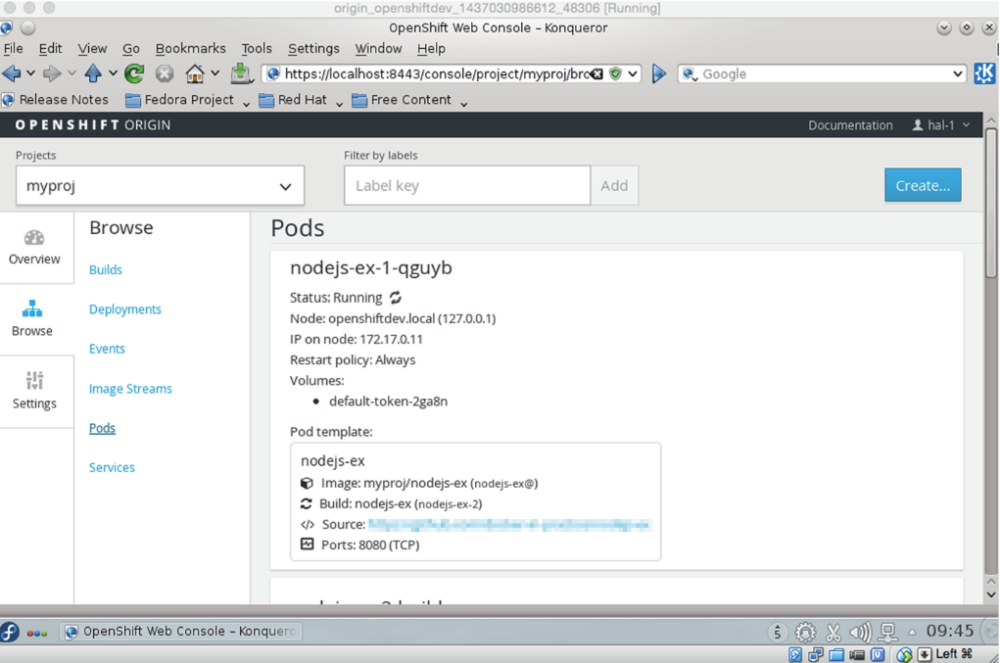

<b class="my_markdown">图14-12　OpenShift pod清单</b>

**提示**

关于什么是pod的解释见技巧88。

如何访问pod？查看“Services”标签（见图14-13），可以看到用于访问的IP地址和端口号。

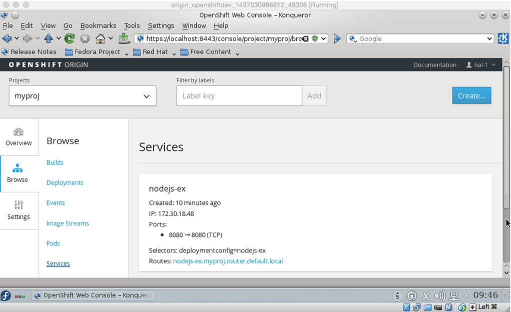

<b class="my_markdown">图14-13　OpenShift NodeJS应用程序服务细节</b>

把浏览器指向这个地址，NodeJS应用程序就会运行起来，如图14-14所示。

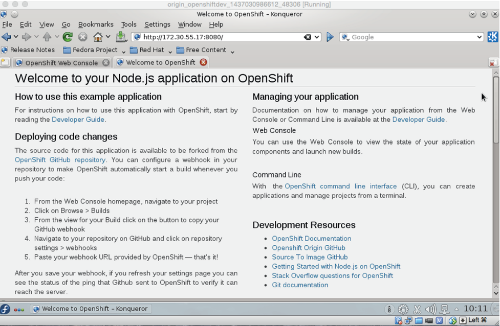

<b class="my_markdown">图14-14　NodeJS应用程序登录页</b>

#### 讨论

我们来总结一下到目前为止我们做到了什么以及它们对安全的重要性。

从用户的角度看，他们不用接触Dockerfile或者使用 `docker run` 命令，就登录了一个Web应用程序，并使用基于Docker的技术部署了一个应用程序。

OpenShift的管理员可以：

+ 控制用户访问权限；
+ 限制项目使用的资源；
+ 集中供应资源；
+ 确保代码默认不是以高权限运行的。

这比直接让用户执行 `docker run` 安全多了。

读者如果想在这个应用程序的基础上继续构建，了解 aPaaS 是如何促进迭代的，可以fork这个Git仓库，在fork的仓库里修改代码，然后创建一个新应用程序。我们已经完成了这些，参见https://github.com/docker-in-practice/nodejs-ex。

要阅读更多关于OpenShift的资料，可以访问OpenShift官方网站。

