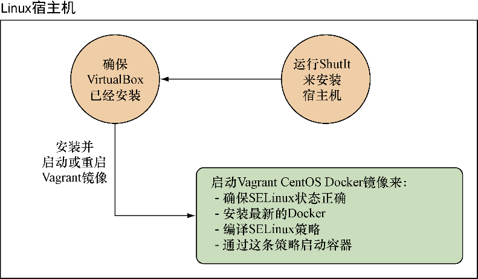

### 技巧100　使用安全选项


**提示**


在之前的技巧里读者已经了解到了，默认情况下用户有Docker容器的root权限，这个用户和宿主机的root用户是一样的。为了改善这一点，我们展示了如何减少用户作为root用户的能力，以便即使它脱离了容器，内核仍然不会允许这一用户执行操作。

但用户可以做更多事情。通过使用Docker的安全选项标志，用户可以防止宿主机上的资源受到容器内执行的操作的影响。这样就限制了容器仅能影响宿主机授权了的资源。

#### 问题

想要保护宿主机不受容器操作的危害。

#### 解决方案

使用SELinux内核支持的强制访问控制（mandatory access control，MAC）工具。SELinux在某种程度上是工业标准，尤其受到关注安全的组织的青睐。它最初由NSA开发，用来保护他们的系统，随后被开源。它在基于Red Hat的系统上被当作标准使用。

SELinux是一个很大的话题，我们无法在本书中详尽讨论。接下来展示如何编写并实施一个简单的策略，以便读者能感受一下SELinux的工作方式。如果需要，读者可以更进一步或者做一些实验。

除用户熟悉的标准安全规则之外，Linux中的强制访问控制（MAC）工具还执行很多。简而言之，它不仅确保文件和进程执行了常规读-写-执行规则，还可在内核级别对进程施加更细粒度的规则。例如，一个MySQL进程可能只允许在特定文件夹（如/var/lib/mysql）下写文件。基于Debian的系统上对应的标准是AppArmor。


本技巧假设用户有一个启用了SELinux的宿主机。也就是说，用户必须首先安装SELinux（如果没有安装好的话）。如果用户在运行Fedora或者其他基于Red Hat的系统，很可能已经装好了。

执行 `sestatus` 命令来确定是否启用了SELinux：

```c
# sestatus
SELinux status:                 enabled
SELinuxfs mount:                /sys/fs/selinux
SELinux root directory:         /etc/selinux
Loaded policy name:             targeted
Current mode:                   permissive
Mode from config file:          permissive
Policy MLS status:              enabled
Policy deny_unknown status:     allowed
Max kernel policy version:      28
```

第一行输出会说明 SELinux 是否已经启用了。如果这个命令不可用，就说明宿主机上没有安装SELinux。

用户还需要一些相关的SELinux策略创建工具。例如，在一个能使用yum的机器上，需要执行 `yum -y install selinux- policy-devel` 。

##### 1．Vagrant机器上的SELinux

如果没有SELinux又想要构建它，可以使用一个ShutIt脚本来在宿主机内构建提前安装好Docker和SELinuxd的虚拟机。图14-15大体介绍了它做了些什么。


<center class="my_markdown"><b class="my_markdown">图14-15　提供SELinux虚拟机的脚本</b></center>


**提示**

ShutIt是一个我们原创的通用的shell自动化工具，可以突破Dockerfile的一些局限。


图14-15中给出了建立策略所需的步骤。脚本会做以下几件事：

（1）创建虚拟机；

（2）启动一个合适的Vagrant镜像；

（3）登录这台虚拟机；

（4）确保SELinux的状态正确；

（5）安装最新版的Docker；

（6）安装SELinux策略开发工具；

（7）给你一个shell。

代码清单14-14给出的是用来设置和运行的它的命令（在Debian和基于Red Hat的发行版上测试过）。

代码清单14-14　安装ShutIt

```c
sudo su -　　⇽---　在开始运行前确保你是root用户
 apt-get install -y git python-pip docker.io || \
yum install -y git python-pip docker.io　　⇽---　确保在宿主机上安装了所需要的包
 pip install shutit　　⇽---　安装ShutIt
 git clone https://github.com/ianmiell/docker-selinux.git　　⇽---　
 cd docker-selinux　　⇽---　复制SELinux ShutIt脚本并进入其目录
 shutit build --delivery bash \　　⇽---　运行ShutIt脚本。--delivery bash意味着命令是在bash中执行的而非通过SSH或者在Docker容器中执行
 -s io.dockerinpractice.docker_selinux.docker_selinux \
  compile_policy no　　⇽---　设置脚本不要去编译SELinux策略，因为我们会手动做这一步
```

运行这个脚本之后，最后应该可以看到下面这样的输出：

```c
Pause point:
Have a shell:
You can now type in commands and alter the state of the target.
Hit return to see the prompt
Hit CTRL and ] at the same time to continue with build
Hit CTRL and u to save the state
```

现在在虚拟机内有一个安装了SELinux的shell在运行了。如果输入 `sestatus` ，可以看到SELinux以宽容（ `permissive` ）模式开启（见代码清单14-15）。按组合键Ctrl+]以返回宿主机的shell。

##### 2．编译SELinux策略

不管使用ShutIt脚本与否，我们都假设读者有一台启用了SELinux的宿主机。输入 `sestatus` 来获得一个状态汇总，如代码清单14-15所示。

代码清单14-15　一旦安装和启用SELinux状态

```c
# sestatus
SELinux status:                enabled
SELinuxfs mount:               /sys/fs/selinux
SELinux root directory:        /etc/selinux
Loaded policy name:            targeted
Current mode:                  permissive
Mode from config file:         permissive
Policy MLS status:             enabled
Policy deny_unknown status:    allowed
Max kernel policy version:     28
```

在这个例子中，我们处于宽容模式，也就说SELinux会把违反安全的行为记录在日志里，但是不会强制实施。这样就可以安全地测试新策略而不会搞得系统没法用。用root身份录入 `setenforce Permissive` 来把SELinux的状态改为宽容状态。如果因为安全原因没法在自己的宿主机上这么做，不用担心，在代码清单14-15中有一个把策略设为宽容的选项。


**注意**

如果在宿主机上自行安装SELinux和Docker，一定要确保Docker守护进程设置了 `--selinux-enabled` 标志。读者可以使用 `ps -ef | grep 'docker -d.*-- selinux-enabled` 来检查，它应该会在输出中返回一些匹配结果。


给策略创建一个文件夹并进入这一文件夹，然后以root身份创建代码清单14-16所示的策略文件。这个策略文件包含我们将要采用的策略。

代码清单14-16　创建SELinux策略

```c
mkdir -p /root/httpd_selinux_policy && >
cd /root/httpd_selinux_policy　　⇽---　创建一个保存策略文件的文件夹并且进入
 cat > docker_apache.te << END　　⇽---　使用“原地”文档来创建要编译的策略文件
 policy_module(docker_apache,1.0) 　　⇽---　使用policy_module指令创建SELinux策略模块docker_apache
 virt_sandbox_domain_template(docker_apache) 　　⇽---　使用提供的模板来创建docker_ apache_t SELinux类型，它可以作为 Docker容器运行。这个模板给了docker_apache SELinu域运行起来的最小权限。我们会增加一些权限来让这个容器成为一个有用的环境
 allow docker_apache_t self: capability { chown dac_override kill setgid >
setuid net_bind_service sys_chroot sys_nice >
sys_tty_config } ; 　　⇽---　 Apache Web服务器要运行需要这些能力，所以用allow指令在这里添加这些能力
 allow docker_apache_t self:tcp_socket >
create_stream_socket_perms; 　　⇽---　
 allow docker_apache_t self:udp_socket >
create_socket_perms;
 corenet_tcp_bind_all_nodes(docker_apache_t)
 corenet_tcp_bind_http_port(docker_apache_t)
 corenet_udp_bind_all_nodes(docker_apache_t)
 corenet_udp_bind_http_port(docker_apache_t) 　　⇽---　这些allow和corenet规则给了容器在网络上监听Apache端口的权限
 sysnet_dns_name_resolve(docker_apache_t) 　　⇽---　使用sysnet指令允许DNS服务器解析
 #permissive docker_apache_t　　⇽---　或者设置docker_apache_t类型为宽容模式，以便即使宿主机在强制施行SELinux这个策略也不会强制施行。无法设置宿主机的SELinux模式的时候使用这个
 END　　⇽---　结束“原地”文档，将其写到磁盘
```


**提示**

为了获得关于前述授权的更多信息，了解其他授权，可以安装selinux-policy- doc包，并用浏览器浏览位于file:///usr/share/doc-base/selinux-policy-doc/html/index.html的文档。


现在编译这一策略，观察程序在强制模式下会启动失败。以宽容模式重启，检查违反情况并在之后改正：

```c
$ make -f /usr/share/selinux/devel/Makefile \
docker_apache.te　　⇽---　把dokcer_apache.te文件编译为以.pp为后缀的二进制SELinux模块
 Compiling targeted docker_apache module
/usr/bin/checkmodule:  loading policy configuration from >
tmp/docker_apache.tmp
/usr/bin/checkmodule: policy configuration loaded
/usr/bin/checkmodule: writing binary representation (version 17) >
to tmp/docker_apache.mod
Creating targeted docker_apache.pp policy package
rm tmp/docker_apache.mod tmp/docker_apache.mod.fc
$ semodule -i docker_apache.pp　　⇽---　安装模块
$ setenforce Enforcing　　⇽---　将SELinux模式设置为“强制”
$ docker run -ti --name selinuxdock >
--security-opt label:type:docker_apache_t httpd　　⇽---　把httpd镜像作为守护进程运行，应用在模块里定义的docker_apache_t安全标签类型。这条命令会失败，因为它违反了SELinux安全配置
 Unable to find image 'httpd:latest' locally
latest: Pulling from library/httpd
2a341c7141bd: Pull complete
[...]
Status: Downloaded newer image for httpd:latest
permission denied
Error response from daemon: Cannot start container >
650c446b20da6867e6e13bdd6ab53f3ba3c3c565abb56c4490b487b9e8868985: >
[8] System error: permission denied
$ docker rm -f selinuxdock　　⇽---　移除刚创建的容器
 selinuxdock
$ setenforce Permissive　　⇽---　将SELinux模式设置为“宽容”，以允许程序启动
$ docker run -d --name selinuxdock >
--security-opt label:type:docker_apache_t httpd　　⇽---　把httpd镜像作为守护进程运行，应用在模块里定义的docker_apache_t安全标签类型。这条命令会成功执行
```

##### 3．检查违反行为

到此为止，我们已经创建了一个SELinux模块并在宿主机上应用这一模块。因为在宿主机上SELinux的执行模式被设为了“宽容”，在“强制”模式里会被禁止的行为允许执行，同时会在审计日志里留下一条日志记录。可以通过执行以下命令来检查这些信息：

```c
$ grep -w denied /var/log/audit/audit.log
type=AVC msg=audit(1433073250.049:392): avc: >　　⇽---　在审计日志中的消息类型永远是AVC代表SELinux违反行为，时间戳表示为纪元开始（定义为1970年1月1日）以来的秒数
denied   { transition } for >　　⇽---　花括号内展示了被拒绝的行为类型
pid=2379 comm="docker" >　　⇽---　触发违反行为的进程ID和命令名
path="/usr/local/bin/httpd-foreground" dev="dm-1" ino=530204 >　　⇽---　目标文件的路径、设备和inode
scontext=system_u:system_r:init_t:s0 >
tcontext=system_u:system_r:docker_apache_t:s0:c740,c787 >　　⇽---　目标的SELinux上下文
tclass=process　　⇽---　目标对象的类别
type=AVC msg=audit(1433073250.049:392): avc:  denied { write } for >
pid=2379 comm="httpd-foregroun" path="pipe:[19550]" dev="pipefs" >
ino=19550 scontext=system_u:system_r:docker_apache_t:s0:c740,c787 >
tcontext=system_u:system_r:init_t:s0 tclass=fifo_file
type=AVC msg=audit(1433073250.236:394): avc:  denied  { append } for >
pid=2379 comm="httpd" dev="pipefs" ino=19551 >
scontext=system_u:system_r:docker_apache_t:s0:c740,c787 >
tcontext=system_u:system_r:init_t:s0 tclass=fifo_file
type=AVC msg=audit(1433073250.236:394): avc:  denied  { open } for >
pid=2379 comm="httpd" path="pipe:[19551]" dev="pipefs" ino=19551 >
scontext=system_u:system_r:docker_apache_t:s0:c740,c787 >
tcontext=system_u:system_r:init_t:s0 tclass=fifo_file
[...]
```

这里好多术语，我们没时间教读者关于SELinux的一切。如果读者想了解更多，可以从Red Hat的SELinux文档开始。

就现在来说，用户需要检查这些违反行为没有预见外的。什么是预见外的？例如，程序试图打开一个用户没打算让它打开的端口或文件。接下来就要好好考虑我们要教的了：通过一个新的SELinux模块给这些违反行为打补丁。

在本例中，我们很高兴看到httpd可以写流水线。我们已经弄明白了SELinux在拒绝，因为提到的“拒绝”行为是向虚拟机的流水线文件执行 `append` 、 `wirte` 和 `open` 。

##### 4．给SELinux违反行为打补丁

一旦确定了看到的违反行文是可以接受的，有些工具就可以自动生成要应用的策略文件，因此就不用犯难又犯险地自己去写了。接下来了的例子用了audit2allow工具来达成这一点，如代码清单14-17所示。

代码清单14-17　创建新的SELinux策略

```c
mkdir -p /root/selinux_policy_httpd_auto　　⇽---　创建一个用来存储新的SELinux模块的新目录
cd /root/selinux_policy_httpd_auto
audit2allow -a -w　　⇽---　使用audit2allow工具来展示要通过读取审计日志生成的策略。检查一遍它的合理性
audit2allow -a -M newmodname create policy　　⇽---　用-M标志和你为模块选的名字来创建模块
semodule -i newmodname.pp　　⇽---　安装来自新创建的.pp文件的模块
```

重要的是要明白，我们新创建的这个SELinux模块，通过引用并且给 `docker_apache_t` 类型增加权限，“包含”（或“需要”）并且改变了我们之前创建的那个模块。如果需要，可以把二者结合到一个完整并独立的.te文件里。

##### 5．测试新模块

安装好了新模块，就可以试一下重新启用SELinux并重启容器，如代码清单14-18所示。


**提示**

如果之前无法把宿主机设为 `permissive` 模式（而且在原始的docker_apache.te文件里加入了讨论过的那一行），那么在继续之前要重新编译和重新安装原始的docker_apache.te文件（带上讨论过的那一行）。

代码清单14-18　用SELinux限制启动容器

```c
docker rm -f selinuxdock
setenforce Enforcing
docker run -d --name selinuxdock \
--security-opt label:type:docker_apache_t httpd
docker logs selinuxdock
grep -w denied /var/log/audit/audit.log
```

审计日志中应该没有错误。应用程序在SELinux机制的上下文中启动了。

#### 讨论

SELinux以复杂且难以管理闻名，有一句流传甚广的抱怨说人们经常关了它而不是调试它。这一点很不安全。虽然SELinux好的方面需要认真努力才能掌握，但是我们希望本技巧展示了在Docker不是开箱即用的情况下，如何创建一份安全专家可以审查乃至批准的东西。

