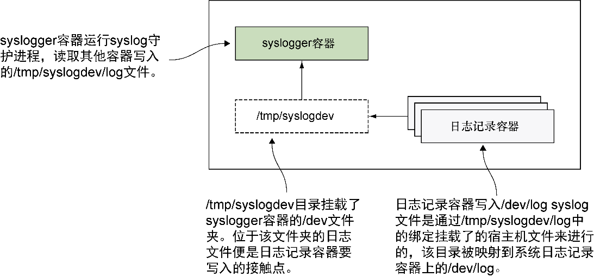

### 技巧101　记录容器的日志到宿主机的syslog

Linux发行版通常会运行一个syslog守护进程。这个守护进程是系统日志记录功能的服务器端，应用程序给这个守护进程发送消息，以及一些类似消息重要性这样的元数据，这个守护进程就会决定存储消息的场所（如果要存储）。很多应用程序，从网络连接管理器到内核本身，都在使用这个功能来在遇到错误的时候转储信息。

正因为syslog是如此可靠且广泛使用的，用户自己写的程序也应在它那里记录日志。但是，一旦用户对自己的应用程序进行了容器化，这种方法就行不通了（因为容器中默认没有syslog守护进程）。如果用户确实决定要在自己的所有容器中启动syslog守护进程，就要自己去每个容器里获取日志。

#### 问题

想要在Docker宿主机上集中获取各个syslog。

#### 解决方案

运行一个服务容器，将其作为Docker容器的syslog守护进程。

本技巧的基本思想就是要运行一个运行着syslog守护进程的服务容器，然后把日志记录接触点（/dev/log）通过宿主机的文件系统共享。日志本身可以通过查询syslog Docker容器来获得，并且存储在卷上。

图15-1说明了宿主机文件系统上的/tmp/syslogdev是如何能够被运行其上的所有容器用作syslog活动的接触点的。日志记录容器挂载到该位置，并把syslog写入该位置。系统日志容器就收集全部的输入。


<center class="my_markdown"><b class="my_markdown">图15-1　Docker容器中心化系统日志记录概览</b></center>


**提示**

syslog守护进程是运行在服务器上的一种进程，它会收集并管理发送到一个中心文件（通常是一个Unix域套接字）的所有消息。它一般会使用/dev/log作为接收日志消息的文件，并且把日志记录到/var/log/syslog。


系统日志容器可以通过代码清单15-1所示的这个简单明了的Dockerfile来创建。

代码清单15-1　构建syslogger容器

```c
FROM ubuntu:14.043
RUN apt-get update && apt-get install rsyslog　　⇽---　安装rsyslog包，以使rsyslogd守护进程程序可用。“r”代表reliable（可靠的）
VOLUME /dev　　⇽---　创建/dev卷来与其他容器共享
VOLUME /var/log　　⇽---　创建/var/log卷来允许syslog文件持久保存
CMD rsyslogd -n　　⇽---　在启动时运行rsyslogd进程
```

接下来构建容器，为其打上 `syslogger` 标签，并且运行它：

```c
docker build -t syslogger .
docker run --name syslogger -d -v /tmp/syslogdev:/dev syslogger
```

把容器的/dev文件夹绑定挂载到宿主机的/tmp/syslogdev文件夹，然后就可以把/dev/log套接字作为一个卷挂载到每个容器上，马上就会看到效果了。这个容器会在后台继续运行，读取所有来自/dev/log文件的信息并且处理之。

在宿主机上现在可以看到系统日志容器上的/dev 文件夹已经挂载到了宿主机的/tmp/syslogdev文件夹：

```c
$ ls -1 /tmp/syslogdev/
fd
full
fuse
kcore
log
null
ptmx
random
stderr
stdin
stdout
tty
urandom
zero
```

在这个演示中，我们将要启动100个守护进程容器，它们会把自己的启动顺序使用 `logger` 命令按从0到100记录到syslog。然后就能在宿主机上执行 `docker exec` 来检查系统日志容器的syslog文件以查看这些消息了。

首先，启动容器，如代码清单15-2所示。

代码清单15-2　启动日志容器

```c
for d in {1..100}
do
    docker run -d -v /tmp/syslogdev/log:/dev/log ubuntu logger hello_$d
done
```

上述的卷挂载操作把容器的syslog端点（/dev/log）链接到了宿主机的/tmp/syslogdev/log文件，而该文件转而映射到了系统日志容器的/dev/log文件。通过这样的搭线，所有的syslog输出都会送到同一个文件。

该操作完成的时候，我们会看到类似于下面这样的输出（本输出经过编辑）：

```c
$ docker exec -ti syslogger tail -f /var/log/syslog
May 25 11:51:25 f4fb5d829699 logger: hello
May 25 11:55:15 f4fb5d829699 logger: hello_1
May 25 11:55:15 f4fb5d829699 logger: hello_2
May 25 11:55:16 f4fb5d829699 logger: hello_3
[...]
May 25 11:57:38 f4fb5d829699 logger: hello_97
May 25 11:57:38 f4fb5d829699 logger: hello_98
May 25 11:57:39 f4fb5d829699 logger: hello_99
```

如果用户希望，可以通过修改 `exec` 命令来归档这些syslog。例如，可以执行下面的命令来获取所有5月25日11时的文档并归档到一个压缩文件里：

```c
$ docker exec syslogger bash -c "cat /var/log/syslog | \
grep '^May 25 11'" | xz - > /var/log/archive/May25_11.log.xz
```


**注意**

为了让这些消息在中心系统日志容器中出现，程序需要记录日志到syslog。我们在这里通过执行 `logger` 命令来确保这一点，然而你的应用程序也要执行一样的操作来使之工作。大多数现代的记录日志方法都有写入本地可见的syslog的手段。


#### 讨论

读者可能想知道，通过本技巧如何区分不同容器的日志消息。这里有两种选择：一是可以把应用程序的日志记录信息改为输出容器的宿主机名，二是可以了解技巧102让Docker来做这个粗重活。


**注意**

本技巧看起来和下一个使用Docker syslog驱动程序的技巧类似，但是它们不是一码事。本技巧让容器运行进程的输出作为 `docker logs` 命令的输出，但技巧102接管了 `logs` 命令，使本技巧显得多余。


