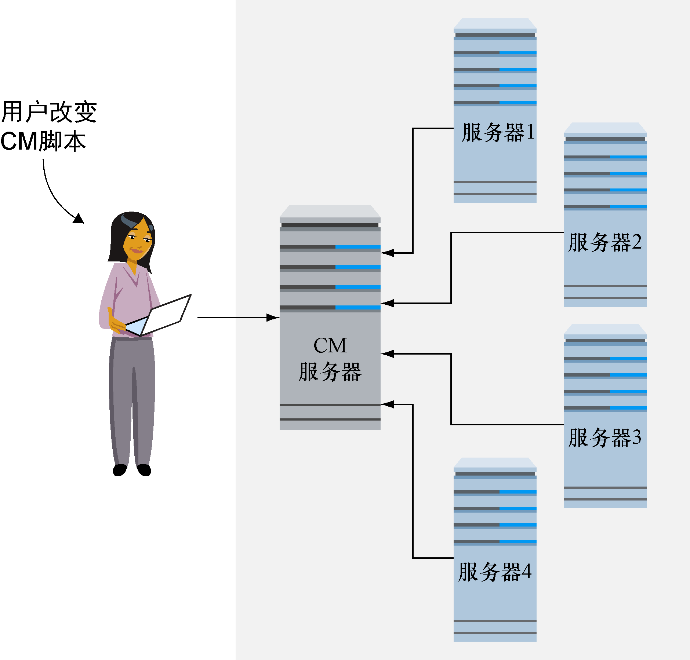
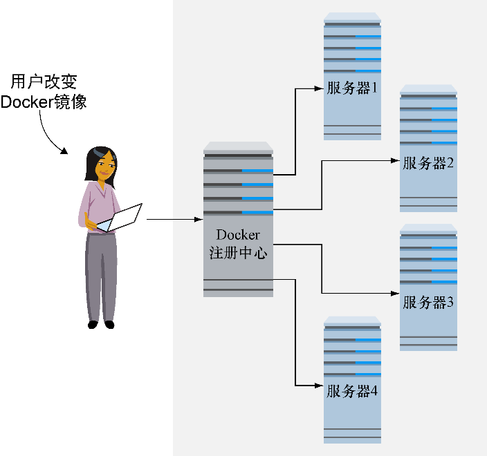

### 技巧107　使用Docker运行cron作业

如果读者在多台宿主机上管理过cron作业，那么可能遇到过这样的难题：要在不同地方部署同一套软件，还要确保crontab本身正确调用想要运行的程序。

尽管这个问题有其他的解决方案（例如，使用Chef、Puppet、Ansible或其他配置管理工具来管理跨宿主机的软件部署），但有一个选项是可以用Docker注册中心来存储正确的调用。

虽然对于这个问题这并不总是最好的解决方案，但是它极好地展示出了有一个对应用程序运行时配置隔离又便携的存储是多么好。如果已经在用Docker了这还是免费的。

#### 问题

想要cron作业能被集中管理和自动更新。

#### 解决方案

把cron作业脚本作为Docker容器来拉取和运行。

如果有很多机器要定期运行作业，一般会使用crontab并手动配置（没错，还有人这么干），或者用一个类似Puppet或Chef这样的配置管理工具。更新其配置脚本可以确保当机器的配置管理控制程序下次运行的时候这些变化都会应用到crontab上，为下次运行做好准备。


**提示**

crontab文件是一种由用户维护的特殊文件，它指定了脚本应该运行的次数。通常都是些维护任务，如压缩和归档日志文件，但是也可能是商业上很重要的应用程序，如信用卡付款结算程序。


本技巧中，我们会展示如何用从Docker注册中心中拉取镜像的方式，来取代这些技巧。

如图15-2展示的一般情况，维护者更新配置管理工具，接下来在有代理（agent）运行的时候，这些工具就被分发到服务器上。同时，系统更新时，cron作业运行着新旧代码。


<center class="my_markdown"><b class="my_markdown">图15-2　在CM代理定期运行中每个服务器都更新cron脚本</b></center>

在图15-3描绘的Docker场景下，在cron作业运行前，每个服务器都去拉取了最新版的镜像。


<center class="my_markdown"><b class="my_markdown">图15-3　在每个cron作业运行前，每个服务器拉取最新的镜像</b></center>

到此为止读者可能会纳闷，如果已经有了能工作的解决方案，为什么要这么麻烦呢。把Docker作为交付机制有以下一些好处：

+ 当作业运行的时候，它会从中央地点把自己更新到最新版；
+ crontab文件变得更加简单，因为脚本和代码都在Docker镜像里封装了；
+ 对于更加庞大复杂的变化，只有Docker镜像变化中的差值需要拉取，加速了交付和更新的速度；
+ 不用在机器本身上维护代码或二进制文件；
+ 可以把Docker和其他技术结合，如把输出记录到syslog，以简化并集中化对这些管理服务的管理。

在这个例子中，我们要使用在技巧49中创建的log_cleaner镜像。回忆一下，这个镜像封装了一个脚本，该脚本会清理服务器上的日志文件并且接收一个指定清理多少天的日志文件的参数。使用Docker作为交付机制的crontab大概看起来像代码清单15-6所示的这样。

代码清单15-6　记录更清晰的crontab入口

```c
0 0 * * * \　　⇽---　每天午夜运行
 IMG=dockerinpractice/log_cleaner && \
 docker pull $IMG && \　　⇽---　先拉取最新版本的镜像
 docker run -v /var/log/myapplogs:/log_dir $IMG 1　　⇽---　运行日志清理程序清理一天的日志文件
```


**提示**

如果对cron不是很熟悉，想要了解如何编辑crontab，可以执行 `crontab -e` 。每行都让一条命令在行首的5个值指定的时间执行。在crontab的帮助手册中可以找到更多信息。


如果有故障发生，那么应当触发发送邮件的标准的cron机制。如果不信任这个，就用 `or` 操作符添加一条命令。接下来的例子中，我们假设读者定制的报警命令是 `my_alert_command` ，如代码清单15-7所示。

代码清单15-7　用错误时警告来记录更清晰的crontab入口

```c
0 0 * * * \
(IMG=dockerinpractice/log_cleaner && \
docker pull $IMG && \
docker run -v /var/log/myapplogs:/log_dir $IMG 1) \
|| my_alert_command 'log_cleaner failed'
```


**提示**

`or` 操作符（本例中是双竖线 `||` ）确保了至少两边的命令有一条得到执行。如果第一个命令失败了（本例中，是在cron对时间的指定 `0 0***` 之后括号中由与操作符 `&&` 连接起来的两条命令中的一条），那么第二条就会执行。


`||` 操作符确保了如果日志清理作业的任一部分失败了，都会触发报警命令。

#### 讨论

我们真的很喜欢这个技巧，它非常简单，又使用了实战检验过的方式来原创性地解决问题。

Cron已经诞生了几十年了（据维基百科，从20世纪70年代末期开始），并且使用Docker镜像来增强是我们在家里会用来管理日常任务的简单方法。

