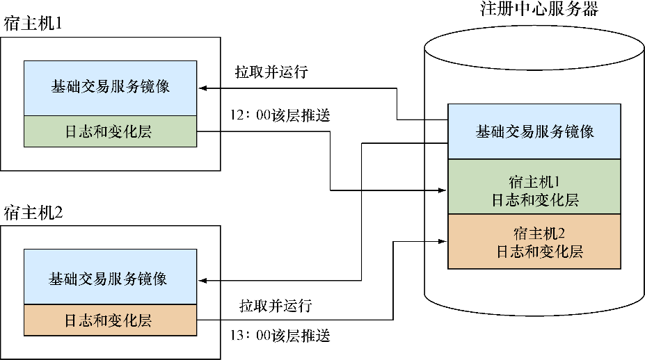

### 技巧108　通过“保存游戏”的方法来备份

如果读者运行过交易系统，那么就会知道，当有差错的时候，在出问题的时候推断系统状态的能力对于源头分析至关重要。

通常它是通过一些方法的结合来达成的：

+ 应用程序日志分析；
+ 数据库法医学（确定在给定时间点的数据状态）；
+ 构建历史分析（确定在给定的时间点，什么样的代码和配置在服务上运行过）；
+ 生产系统分析（例如，有没有人登录并改动过什么东西）。

对这样重要的系统，可以采取简单有效的备份Docker服务容器的办法。尽管可能数据库是和Docker基础设施分离的，配置、代码和日志的状态都可以通过几个简单的命令存储在注册中心里。

#### 问题

想要保存Docker容器的备份。

#### 解决

在容器运行的时候提交，然后把产生的镜像作为一个单独的Docker仓库推送。

遵循Docker最佳实践，利用一些Docker特性可以不用存储容器备份。例如，使用技巧102中的日志记录驱动程序而不是把日志记录到容器的文件系统里，意味着不用从容器备份里获取日志。

但是，有时候用户不得不被迫做一些不喜欢做的事情，必须看一下容器是什么样的。代码清单15-8中的命令展示了提交和推送备份容器的整个过程。

代码清单15-8　提交和推送备份容器

```c
DATE=$(date +%Y%m%d_%H%M%S) 　　⇽---　产生一个记录到秒的时间戳
TAG="your_log_registry:5000/live_pmt_svr_backup:$(hostname -s)_${DATE}"　　⇽---　通过带有宿主机名和日期的标签产生一个指向你的注册中心URL的标签
docker commit -m="$DATE" -a="Backup Admin" live_pmt_svr $TAG　　⇽---　以日期为消息，以Backup Admin为作者，提交容器
docker push $TAG　　⇽---　把容器推送到注册中心
```


**警告**

本技巧会在容器运行时将它暂停，高效地停止它的服务。你的服务要么可以忍受中断，要么你应该以负载均衡的方式保持有其他可以处理请求的节点。


如果在各台宿主机上交错执行这些操作，就会有一个高效的备份系统，并且有一个为支持工程师复原尽可能清晰的状态的方法。图15-4描述了这个过程的简化视图。


<center class="my_markdown"><b class="my_markdown">图15-4　双宿主机服务备份</b></center>

备份只会推送基础镜像和备份时容器的状态之间的差异，备份是交错进行的，以确保至少有一台宿主机上的服务是运行的。注册中心服务器只存储基础镜像和每次提交时的差异，节省磁盘空间。

#### 讨论

用户可以更进一步把这个技巧和“凤凰式部署”模型结合起来。凤凰式部署是一个强调尽可能替换系统而不是就地升级部署的部署模型。它是很多Docker工具的中心原则。

在本例中，比起提交容器，暂时中断其服务，再让它继续运行，可以采用如下做法：

+ 从注册中心拉取最新的镜像的副本；
+ 停止运行中的容器；
+ 开启新容器；
+ 提交，打标签，然后把旧的容器推送到Registry。

和这种方法结合，让你更加确定生产系统没有偏离源镜像。作者中的一位用这种方法来管理家庭服务器上的一个生产系统。

