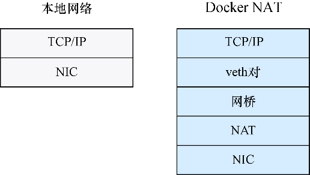

### 技巧109　从容器访问宿主机资源

我们在技巧34中讨论了卷，它是最常用的绕过Docker抽象的手段。通过使用卷，用户可以方便地与宿主机共享文件，以及在镜像层外保存大文件。而且应用程序访问这些卷的速度比访问容器文件系统要快得多，这是因为一些存储后端给某些工作负载带来了巨大的开销——这一点并不是对所有应用程序都那么有用，但是在某些情况下却至关重要。

除了一些存储后端带来的开销，Docker 为了给每个容器提供独立的网络而设置的网络接口则会带来另一个性能问题。就像文件系统性能一样，网络性能肯定不是每个人都会遇到的瓶颈，但是读者可能要按需进行基准测试（尽管网络调优的细节已经超出了本书的范围）。或者，读者可能有其他原因需要完全绕过Docker网络，例如，一台开放了随机端口监听的服务器可能无法很好地与Docker指定映射端口范围的方式相契合，特别是如果要为此直接映射整段的端口，宿主机的这段端口就会一直被占用，不论服务是否真的在使用它们。

无论什么样的原因，有时候Docker这样的抽象会是一个阻碍，因此，Docker也为那些有需求的用户提供了绕开其限制的能力。

#### 问题

想要从容器访问宿主机的资源。

#### 解决方案

使用Docker为 `docker run` 命令提供的标志来绕过Docker使用的内核命名空间功能。

Docker提供了几种方法来绕过Docker使用的内核命名空间功能。


**提示**

内核命名空间是内核提供给程序的一个服务，允许它们以某种方式获取全局资源的视图，使这些资源看起来像是提供给自己的单独实例。例如，一个程序可以请求一个网络命名空间，看上去就像是一个完整的网络栈。Docker使用和管理这些命名空间来创建其容器。


表16-1总结了Docker如何使用命名空间，以及如何有效地关闭它们。

<center class="my_markdown"><b class="my_markdown">表16-1　命名空间和Docker</b></center>

| 内核命名空间 | 描 述 | 是否在Docker中使用 | “关闭”选项 |
| :-----  | :-----  | :-----  | :-----  | :-----  | :-----  |
| Network | 网络子系统 | 是 | `--net=host` |
| IPC | 进程间通信：共享内存、信号量等 | 是 | `--ipc=host` |
| UTS | 主机名和NIS域 | 是 | `--uts=host` |
| PID | 进程ID | 是 | `--pid=host` |
| Mount | 挂载点 | 是 | `--volume,--device` |
| User | 用户和用户组ID | 否 | N/A |


**注意**

如果这些标志不可用，很可能是因为所使用的Docker版本过时了。


如果应用程序需要大量使用共享内存，例如，想让容器和宿主机共享内存空间，可以使用 `--ipc=host` 标志来实现这一点。这种用法比较高级，因此我们将主要关注其他一些更常见的用法。

##### 1．网络和主机名

要使用宿主机的网络，可以在运行容器时将 `--net` 标志设置为 `host` ，如下所示：

```c
user@yourhostname:/$ docker run -ti --net=host ubuntu /bin/bash
root@yourhostname:/#
```

不难发现，这与使用了网络命名空间的容器的不同之处在于，容器中的主机名与宿主机的主机名是相同的。从实践角度讲，这可能会导致混乱，因为它不能清楚地告诉用户，是在一个容器里。

在一个网络隔离的容器中，可以使用 `netstat` 来快速验证启动时没有网络连接：

```c
host$ docker run -ti ubuntu
root@b1c4877a00cd:/# netstat
Active Internet connections (w/o servers)
Proto Recv-Q Send-Q Local Address           Foreign Address          State
Active UNIX domain sockets (w/o servers)
Proto RefCnt Flags       Type       State         I-Node   Path
root@b1c4877a00cd:/#
```

执行相同的命令但使用 `host` 网络命令会显示繁忙的宿主机网络：

```c
$ docker run -ti --net=host ubuntu
root@host:/# netstat -nap | head
Active Internet connections (servers and established)
Proto Recv-Q Send-Q Local Address   Foreign Address State       PID
➥ /Program name
tcp        0      0 127.0.0.1:47116 0.0.0.0:*       LISTEN      -
tcp        0      0 127.0.1.1:53    0.0.0.0:*       LISTEN      -
tcp        0      0 127.0.0.1:631   0.0.0.0:*       LISTEN      -
tcp        0      0 0.0.0.0:3000    0.0.0.0:*       LISTEN      -
tcp        0      0 127.0.0.1:54366 0.0.0.0:*       LISTEN      -
tcp        0      0 127.0.0.1:32888 127.0.0.1:47116 ESTABLISHED -
tcp        0      0 127.0.0.1:32889 127.0.0.1:47116 ESTABLISHED -
tcp        0      0 127.0.0.1:47116 127.0.0.1:32888 ESTABLISHED -
root@host:/#
```


**注意**

`netstat` 是一个命令，允许用户查看本地网络栈上的相关网络信息。它常用于确定网络套接字的状态。


通常使用 `net=host` 标志有几个原因。首先，它可以让外界服务更容易连接到容器。不过这样也会失去为容器创建端口映射的好处。例如，如果有两个容器都监听80端口，使用这种方式将无法在同一台宿主机上同时运行它们。其次，使用这个标志时网络性能相比Docker网络会有显著提升。

图16-1展示了Docker中的网络分组（也称数据包）和本地网络中的分组必须经过的层数。尽管本地网络只需通过宿主机的TCP/IP栈到网卡（network interface card，NIC）但Docker必须额外维护一个虚拟以太网对（“veth对”——对使用以太网电缆的物理连接的虚拟表示），veth对和宿主机网络之间有一个网桥，并且有一个网络地址转换（network address translation，NAT）层。在正常的使用场景里，这样的开销可以导致Docker网络的速度仅有本地宿主机网络的一半。


<center class="my_markdown"><b class="my_markdown">图16-1　Docker网络与本地网络对比</b></center>

##### 2．PID

PID命名空间标志与其他命名空间很相似：

```c
imiell@host:/$ docker run ubuntu ps -p 1　　⇽---　在容器化环境中执行ps命令，显示只有一个PID为1的进程
   PID TTY          TIME CMD
    1 ?        00:00:00 ps　　⇽---　执行的ps命令是该容器中唯一的进程，而且PID为1
imiell@host:/$ docker run --pid=host ubuntu ps -p 1　　⇽---　执行同样的ps命令但不使用PID命名空间，展示了主机的进程的视图
   PID TTY          TIME CMD
    1 ?        00:00:27 systemd　　⇽---　这次PID为1的进程是systemd命令，它是宿主机的操作系统的启动进程。读者看到的展示可能有所不同，这取决于所使用的发行版
```

上面的示例演示了在具有宿主机PID视图的容器中，systemd 进程ID为1，而在没有该视图的情况下，能看到的唯一一个进程是 `ps` 命令本身。

##### 3．挂载

如果要访问宿主机的设备，要使用 `--device` 标志来使用特定设备，或者使用 `—volume` 标志来挂载宿主机的整个文件系统：

```c
docker run -ti --volume /:/host ubuntu /bin/bash
```

这一命令将宿主机的 `/` 目录挂载到容器的/host目录。读者可能想知道为什么不能把宿主机的 `/` 目录挂载到容器的 `/` 目录，原因是这是 `docker` 命令明确禁止的行为。

读者可能还想知道是否可以使用这些标志创建一个与宿主机几乎无法区分的容器。这个问题我们将在下一节讨论。

##### 4．类宿主机容器

可以使用下面的标志来创建一个几乎拥有宿主机透明视图的容器。

```c
host:/$ docker run -ti --net=host --pid=host --ipc=host \　　⇽---　使用3个host参数(net、pid和ipc)运行容器
 --volume /:/host \　　⇽---　将宿主机的根文件系统挂载到容器的/host目录。Docker不允许将卷挂载到/目录，所以用户必须指定/host子目录卷
 busybox chroot /host　　⇽---　启动BusyBox容器。用户只需要chroot命令，而这是一个包含该命令的小镜像。执行chroot可以使被挂载的文件系统就像root一样展现给用户
```

具有讽刺意味的是，Docker被称为“吃了类固醇的chroot”，而这里我们使用某些特性作为框架，以一种破坏chroot主要设计目标之一（即保护宿主机系统）的方式运行chroot。在这一点上我们尽量不要想得太复杂。

在任何情况下，很难想象有人会在现实世界中使用这个命令（有指导性的）。如果读者想到了，请联系我们。

也就是说，用户可能更想将它作为一个更有用的命令的基础，像这样：

```c
$ docker run -ti --workdir /host \
   --volume /:/host:ro ubuntu /bin/bash
```

在这个例子中， `--workdir /host` 将容器启动时的工作目录设置为宿主机的文件系统的根目录，使用 `--volume` 参数进行挂载。卷规格说明的 `:ro` 部分意思是宿主机文件系统以只读模式挂载。

执行该命令可以给用户一个文件系统的只读视图，同时拥有一个可以安装工具（使用标准的Ubuntu包管理工具）来检查文件系统的环境。例如，可以使用一个运行了nifty工具的镜像来向宿主机的文件系统报告安全问题，而不用将该工具安装到宿主机上。


**警告**

正如前面的讨论中暗示的那样，带上这些标志会引入更多的安全风险。在安全性方面，使用它们应该被视为等同于运行时使用 `--privileged` 标志。


#### 讨论

在本技巧中，读者学到了该如何绕过容器中Docker的一些抽象。禁用这些功能可以提高速度，或者提供可让Docker更好地服务于你的需求的其他便利。其中一种方式我们已经用过，就是把网络工具（如技巧112中的提到的tcpflow）安装在容器里，并且公开宿主机的网络接口。这可以让你对不同的工具进行临时基础上的实验而不用进行安装。

我们将在技巧110里一起看看如何绕过Docker底层磁盘存储的限制。

