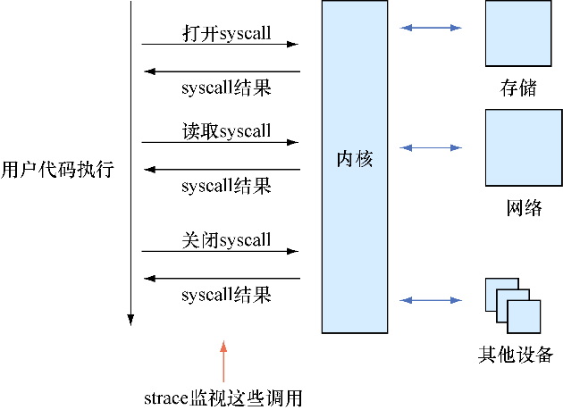

### 技巧113　调试在特定宿主机上出问题的容器

前两个技巧已经展示了该如何对由容器和其他位置（无论是其他容器还是互联网上的第三方）之间的交互造成的问题开始调查。

如果用户已经将问题定位到某台宿主机，并且确定不是外部交互的原因，那么下一步应该是尝试减少变动部分（删除卷和端口）的数量，并检查宿主机自身的详细信息（可用磁盘空间、打开的文件描述符的数量等）。每台宿主机是否使用了最新版本的Docker可能也值得检查一下。

在某些情况下，上面的方法都行不通。例如，有一个镜像，运行时没有带任何参数（如 `docker run imagename` ），而它在不同的宿主机上运行的行为不同，这完全有可能发生。

#### 问题

想要确认为什么在特定宿主机上的某个容器的特定行为无法正常工作。

#### 解决方案

追踪整个过程来查看它的系统调用，同时将其与一个正常工作的系统作对比。

虽然Docker的目标是允许用户“在任何地方运行任何应用”，但它试图实现这一点的手段并不总是万无一失。

Docker将Linux内核API视为其 **宿主机** （即它可以运行的环境）。当第一次了解Docker如何工作时，许多人会问Docker如何处理Linux API的更改。据我们所知，目前它没有做任何处理。幸运的是，Linux API是向后兼容的，但是不难想象将来的某个场景，即创建一个 **新** 的Linux API并被Docker化的应用程序使用，然后该应用被部署到一个足够运行Docker但版本足够老的内核时，它可能并不支持该特定的API调用。


**注意**

读者可能认为Linux内核API的变更只是一个理论上存在的问题而已，但是实际上，我们在编写这本书第1版时的确遇到了这种情况。我们工作的项目使用 `memfd_create`  Linux系统调用，它只存在于3.17及以上版本的内核。因为我们工作的一些宿主机有较老的内核，我们的容器只能在部分系统上正常工作，其他的系统则不行。


并不是只有这种情况会导致Docker抽象不工作。容器还有可能无法工作在特定的内核上，因为应用可能对宿主机上的文件做出一些假设。虽然这种情况发生的概率很小，但是它确实存在，重要的是要警惕这种风险。

##### 1．SELinux会干扰容器

可以让Docker抽象无法工作的一个例子是与SELinux交互的任何东西。如第14章所讨论的，SELinux是在内核中实现的安全层，它游离于正常的用户权限之外。

Docker通过这一层来增强容器的安全性，即管理可以在容器里执行什么操作。例如，如果你是容器的root用户，那么你也是宿主机上的root用户。虽然很难，但是一旦容器被攻破，也就同时获得了宿主机的root权限，这并非不可能。之前已经有漏洞被曝光，而且可能还存在一些社区还未发觉的漏洞。SELinux等于提供了另一层保护，即使root用户从容器侵入宿主机，这里对其在宿主机上可以执行的操作也做了一些限制。

到目前为止还算不错，但是对Docker来说，问题在于SELinux是在宿主机上实现的，而不是容器内部。这就意味着在容器里运行的应用程序查询SELinux并发现它是开启的状态时，可能会促使它们对运行的环境做出某些假设。如果不满足这些预期，则会以意想不到的方式失败。

在下面的示例中，我们运行一个安装了Docker的CentOS 7 Vagrant机器，并且在里面安装了一个ubuntu: 12.04容器。如果我们执行一条相当简单的命令来添加一个用户，退出码会是12，这代表有错误，并且提示用户没有被成功创建：

```c
[root@centos vagrant]# docker run -ti ubuntu:12.04
Unable to find image 'ubuntu:12.04' locally
Pulling repository ubuntu
78cef618c77e: Download complete
b5da78899d3a: Download complete
87183ecb6716: Download complete
82ed8e312318: Download complete
root@afade8b94d32:/# useradd -m -d /home/dockerinpractice dockerinpractice
root@afade8b94d32:/# echo $?
12
```

同样的命令在ubuntu: 14.04容器上却可以正常工作。如果想尝试重现这个结果，需要一台CentOS 7（或类似的）机器。但是出于学习的目的，这对于接下来技巧中使用的任何命令和容器已经足够了。


**提示**

在bash中， `$?` 给出最后一条执行命令的退出码。退出码的含义因命令而异，但通常退出码为0意味着调用成功，非零码指示某种错误或异常条件。


##### 2．调试Linux API调用

我们知道容器之间可能的不同是由于在宿主机上运行的内核API之间存在差异性，strace可以帮助确定调用内核API之间的差异。

strace是一个工具，它允许嗅探一个进程对Linux API所做的调用（也称为系统调用）。这是一个非常有用的调试和教学工具。图16-2给出了它的工作原理。


<center class="my_markdown"><b class="my_markdown">图16-2　strace的工作原理</b></center>

首先，需要使用相应的包管理工具在容器上安装strace，然后使用 `strace` 命令执行不同的命令。下面是失败的 `useradd` 调用的一些输出示例：

```c
# strace -f \　　⇽---　带上-f标志执行strace命令，它可以确保命令的进程及其子进程都能被strace追踪
 useradd -m -d /home/dockerinpractice dockerinpractice　　⇽---　在strace调用中追加想要调试的命令
 execve("/usr/sbin/useradd", ["useradd", "-m", "-d", >　　⇽---　 strace输出的每一行都从Linux API调用开始。execve调用在这里执行传给strace的命令。结束处的0是调用的返回值（表示成功）
 "/home/dockerinpractice", "dockerinpractice"], [/* 9 vars */]) = 0
[...]
open("/proc/self/task/39/attr/current", >　　⇽---　 open系统调用打开一个文件进行读取。返回值（9）是用于对文件进行后续调用的文件句柄号。在这种情况下，/proc文件系统会检索SELinux信息，该文件系统保存正在运行的进程的有关信息
 O_RDONLY) = 9
read(9, "system_u:system_r:svirt_lxc_net_"..., >　　⇽---　 read系统调用工作于之前打开的文件（文件句柄号为9），返回了读取的字节数（46）
 4095) = 46
close(9)  =  0　　⇽---　 close系统调用根据文件描述符编号关闭了引用的文件
 [...]
open("/etc/selinux/config", O_RDONLY) = >　　⇽---　
 -1 ENOENT (No such file or directory)
open("/etc/selinux/targeted/contexts/files/ >
 file_contexts.subs_dist", O_RDONLY) = -1 ENOENT (No such file or directory)
open("/etc/selinux/targeted/contexts/files/ >
 file_contexts.subs", O_RDONLY) = -1 ENOENT (No such file or directory)
open("/etc/selinux/targeted/contexts/files/ >
 file_contexts", O_RDONLY) = -1 ENOENT (No such file or directory) 　　⇽---　应用程序试图打开它期望位置的SELinux文件，但是都失败了。strace可以告诉用户返回值的含义：没有该文件或目录
[...]
exit_group(12) 　　⇽---　进程退出码为12，对于useradd命令来说意味着不能创建目录
```

上面的输出可能看起来很混乱，但重复阅读几次之后就不难理解了。每一行代表一个对Linux内核的调用，以便在所谓的 **内核空间** （而不是用户空间，其中动作会被程序执行，无须将责任移交给内核）。


**提示**

如果读者想了解有关特定系统调用的更多信息，可以执行 `man 2 callname` 。读者可能需要使用 `apt-get install manpages-dev` 或类似的命令安装帮助手册。或者，在Google浏览器中搜索“man 2 callname”也可能会得到需要的信息。


这是一个Docker抽象无法正常工作的例子。在这种情况下，操作失败是因为程序期望SELinux文件存在，因为SELinux似乎在容器上是启用的，但是限制的细节保留在宿主机上。


**提示**

如果你真的想成为一名开发人员，阅读所有系统调用的帮助手册是非常有用的。起初，这里面看似充斥着晦涩的术语，但是当阅读完各个主题之后，你会学到很多基本的Linux概念。在某些时候，你会开始看到大多数语言是如何起源于此，而且它们的一些轶事也相当有趣。耐心一点吧，毕竟你没办法一下子就全部理解。


#### 讨论

尽管这种情况很少见，但是使用strace来调试和了解应用程序如何进行交互的能力是一种非常宝贵的技术，它不仅针对Docker，还可用在更通用的开发过程。

如果有一个很小的Docker镜像，也许是通过技巧57来创建的，那么最好不要在容器中安装strace，在宿主机中也可以使用strace。可以使用 `docker top <container_id>` 来找到容器中进程的PID，strace使用 `-p` 参数来挂载到某个运行的进程上。别忘了使用sudo。挂载到进程可能会允许读取其密码，所以需要额外的权限。

