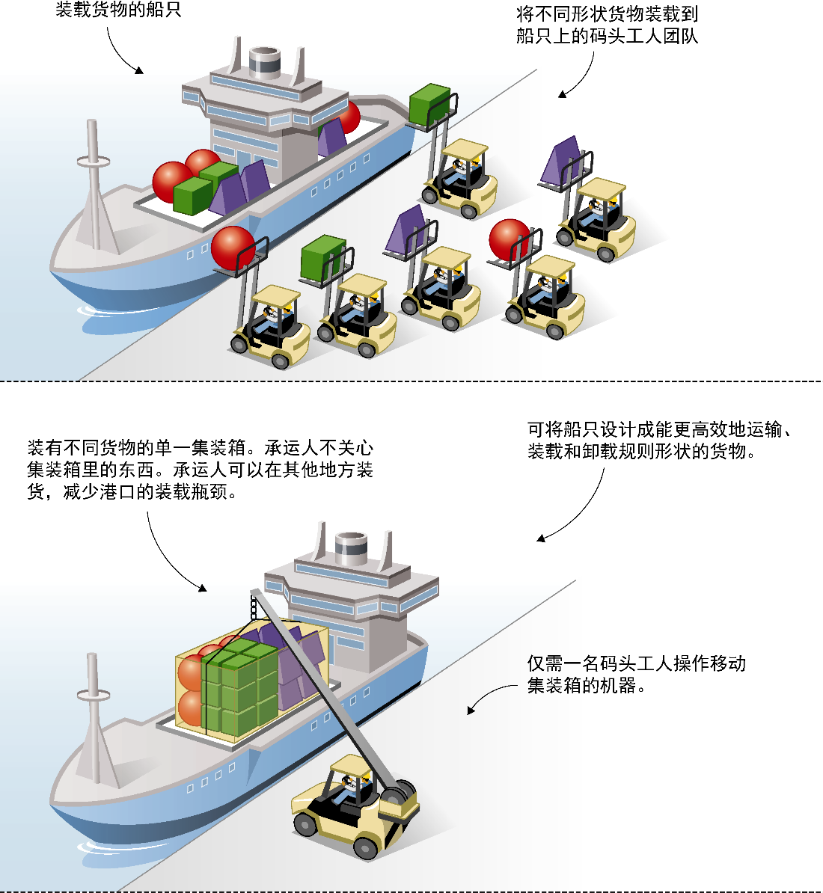

### 1.1.1　Docker是什么

要理解Docker是什么，从一个比喻开始会比技术性解释来得简单，而且这个Docker的比喻非常有说服力。Docker这个单词原本是指在船只停靠港口之后将商品移进或移出的码头工人。箱子和物品的大小、形状各异，而有经验的码头工人能以合算的方式手工将商品装入船只，因而他们倍受青睐（见图1-2）。雇人搬东西并不便宜，但除此之外别无他法。

对在软件行业工作的人来说，这听起来应该很熟悉。大量时间和精力被花在将奇形怪状的软件放置到装满了其他奇形怪状的软件、大小各异的船只上，以便将其卖给其他地方的用户或商业机构。

图1-3展示了使用Docker概念时如何能节省时间和金钱。在Docker出现之前，部署软件到不同环境所需的工作量巨大。即使不是采用手工运行脚本的方式在不同机器上进行软件配备（有很多人这么做），用户也不得不全力应付那些配置管理工具，它们掌管着渴求资源且快速变化的环境的状态。即便将这些工作封装到虚拟机中，还是需要花费大量时间来部署这些虚拟机，等待它们启动并管理它们所产生的额外的资源开销。

<b class="my_markdown">图1-2　标准化集装箱前后的航运对比</b>

使用Docker，配置工作从资源管理中分离了出来，而部署工作则不值一提：执行 `docker run` ，环境的镜像会被拉取下来并准备运行，所消耗的资源更少并且是内含的，因此不会干扰其他环境。

读者无须担心容器是被分发到Red Hat机器、Ubuntu机器还是CentOS虚拟机镜像中，只要上面有Docker，就能良好地运行。

<b class="my_markdown">图1-3　使用Docker前后软件交付的对比</b>

