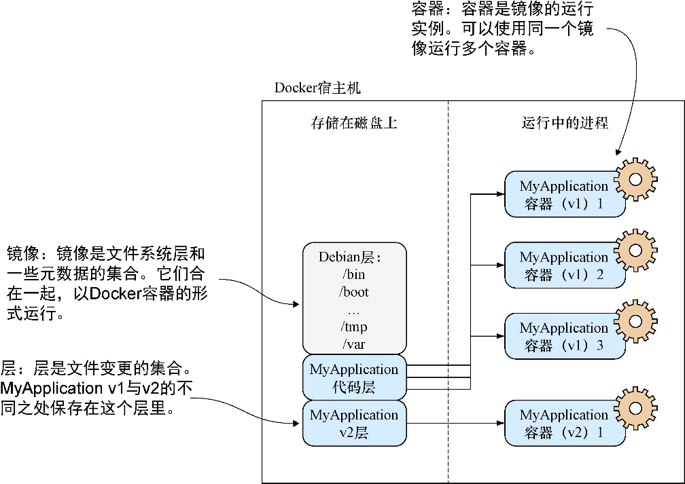
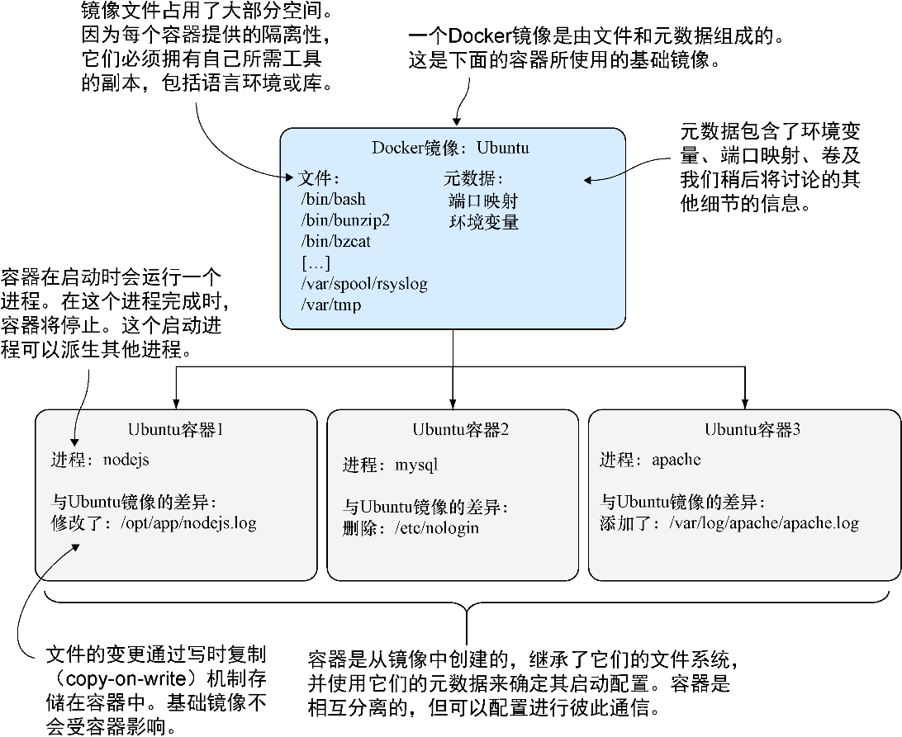

### 1.1.3　关键的概念

在本节中，我们将介绍一些关键的Docker概念，如图1-4所示。

<b class="my_markdown">图1-4　Docker的核心概念</b>

在开始执行Docker命令之前，将镜像、容器及层的概念牢记于心是极其有用的。简而言之， **容器** 运行着由 **镜像** 定义的系统。这些镜像由一个或多个 **层** （或差异集）加上一些Docker的元数据组成。

让我们来看一些核心的Docker命令。我们将把镜像转变成容器，修改它们，并添加层到我们即将提交的新镜像中。如果这一切听上去有点儿混乱，不用太担心。在本章结束时，一切都将更加清晰。

##### 1．关键的Docker命令

Docker的中心功能是构建、分发及在任何具有Docker的地方运行软件。对终端用户而言，Docker是他们运行的一个命令行程序。就像Git（或任何源代码控制工具）一样，这个程序具有用于执行不同操作的子命令。表1-1中列出了将在宿主机上使用的主要的Docker子命令。

<b class="my_markdown">表1-1　Docker子命令</b>

| 命 令 | 目 的 |
| :-----  | :-----  | :-----  | :-----  |
| `docker build` | 构建一个Docker镜像 |
| `docker run` | 以容器形式运行一个Docker镜像 |
| `docker commit` | 将一个Docker容器作为一个镜像提交 |
| `docker tag` | 给一个Docker镜像打标签 |

##### 2．镜像与容器

如果读者不熟悉Docker，可能这是第一次听说本书所说的“容器”和“镜像”这两个词。它们很可能是Docker中最重要的概念，因此有必要花点儿时间明确其差异。在图1-5中，读者将看到这些概念的展示，里面是从一个基础镜像启动的3个容器。

<b class="my_markdown">图1-5　Docker镜像与容器</b>

看待镜像和容器的一种方式是将它们类比成程序与进程。一个进程可以视为一个“被执行的应用程序”，同样，一个Docker容器可以视为一个运行中的Docker镜像。

如果读者熟悉面向对象原理，看待镜像和容器的另一种方法是将镜像看作类而将容器看作对象。对象是类的具体实例，同样，容器是镜像的实例。用户可以从单个镜像创建多个容器，就像对象一样，它们之间全都是相互隔离的。不论用户在对象内修改了什么，都不会影响类的定义——它们从根本上就是不同的东西。

