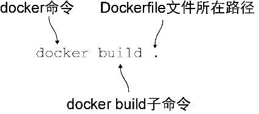
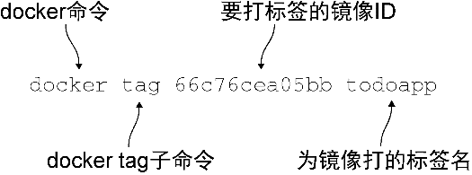

### 1.2.3　构建一个Docker镜像

读者已经定义了自己的Dockerfile的构建步骤。现在可以键入图1-7所示的命令，从而构建Docker镜像了。


<center class="my_markdown"><b class="my_markdown">图1-7　 **docker build** 子命令</b></center>

输出看起来和下面类似。

```c
Sending build context to Docker daemon 2.048kB　　⇽---　 Docker会上传docker build指定目录下的文件和目录
Step 1/7 : FROM node　　⇽---　每个构建步骤从 1 开始按顺序编号，并与命令一起输出
 ---> 2ca756a6578b　　⇽---　每个命令会导致一个新镜像被创建，其镜像ID在此输出
Step 2/7 : LABEL maintainer ian.miell@gmail.com
 ---> Running in bf73f87c88d6
 ---> 5383857304fc
Removing intermediate container bf73f87c88d6　　⇽---　为节省空间，在继续前每个中间容器会被移除
Step 3/7 : RUN git clone -q https://github.com/docker-in-practice/todo.git
 ---> Running in 761baf524cc1
 ---> 4350cb1c977c
Removing intermediate container 761baf524cc1
Step 4/7 : WORKDIR todo
 ---> a1b24710f458
Removing intermediate container 0f8cd22fbe83
Step 5/7 : RUN npm install > /dev/null
 ---> Running in 92a8f9ba530a
npm info it worked if it ends with ok　　⇽---　构建的调试信息在此输出（限于篇幅，本代码清单做了删减）
 [...]
npm info ok
 ---> 6ee4d7bba544
Removing intermediate container 92a8f9ba530a
Step 6/7 : EXPOSE 8000
 ---> Running in 8e33c1ded161
 ---> 3ea44544f13c
Removing intermediate container 8e33c1ded161
Step 7/7 : CMD npm start
 ---> Running in ccc076ee38fe
 ---> 66c76cea05bb
Removing intermediate container ccc076ee38fe
Successfully built 66c76cea05bb　　⇽---　此次构建的最终镜像ID，可用于打标签
```

现在，拥有了一个具有镜像ID（前面示例中的“66c76cea05bb”，不过读者的ID会不一样）的Docker镜像。总是引用这个ID会很麻烦，可以为其打标签以方便引用，如图1-8所示。


<center class="my_markdown"><b class="my_markdown">图1-8　 `docker tag` 子命令</b></center>

输入图1-8所示的命令，将66c76cea05bb替换成读者生成的镜像ID。

现在就能从一个Dockerfile构建自己的Docker镜像副本，并重现别人定义的环境了！

