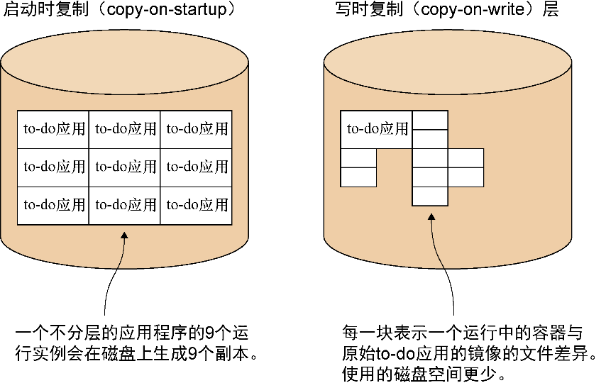
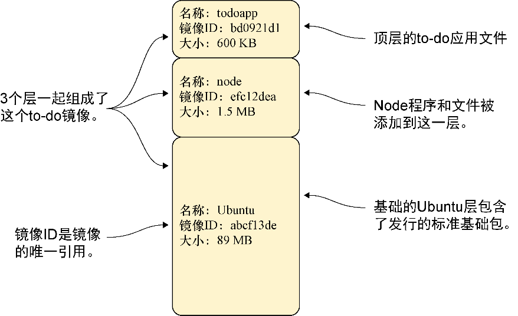

### 1.2.5　Docker分层

Docker分层协助用户管理在大规模使用容器时会遇到的一个大问题。想象一下，如果启动了数百甚至数千个to-do应用，并且每个应用都需要将文件的一份副本存储在某个地方。

可想而知，磁盘空间会迅速消耗光！默认情况下，Docker在内部使用写时复制（copy-on-write）机制来减少所需的硬盘空间量（见图 1-9）。每当一个运行中的容器需要写入一个文件时，它会通过将该项目复制到磁盘的一个新区域来记录这一修改。在执行Docker提交时，这块磁盘新区域将被冻结并记录为具有自身标识符的一个层。

<b class="my_markdown">图1-9　启动时复制与写时复制对比</b>

这一部分解释了Docker容器为何能如此迅速地启动——它们不需要复制任何东西，因为所有的数据已经存储为镜像。

**提示**

写时复制是计算技术中使用的一种标准的优化策略。在从模板创建一个新的（任意类型）对象时，只在数据发生变化时才能将其复制进来，而不是复制整个所需的数据集。依据用例的不同，这能省下相当可观的资源。

图1-10展示了构建的to-do应用，它具有我们所感兴趣的3个层。因为层是静态的，所以如果用户需要更改更高层上的任何东西，都可以在想引用的镜像之上进行构建。在这个to-do应用中，我们从公开可用的node镜像构建，并将变更叠加在最上层。

所有这3个层都可以被多个运行中的容器共享，就像一个共享库可以在内存中被多个运行中的进程共享一样。对于运维人员来说，这是一项至关重要的功能，可以在宿主机上运行大量基于不同镜像的容器，而不至于耗尽磁盘空间。

想象一下，将所运行的to-do应用作为在线服务提供给付费用户。你可以将服务扩散给大量用户。如果是在开发中，你可以一次在本地机器上启动多个不同的环境。如果是在进行测试，你可以比之前同时运行更多测试，速度也更快。有了分层，所有这些东西都成为可能。

<b class="my_markdown">图1-10　Docker中to-do应用的文件系统分层</b>

通过使用Docker构建和运行一个应用程序，读者开始见识到Docker能给工作流带来的威力。重现并共享特定的环境，并能在不同的地方落地，让开发过程兼具灵活性和可控性。

