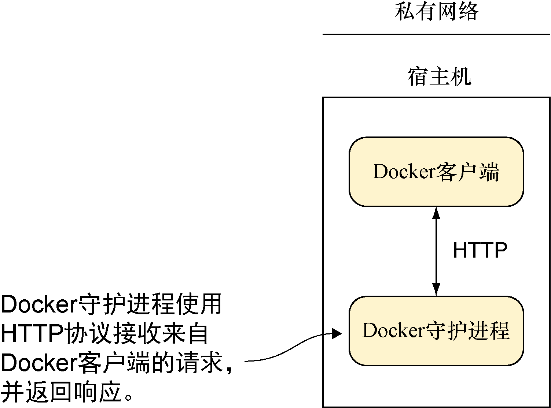

### 2.2　Docker守护进程

Docker守护进程（见图2-2）是用户与Docker交互的枢纽，因而它是理解所有相关部分的最佳切入点。它控制着用户机器上的Docker访问权限，管理着容器与镜像的状态，同时代理着与外界的交互。

<b class="my_markdown">图2-2　Docker守护进程</b>

**提示**

守护进程是运行在后台的一个进程，不在用户的直接控制之下。服务器是负责接受客户端请求，并执行用于满足该请求所需的操作的一个进程。守护进程通常也是服务器，接收来自客户端的请求，为其执行操作。 `docker` 命令是一个客户端，而Docker守护进程则作为服务器对Docker容器和镜像进行操作。

我们来看几个技巧，这些技巧用于展示Docker作为守护进程如何高效运行，以及使用 `docker` 命令与其进行的交互是如何被限定为执行操作的几个简单请求，就像与Web服务器进行交互一样。第一个技巧允许其他人连接你的Docker守护进程，并执行与你在宿主机上所能执行的相同操作，第二个技巧说明的是Docker容器是由守护进程而不是你的shell会话管理的。

