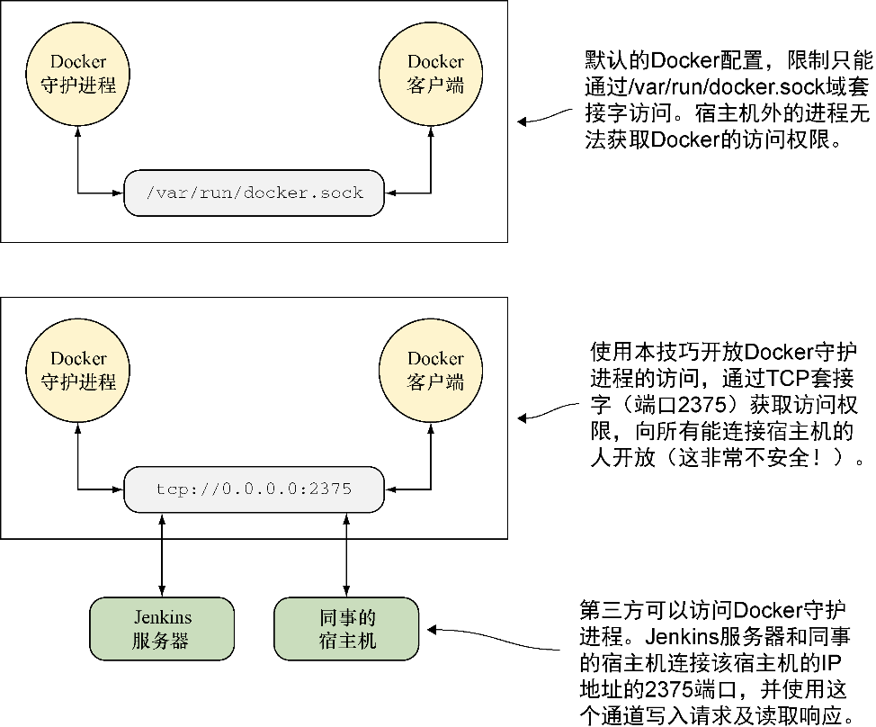

### 技巧1　向世界开放Docker守护进程

虽然默认情况下Docker的守护进程只能在宿主机上访问，但是在有些情况下还是需要允许其他人访问。读者可能遇到了一个问题，需要其他人来远程调试，或者可能想让DevOps工作流中的某一部分在宿主机上启动一个进程。


**警告**

尽管这个技巧很强大也很有用，但它被认为是不安全的。Docker套接字可能被任何拥有访问权限的容器所利用（包括挂载了Docker套接字的容器），以获得root权限。


#### 问题

想要将Docker服务器开放给其他人访问。

#### 解决方案

使用开放的TCP地址启动Docker守护进程。

图2-3给出了这个技巧的工作原理概览。


<center class="my_markdown"><b class="my_markdown">图2-3　Docker可访问性：正常情况与公开情况</b></center>

在开放Docker守护进程之前，必须先停止正在运行的实例。操作的方式因操作系统而异（非Linux用户应该看一下附录A）。如果不清楚怎么做，从这个命令开始：

```c
$ sudo service docker stop
```

如果得到一个类似下面这样的消息，说明这是一个基于systemctl的启动系统：

```c
The service command supports only basic LSB actions (start, stop, restart,
try-restart, reload, force-reload, status). For other actions, please try
to use systemctl.
```

可以试试这个命令：

```c
$ systemctl stop docker
```

如果这个方法有效，以下命令将看不到任何输出：

```c
$ ps -ef | grep -E 'docker(d| -d| daemon)\b' | grep -v grep
```

一旦Docker守护进程停止，就可以使用以下命令手工重启并向外界用户开放它：

```c
$ sudo docker daemon -H tcp://0.0.0.0:2375
```

这个命令以守护进程方式启动（ `docker daemon` ），使用 `-H` 标志定义宿主机服务器，使用TCP协议，开放所有IP接口（使用 `0.0.0.0` ），并开放标准的Docker服务器端口（ `2375` ）。

可以从外部使用如下命令进行连接：

```c
$ docker -H tcp://<宿主机IP>:2375 <subcommand>
```

也可以设置 `DOCKER_HOST` 环境变量（如果不得不使用sudo运行Docker，这条命令将失效——详见技巧41以免除sudo限制）：

```c
$ export DOCKER_HOST=tcp://<宿主机的IP>:2375
$ docker <subcommand>
```

需要注意的是，在本地机器内部也需要像这两者之一这么做，因为Docker已经不再在其默认位置进行监听了。

如果想在宿主机上让这项变更永久生效，需要对启动系统进行配置。其操作方式参见附录B。


**警告**

如果使用这个技巧让自己的Docker守护进程监听某个端口，在指定IP为 `0.0.0.0` 时要注意，这将赋予来自所有网卡（包括公共的和私有的）的用户访问权限，通常我们认为这是不安全的！


#### 讨论

如果你在一个安全的私有网络里拥有一台强大的Docker专用机器，这将是一个非常有用的技巧，因为网络上的所有人都能轻松地将Docker工具指向正确的位置—— `DOCKER_HOST` 作为广为人知的环境变量，将告之绝大多数访问Docker的程序上哪去查找。

作为手工停止和运行Docker服务这个有些繁琐的过程的替换方法，你可以将挂载Docker套接字为数据卷（来自技巧45）与使用socat工具转发来自外部端口的流量相结合——简单地执行 `docker run -p 2375:2375 –v/var/run/docker.sock:/var/run/docker. socksequenceid/socat` 。

在本章后面的技巧5中，你将看到该技巧能实现的一个具体示例。

