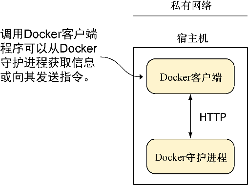

### 2.3　Docker客户端

Docker客户端（见图2-4）是Docker架构中最简单的部件。在主机上输入 `docker run` 或 `docker pull` 这类命令时运行的便是它。它的任务是通过HTTP请求与Docker守护进程通信。

<b class="my_markdown">图2-4　Docker客户端</b>

在本节中，读者将看到如何监听Docker客户端与服务器之间的信息，还将看到使用浏览器作为Docker客户端的方法，以及一些与端口映射有关的基本技巧，这是向本书第四部分讨论的编排迈进的一小步。

