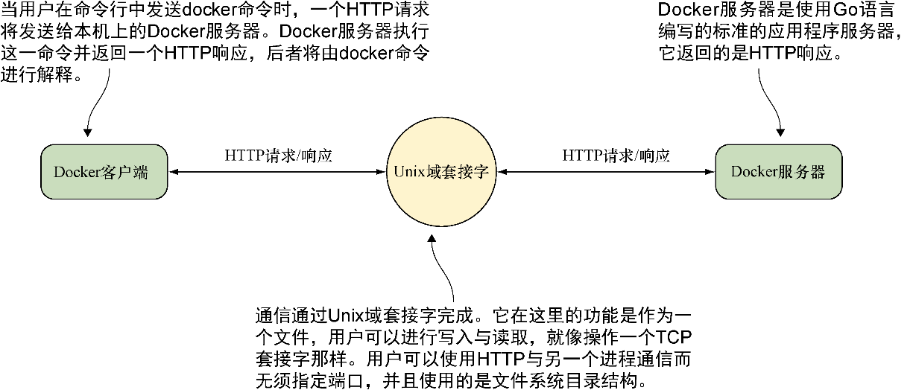
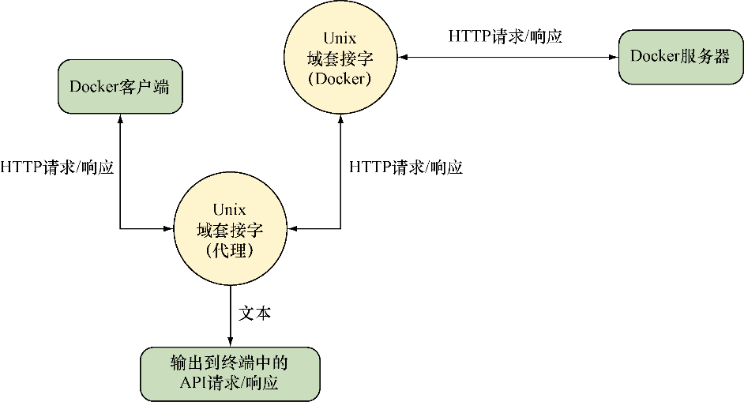

### 技巧4　使用socat监控Docker API流量


有时 `docker` 命令可能会不按预期工作。多数时候是因为没有理解命令行参数的某些部分，不过偶尔也存在更严重的安装问题，如Docker的二进制文件过时了。为了诊断问题，查看与之通信的Docker守护进程来往的数据流是十分有用的。


**注意**

不用惊慌！本技巧的存在并不表示Docker需要经常调试，或者它有任何的不稳定！这条技巧主要是作为理解Docker架构的一个工具，同时也是为了介绍 `socat` 这个强大的工具。如果读者像我们一样，在众多不同的地方使用Docker，所使用的Docker版本将会有差异。与任何软件一样，不同的版本将具有不同的功能和标志，这可能会让读者无所适从。


#### 问题

想要调试一个Docker命令的问题。

#### 解决方案

使用流量监听器（traffic snooper）来检查API调用，并自行解决。

在本技巧中，用户将在自己的请求与服务器套接字之间插入一个代理Unix域套接字去查看通过它的内容（见图2-5）。注意，完成这一步需要root或sudo权限。


<center class="my_markdown"><b class="my_markdown">图2-5　宿主机上的Docker客户端/服务器架构</b></center>

要创建这个代理，会用到 `socat` 。

```c
$ socat -v UNIX-LISTEN:/tmp/dockerapi.sock,fork \
　UNIX-CONNECT:/var/run/docker.sock &
```

**提示**

`socat` 是一个强大的命令，能让用户在两个几乎任意类型的数据通道之间中继数据。如果熟悉netcat，可以将其看作是加强版的netcat。你可使用系统的标准包管理器来安装它。


在这条命令中， `-v` 用于提高输出的可读性，带有数据流的指示。 `UNIX-LISTEN` 部分是让 `socat` 在一个Unix套接字上进行监听， `fork` 确保 `socat` 不会在首次请求后退出，而 `UNIX-CONNECT` 是让 `socat` 连接到Docker的Unix套接字。 `&` 符号指定在后台执行该命令。如果你通常使用sudo来运行Docker客户端，这里也需要这么做。

发往守护进程的请求所经过的新路由如图2-6所示。所有双向流量都会被 `socat` 看到，并与Docker客户端所提供的任何输出一起记录到终端日志中。


<center class="my_markdown"><b class="my_markdown">图2-6　插入socat作为代理的Docker客户端与服务器</b></center>

现在一个简单的 `docker` 命令的输出看起来将类似下面这样：

```c
$ docker -H unix:///tmp/dockerapi.sock ps -a　　⇽---　用于查看请求与响应所发送的命令
 > 2017/05/15 16:01:51.163427 length=83 from=0 to=82
GET /_ping HTTP/1.1\r
Host: docker\r
User-Agent: Docker-Client/17.04.0-ce (linux)\r
\r
< 2017/05/15 16:01:51.164132 length=215 from=0 to=214
HTTP/1.1 200 OK\r
Api-Version: 1.28\r
Docker-Experimental: false\r
Ostype: linux\r
Server: Docker/17.04.0-ce (linux)\r
Date: Mon, 15 May 2017 15:01:51 GMT\r
Content-Length: 2\r
Content-Type: text/plain; charset=utf-8\r
\r
OK> 2017/05/15 16:01:51.165175 length=105 from=83 to=187　　⇽---　 HTTP请求从此处开始，左侧带有右尖括号
 GET /v1.28/containers/json?all=1 HTTP/1.1\r
Host: docker\r
User-Agent: Docker-Client/17.04.0-ce (linux)\r
\r
< 2017/05/15 16:01:51.165819 length=886 from=215 to=1100　　⇽---　 HTTP响应从此处开始，左侧带有左尖括号
HTTP/1.1 200 OK\r
Api-Version: 1.28\r
Content-Type: application/json\r
Docker-Experimental: false\r
Ostype: linux\r
Server: Docker/17.04.0-ce (linux)\r
Date: Mon, 15 May 2017 15:01:51 GMT\r
Content-Length: 680\r
\r
[{"Id":"1d0d5b5a7b506417949653a59deac030ccbcbb816842a63ba68401708d55383e",
➥ "Names":["/example1"],"Image":"todoapp","ImageID":
➥ "sha256:ccdda5b6b021f7d12bd2c16dbcd2f195ff20d10a660921db0ac5bff5ecd92bc2",
➥ "Command":"npm start","Created":1494857777,"Ports":[],"Labels":{},
➥ "State":"exited","Status":"Exited (0) 45 minutes ago","HostConfig":
➥ {"NetworkMode":"default"},"NetworkSettings":{"Networks":{"bridge":
➥ {"IPAMConfig":null,"Links":null,"Aliases":null,"NetworkID":
➥ "6f327d67a38b57379afa7525ea63829797fd31a948b316fdf2ae0365faeed632",
➥ "EndpointID":"","Gateway":"","IPAddress":"","IPPrefixLen":0,
➥ "IPv6Gateway":"","GlobalIPv6Address":"","GlobalIPv6PrefixLen":0,
➥ "MacAddress":""}}},"Mounts":[]}]　　⇽---　来自Docker服务器的响应的JSON内容
 CONTAINER ID　　　　IMAGE　　　　　　　 COMMAND　　　　　　 CREATED
➥　　　STATUS　　　　　　　　　　　PORTS　　　　　　　 NAMES　　⇽---　用户正常看到的输出，由Docker客户端从前面的JSON解释而来
 1d0d5b5a7b50　　　　todoapp　　　　　　 "npm start"　　　　 45 minutes ago
➥　　　Exited (0) 45 minutes ago　　　　　　　　　　　 example1
```

上述输出的细节将随着Docker API的增长壮大而改变。在执行上述命令时你将看到更高的版本以及不同的JSON输出。你可以通过执行 `docker version` 命令来查看客户端和服务端的API版本。


**警告**

如果在前面的示例中以root身份运行 `socat` ，需要使用sudo来执行 `docker -H` 命令。这是因为dockerapi.sock文件的所有者是root。


使用 `socat` 不仅对Docker来说是一种强大的调试方式，对工作过程中可能碰到的任何其他网络服务也是如此。

#### 讨论

对于这个技巧，可以延伸出其他多个用例。

+ Socat就像一把瑞士军刀，可以处理很多不同的协议。上述示例演示的是在Unix套接字上进行监听，不过你也可以使用 `TCP-LISTEN:2375,fork` 取代 `UNIX-LISTEN:…` 参数，让它监听外部端口。这相当于技巧1的一个更简单的版本。使用这个方法无须重启Docker守护进程（这会杀掉所有运行中的容器），可根据需要启动或停止socat监听器。
+ 由于前一条设置起来如此简单，并且是临时的，你可以将其与技巧47结合起来，以便远程加入同事的运行容器中，协助他们调试问题。你也可以使用很少用到的 `docker attach` 命令加入他们以 `docker run` 启动的同一个终端中，以便直接协作。
+ 如果你有一台共享的Docker服务器（或许是使用技巧1设置的），你可以使用对外公开的功能将socat设置为外界与Docker套接字之间的代理，将其作为原始的审计日志，记录下所有请求来源及所进行的操作。

