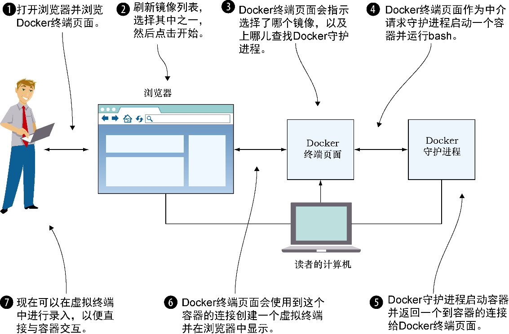

### 技巧5　在浏览器中使用Docker

销售新技术可能很艰难，因此简单而有效的演示是非常有价值的。让演示可操作则效果更佳，这也是为什么我们发现，创建一个允许用户在浏览器中与容器进行交互的网页是一个非常棒的技巧。这以易于达成的方式给新手带来Docker的初体验，让他们可以创建容器，在浏览器中使用容器终端，附加到其他人的终端上，并共享控制权。这种让人眼前一亮的体验没有坏处！

#### 问题

想要演示Docker的强大威力，用户无须自己安装Docker或执行自己不理解的命令。

#### 解决方案

使用一个开放端口启动Docker守护进程，并启用跨域资源共享（Cross-Origin Resource Sharing，CORS），然后使用所选择的Web服务器为Docker终端仓库提供服务。

REST API最常见的用法是在一台服务器上公开它，并在一个网页上使用JavaScript来调用。由于Docker正巧是通过REST API来执行所有交互的，因此可以使用相同方式来控制Docker。尽管一开始看起来有点儿令人惊讶，但这种控制一直延伸到能通过浏览器里的终端与容器进行交互。

我们在技巧1中已经讨论过如何在2375端口上启动守护进程，因而不再赘述。此外，CORS太庞大，这里无法深入讲述，如果读者不熟悉CORS，可以参考Monsur Hossain所著的CORS in Action（Manning, 2014）。简言之，CORS是小心地绕过JavaScript只能访问当前域这一常规限制的一种机制。在这个例子中，CORS将允许守护进程在一个不同于Docker终端页面服务的端口上进行监听。要启用CORS，需要使用 `--api-enable-cors` 选项和用于监听端口的选项一起来启动Docker守护进程。

现在，先决条件已经梳理好，我们让它运行起来。首先，需要获取代码：

```c
git clone https://github.com/aidanhs/Docker-Terminal.git
cd Docker-Terminal
```

然后需要提供文件服务：

```c
python2 -m SimpleHTTPServer 8000
```

上述命令使用Python内置的一个模块为目录中的静态文件服务。用户可以使用任何自己喜欢的等效服务。

现在就可以在浏览器中访问http://localhost:8000并启动一个容器了。

图2-7展示了Docker终端是如何连接起来的。页面托管在本地计算机中，并连接到本地计算机上的Docker守护进程，以执行所有操作。

如果想把链接发送给其他人，以下几点值得注意。

+ 其他人不能使用任何类型的代理。这是我们见到的最常见的错误根源——Docker终端使用WebSockets，后者目前无法通过代理工作。
+ 给出指向 `localhost` 的链接明显无法工作——需要给出外部IP地址。
+ Docker终端需要知道上哪儿找到Docker API——它应该可以根据浏览器访问的地址自动完成这一点，不过这一点需要留意。


<center class="my_markdown"><b class="my_markdown">图2-7　Docker终端是如何工作的</b></center>


**提示**

如果读者的Docker经验更丰富，会奇怪为什么我们不在这个技巧中使用Docker镜像。原因是，我们还在介绍Docker，不想给刚接触Docker的读者增加复杂度。“Docker化”这个技巧将作为一个练习留给读者。


#### 讨论

尽管我们最初是想用这个技巧来作为Docker一个激动人心的演示（即便使用终端复用器，要在用后即弃的机器上让多人简便地共享终端，其设置也是相当困难的），我们在一些不相关的领域发现了一些有趣的应用程序。其中一个例子是用它来监控在命令行执行任务的一小组受训人员。双方均无须任何安装，你只需要打开浏览器，就可以连接到他们的终端，并随时为他们提供帮助！

同样，这点在协作方面也有一些优势。过去，当我们想与同事分享一个bug时，我们会在Docker容器中复现它，以便一起追查。使用本技巧，就无须经历在此之前可能出现的“为什么我要用Docker？”的讨论。

