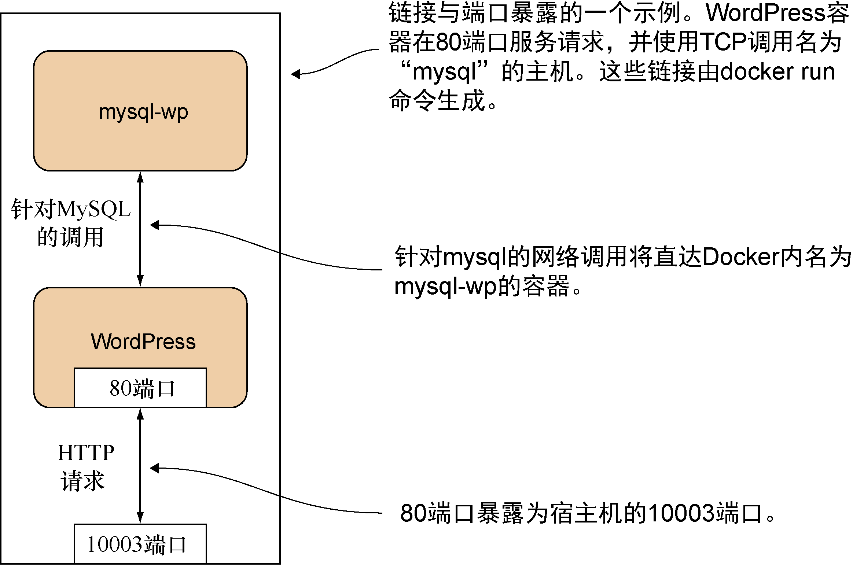

### 技巧8　链接容器实现端口隔离

在技巧7中，你已经知道如何让容器通过用户自定义网络进行通信。不过，存在一项更老的声明容器通信的方法——Docker的link标志。这已经不再是推荐的工作方式，不过在很长一段时间中它曾是Docker的一部分，因此还是值得注意的，以免你在外碰到它。

#### 问题

不使用用户自定义网络，让容器之间进行通信。

#### 解决方案

使用Docker的链接功能可以让容器彼此通信。

继续安装WordPress的任务，我们将把MySQL数据库层从WordPress容器中分离出来，并将它们链接在一起，且不需要进行端口配置。图2-8展示了最终状态的概览。


<center class="my_markdown"><b class="my_markdown">图2-8　使用链接容器设置WordPress</b></center>


**注意**

既然已经可以将端口公开给宿主机来使用，为什么还要用链接？链接可以让用户封装并定义容器间的关系，而无须将服务公开给宿主机网络（即可能公开给外界）。用户可能会因为安全因素而这么做。


运行容器，可按照以下顺序执行，并在第一条和第二条命令之间暂停大约1分钟：

```c
$ docker run --name wp-mysql \
　-e MYSQL_ROOT_PASSWORD=yoursecretpassword -d mysql
$ docker run --name wordpress \
　--link wp-mysql:mysql -p 10003:80 -d wordpress
```

首先将MySQL容器命名为 `wp-mysql` ，用于在后面引用它。还需要提供一个环境变量以便MySQL容器可以初始化数据库（ `-e MYSQL_ROOT_PASSWORD=yoursecretpassword` ）。两个容器都以守护进程方式运行（ `-d` ），同时使用了Docker Hub上官方MySQL镜像的引用。

在第二个命令中，将WordPress容器命名为 `wordpress` ，以备后面引用它。同时将wp-mysql容器链接到WordPress容器中（ `--link wp-mysql:mysql` ）。在WordPress容器内对mysql服务器的引用将被发送到名为 `wp-mysql` 的容器中。如技巧6所述，使用了一个本地端口映射（ `-p 10003:80` ），并添加了Docker Hub上官方WordPress镜像（ `wordpress` ）的引用。请注意，链接不会等待被链接容器启动，因此才有在命令之间暂停的指示。完成这一步更精确的方法是，在运行WordPress容器之前，在 `docker logs wp-mysql` 的输出中查找 `mysqid: ready for connections` 。

如果现在浏览http://localhost:10003，将会看到WordPress介绍画面，并可设置这个WordPress实例。

这个示例的关键在于第二条命令里的 `--link` 标志。这个标志会设置容器的host文件以便WordPress容器能够引用MySQL服务器，这将被路由到具有“ `wp-mysql` ”名称的容器。这有很大的好处，即无须对WordPress容器做任何改动，就可以将不同的MySQL容器交换进来，使不同服务的配置管理变得更简单。


**注意**

容器必须以正确的顺序启动，以便能对已经存在的容器名称做映射。截至编写本书时，Docker不具备动态解析链接的功能。


为了使用这种方式链接容器，在构建镜像时必须指定公开容器的端口。这可以通过在镜像构建的Dockerfile中使用 `EXPOSE` 命令来达成。Dockerfile中 `EXPOSE` 指令中所列出的端口同样将用在 `docker run` 命令 `-P` 标志（“公布所有端口”，与之相对的 `-p` 将公布指定端口）中。

以一个特定的顺序启动不同的容器，这就是Docker编排的一个简单示例。Docker编排是协调Docker容器运行的进程。它是本书第四部分将深入探讨的一个重大且重要的课题。

通过将工作负载分散到独立的容器里，你就已经将应用的微服务架构推进了一步。在这个例子中，可以在不影响WordPress容器的同时对MySQL容器进行操作，反之亦然。这种对运行中服务的细粒度控制是微服务架构的关键的运维优势之一。

#### 讨论

这种针对一组容器的精准控制并不总是必需的，但它作为一个非常直截了当且易于思考的容器交换方式是非常有用的。例如，在本技巧的示例中，你可能想测试一个不同的MySQL版本——WordPress镜像不需要知道任何与此有关的事情，因为它只需要查找mysql链接即可。

