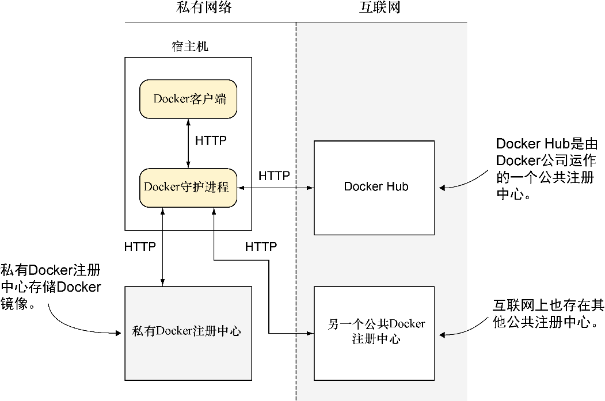

### 2.4　Docker注册中心

一旦创建了镜像，读者可能就想与其他用户分享它。这是Docker注册中心概念的所在。

图2-9中的3个注册中心差别在于它们的可访问性。一个处于私有网络上，一个开放在公共网络中，而另一个是公共的但只有注册用户才能使用Docker访问。它们全部使用相同的API完成相同的功能，这就是Docker守护进程知道怎样与它们进行相互通信的方式。

Docker注册中心允许多个用户使用REST风格API将镜像推送到一个中央存储中，也可以从中拉取镜像。

与Docker自身一样，注册中心代码也是开源的。很多公司（如我们公司）建立了私有注册中心在内部存储和共享专有的镜像。这是在我们进一步说明Docker公司的注册中心之前，我们将要讨论的东西。

<b class="my_markdown">图2-9　一个Docker注册中心</b>

