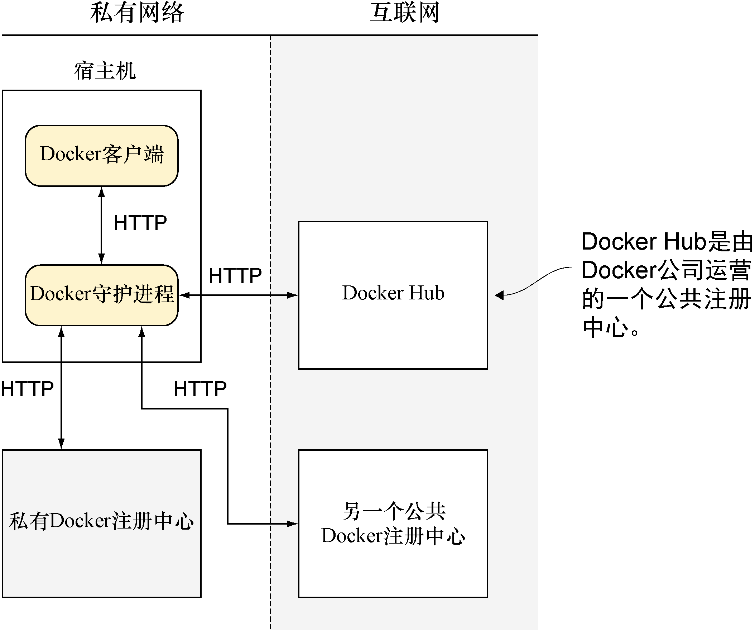

### 2.5　Docker Hub

Docker Hub（见图2-10）是由Docker公司维护的一个注册中心。它拥有成千上万个镜像可供下载和运行。任何Docker用户都可以在上面创建免费账号，并存储公共Docker镜像。除了用户提供的镜像，上面还维护着一些作为参考的官方镜像。

<b class="my_markdown">图2-10　Docker Hub</b>

镜像受用户认证的保护，同时具有一个与GitHub类似的支持率打星系统。这些官方镜像的表现形式可能是Linux发行版（如Ubuntu或Cent OS）、预装软件包（如Node.js）或完整的软件栈（如WordPress）。

