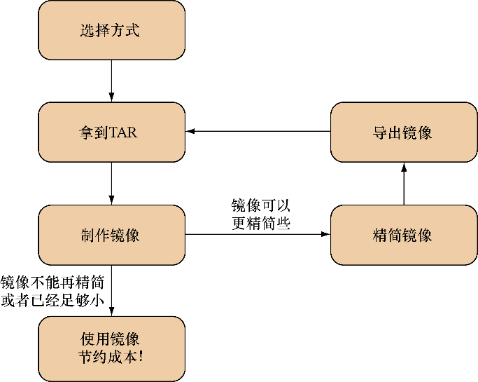

### 技巧11　将虚拟机转换为容器

Docker Hub上并没有囊括所有的基础镜像，因此，针对一些小众的Linux发行版和用例，人们可能需要创建自己的镜像。例如，用户已经在一台虚拟机里运行了一个应用，想把它放到Docker里迭代，或者通过使用现有的一些工具和相关技术从Docker生态系统中获益。

在理想情况下，用户会想使用标准的Docker技术，如一些结合了标准配置管理工具（见第7章）的Dockerfile，从头开始构建一个等同于虚拟机的容器。然而，现实情况是，很多虚拟机都没有被仔细地实施过配置管理。这一点的确可能发生，因为一台虚拟机从人们开始用它的时候起会不断地演进，而以一个更加结构化的方式重新创建它的话，从成本上来说是不值得的。

#### 问题

有一台虚拟机，想要将其转换成一个Docker镜像。

#### 解决方案

归档和复制虚拟机文件系统，随后将其打包到一个Docker镜像。

首先，我们可以将虚拟机划分为两大类。

+ 本地虚拟机——虚拟机磁盘镜像放在本地，虚拟机的执行操作发生在用户的计算机上。
+ 远程虚拟机——虚拟机磁盘镜像存储在远程，虚拟机的执行操作发生在其他地方。

这两类虚拟机（以及其他任何用户想为之创建Docker镜像的虚拟机）在原则上是一致的——需要拿到整个文件系统的TAR，然后用 `ADD` 命令将TAR文件加到scratch镜像的 `/` 。


**提示**

在镜像中包含 `ADD` 命令时，Dockerfile的 `ADD` 命令（不像它的兄弟命令 `COPY` ）会自动将TAR文件（gzip压缩过的文件以及其他一些类似的文件类型也是如此）解压出来。


**提示**

scratch镜像是一个零字节虚拟镜像，用户可以基于此构建其他镜像。一般来说，它适用于想用一个Dockerfile复制（或添加）一个完整文件系统的情况。


现在，让我们先来看看用户有一台本地Virtualbox虚拟机的情况。

在开始之前，首先需要完成下列任务：

+ 安装 `qemu-nbd` 工具（在Ubuntu上是作为 `qemu-utils` 包的一部分提供的）；
+ 定义虚拟机的磁盘镜像的路径；
+ 关闭虚拟机。

如果用户的虚拟机磁盘镜像是.vdi或.vmdk格式，这一技巧应该会很奏效。其他格式则可能成败参半。代码清单3-1展示了该如何将用户的虚拟机文件转换成一个虚拟磁盘，这样一来就可以从这里复制出所有文件。

代码清单3-1　提取一个虚拟机镜像的文件系统

```c
$ VMDISK="$HOME/VirtualBox VMs/myvm/myvm.vdi"　　⇽---　设置一个环境变量指向用户的虚拟机磁盘镜像
$ sudo modprobe nbd　　⇽---　初始化一个qemu-nbd需要的内核模块
$ sudo qemu-nbd -c /dev/nbd0 -r $VMDISK3　　⇽---　将虚拟机的磁盘连接到一个虚拟设备节点
$ ls /dev/nbd0p*　　⇽---　列出这块磁盘上可以挂载的分区号
/dev/nbd0p1 /dev/nbd0p2 
$ sudo mount /dev/nbd0p2 /mnt　　⇽---　通过qemu-nbd把选择的分区挂载到/mnt
$ sudo tar cf img.tar -C /mnt . 　　⇽---　从/mnt创建一个名为img.tar的TAR文件
$ sudo umount /mnt && sudo qemu-nbd -d /dev/nbd0　　⇽---　卸载分区然后用qemu-nbd清理
```


**注意**

要选择挂载的分区，可以执行 `sudo cfdisk /dev/nbd0` 来查看可选项。注意，如果看到了LVM选项，也就意味着磁盘采用的不是普通的分区方案，关于如何挂载LVM分区，用户将需要做一些额外的调研。


如果是远程虚拟机，用户需要作出一个选择：要么关掉虚拟机并让运维团队介入，转储分区文件，要么在虚拟机运行的状态下为它创建一个TAR。

如果用户拿到的是分区转储文件，就可以很轻松地进行挂载，然后按照代码清单3-2中给出的命令把它转换成一个TAR文件。

代码清单3-2　提取一个分区

```c
$ sudo mount -o loop partition.dump /mnt
$ sudo tar cf $(pwd)/img.tar -C /mnt .
$ sudo umount /mnt
```

另外，也可以选择从一个正在运行的系统创建TAR文件。在登录到系统后可以轻松实现这一点，如代码清单3-3所示。

代码清单3-3　提取一个正在运行的虚拟机的文件系统

```c
$ cd /
$ sudo tar cf /img.tar --exclude=/img.tar --one-file-system /
```

至此，用户拿到了文件系统镜像的TAR，紧接着可以通过 `scp` 把它发送到其他机器。


**警告**

从一个正在运行的系统创建TAR看上去可能是最简单的方案（没有关机，不需要安装软件或请求别的团队），但是它也存在一些弊端——用户复制出来的文件可能存在状态不一致的情况，并且可能会在试用制作出来的新的Docker镜像时遇到一些莫名其妙的问题。如果只能这样做，那就尽可能多地停掉一些应用和服务。


一旦拿到了文件系统的TAR，用户便可以将其添加到镜像里。这一过程再简单不过了，它是由代码清单3-4所示的两行代码的Dockerfile组成的。

代码清单3-4　将归档文件添加到Docker镜像里

```c
FROM scratch
ADD img.tar /
```

现在可以执行 `docker build .` ，然后便能得到自己的镜像了！


**注意**

除了 `ADD` ，Docker还提供了一个替代的 `docker import` 形式的命令，可以使用 `cat img.tar | docker import - new_image_name` 来导入文件。然而，即便选择在构建镜像时附带一些额外的指令，用户仍然始终需要创建一个Dockerfile。因此，使用 `ADD` 命令可能会更简单一些，也可以轻松地看到镜像的历史。


现在，因为在Docker里已经有了一个镜像，所以我们可以开始用它来做一些实验了。在本例中，用户可能会从基于新镜像创建一个新的Dockerfile开始，通过剥离文件和软件包来实验。

一旦完成了这一点并且得到了满意的结果，紧接着便可以在运行中的容器上用 `docker export` 导出一个新的、更小巧的TAR，用户可以把它用作新一层镜像的基础，然后重复这一过程直到用户对得到的镜像满意为止。

图3-1中的流程图展示了这一过程。


<center class="my_markdown"><b class="my_markdown">图3-1　容器的“瘦身”过程</b></center>

#### 讨论

本技巧演示了一些基本原理和技术，这些原理和技术在将VM转换为Docker镜像之外的上下文中非常有用。

更宽泛地讲，它表明Docker镜像本质上是一组文件和一些元数据：scratch镜像是一个空文件系统，可以在上面叠放一个TAR文件。在我们讨论如何精简镜像时，我们将回到这个主题。

更具体地说，用户已经了解了如何将TAR文件添加到Docker镜像，以及如何使用 `qemu-nbd` 工具。

获得镜像后，用户可能需要知道如何像更传统的主机一样运行它。由于Docker容器通常只运行一个应用程序进程，这样做可能有点影响产出，我们将在技巧12中介绍。

