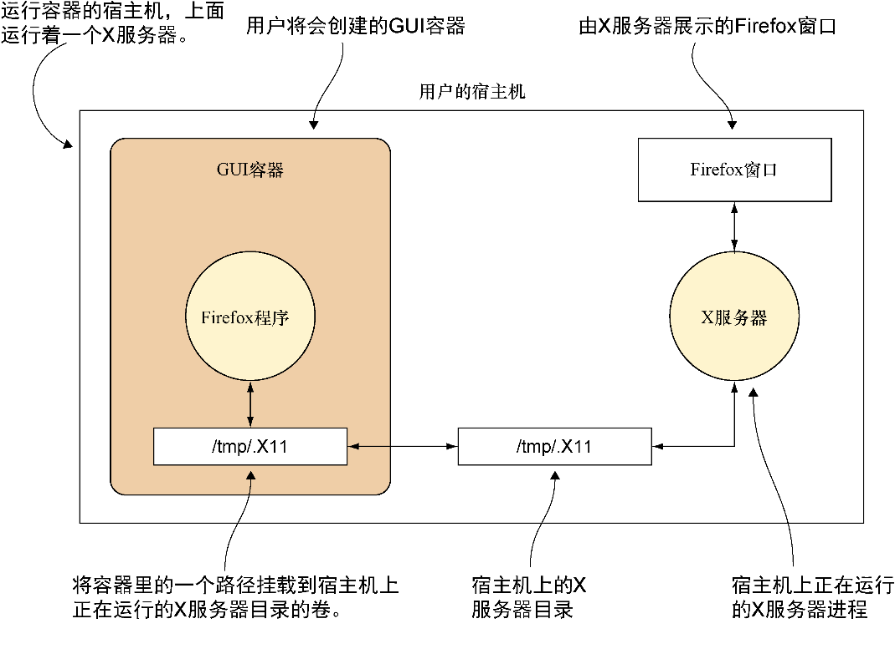

### 技巧29　在Docker里运行GUI

在技巧19里我们已经介绍过如何在一个Docker容器里借助一个VNC服务器来提供GUI服务。这是查看Docker容器里的应用的一种办法，而且它是自给自足的，只需要用到一个VNC客户端。

幸运的是，这里还有一个更加轻便而且集成度更高的方法在桌面上运行GUI应用，但是它需要用户执行更多的设置。它会挂载管理和X服务器通信的宿主机上的目录，以便容器可以访问。

#### 问题

想要能够在容器里运行GUI应用，就像它们是普通的桌面应用那样。

#### 解决方案

创建一个带有用户凭证和程序的镜像，然后将X服务器绑定挂载到镜像里。

图5-1展示了最终设置是如何工作的。


<center class="my_markdown"><b class="my_markdown">图5-1　和宿主机上的X服务器通信</b></center>

容器通过挂载宿主机上的/tmp/.X11目录链接到了宿主机，这也是容器在宿主机的桌面上执行操作的方式。

首先，我们需要在一个方便的地方创建一个新目录，然后用 `id` 命令来确定用户ID和组ID，如代码清单5-1所示。

代码清单5-1　设置一个目录并找出用户的详细信息

```c
$ mkdir dockergui
$ cd dockergui
$ id　　⇽---　获取Dockerfile需要的用户信息
 uid=1000(dockerinpractice) \　　⇽---　记下用户ID（uid）。在这个例子里是1000
 gid=1000(dockerinpractice) \　　⇽---　记下组ID（gid）。在这个例子里是1000
 groups=1000(dockerinpractice),10(wheel),989(vboxusers),990(docker)
```

现在，如代码清单5-2所示，创建一个名为Dockerfile的文件。

代码清单5-2　一份Dockerfile里的Firefox

```c
FROM ubuntu:14.04
RUN apt-get update
RUN apt-get install -y firefox　　⇽---　安装一个Firefox作为GUI应用。用户可以把这个改成所需的任何应用
RUN groupadd -g GID USERNAME　　⇽---　把宿主机上的用户组加到镜像里。将GID换成期望的组ID，USERNAME换成期望的用户名
RUN useradd -d /home/USERNAME -s /bin/bash \
-m USERNAME -u UID -g GID　　⇽---　把用户账号加到镜像里。将USERNAME换成期望的用户名，UID换成期望的用户ID，然后GID换成期望的用户组ID
USER USERNAME　　⇽---　镜像的运行用户应当是刚创建的那个。将USERNAME换成期望的用户名
ENV HOME /home/USERNAME　　⇽---　设置HOME变量。将USERNAME换成期望的用户名
CMD /usr/bin/firefox　　⇽---　默认启动Firefox
```

现在用户可以基于这份Dockerfile构建镜像并给它的产出结果打上“gui”标签：

```c
$ docker build -t gui .
```

按照如下方式运行该容器：

```c
docker run -v /tmp/.X11-unix:/tmp/.X11-unix \　　⇽---　将X服务器目录绑定挂载到容器里
 -h $HOSTNAME -v $HOME/.Xauthority:/home/$USER/.Xauthority \　　⇽---　将容器里的DISPLAY变量值设置成和宿主机上用到的那个保持一致，这样程序就知道该和哪个X服务器通信
 -e DISPLAY=$DISPLAY gui　　⇽---　为容器提供一个合适的凭证
```

你会看到一个Firefox窗口弹出！

#### 讨论

可以使用本技巧来避免将桌面工作和开发工作混淆在一起。以Firefox为例，出于测试目的，用户可能希望以一种可重复的方式查看在没有Web缓存、书签或者搜索历史记录的情况下应用程序的行为。如果用户在尝试启动镜像运行Firefox时看到相关的无法打开显示器的错误消息，参考技巧65，通过其他方式让容器启动一个可以在宿主机上展示的图形应用程序。

我们了解到，有些人在Docker中几乎运行了全部的应用，包括游戏！尽管我们不会走这么远，但是了解一些用户看到的有些人可能已经遇到过的问题也很有价值。

