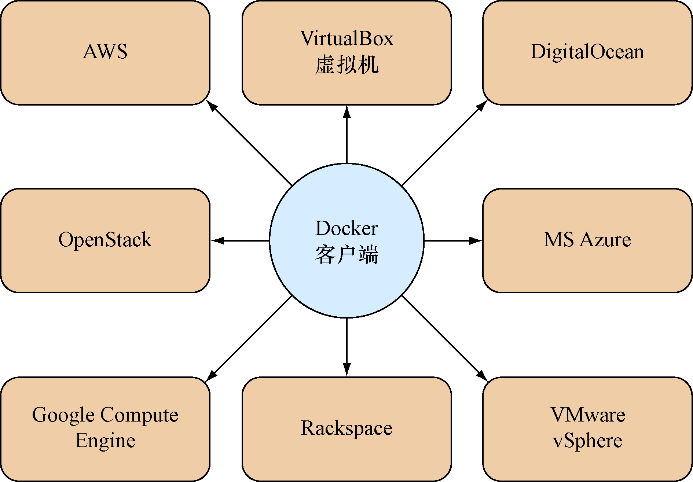

### 技巧32　使用Docker Machine置备Docker宿主机

在本地机器上设置Docker可能不是很困难——为了方便起见用户可以使用一个脚本，或者用户可以使用一些命令给软件包管理器添加适当的源。但是，当用户尝试管理其他宿主机上的Docker安装时，这个过程可能就会显得有些多余。

#### 问题

用户想要在其他单独的Docker宿主机上启动容器。

#### 解决方案

使用Docker Machine是管理远程机器上Docker安装的官方解决方案。

如果用户需要在多台外部宿主机上运行Docker容器，本技巧将会非常有用。用户可能出于多种原因而希望这样做：通过在自己的物理主机上置备一台虚拟机来测试Docker容器之间的联网功能；通过一个VPS供应商在一台性能更强的机器上置备容器；冒着破坏宿主机的风险进行一些疯狂实验；拥有在多个云厂商之间选择的能力。无论出于何种原因，Docker Machine可能都是用户的最佳选择。它也是通往像Docker Swarm等更复杂的编排工具的门户。

##### 1．什么是Docker Machine

Docker Machine主要是一个便利程序。它将大量配置外部宿主机的指令包装起来，然后将它们转换为一些易于上手使用的命令。

如果你熟悉Vagrant，那么会有类似的感觉：通过提供一致的界面，用户可以更加轻松地置备和管理其他机器环境。不妨回想一下第2章里面关于Docker架构的概述，理解Docker Machine的其中一种视角便是设想它有助于通过一个客户端管理不同的Docker守护进程（见图5-2）。


<center class="my_markdown"><b class="my_markdown">图5-2　Docker Machine作为外部宿主机的一个客户端</b></center>

图5-2里的Docker宿主机供应商列表并不完整，而且这个清单可能会不断增加。在撰写本书时，有如下驱动是可用的，这些驱动程序允许用户从给定的主机供应商置备机器：

+ Amazon Web Services；
+ DigitalOcean；
+ Google Compute Engine ；
+ IBM SoftLayer；
+ Microsoft Azure；
+ Microsoft Hyper-V；
+ OpenStack；
+ Oracle VirtualBox；
+ Rackspace；
+ VMware Fusion；
+ VMware vCloud Air；
+ VMware vSphere。

视每个驱动所提供的功能的不同，置备一台机器时必须指定的参数也存在很大差异。一方面，和Openstack的17个参数相比，在用户的机器上置备一台Oracle VirtualBox虚拟机的 `create` 指令只有3个参数。


**注意**

这里有必要说明的是，Docker Machine并不是针对Docker实现的任何集群解决方案。其他工具（如Docker Swarm）落实了这项功能，我们将在后面部分讨论。


##### 2．安装

安装过程只用到一个简单的二进制文件。Docker的GitHub上提供了不同系统架构下的下载链接和安装指令。


**注意**

由于下载下来的文件，名字一般会带上一个较长的二进制文件所属系统架构的后缀，继续操作之前，用户可能需要把下载好的二进制文件挪到一个标准路径下，如/usr/bin，然后确保它被重命名或软链接到了 `docker-machine` 。


##### 3．使用Docker Machine

为了演示Docker Machine的使用，用户首先需要创建一台装有Docker守护进程的虚拟机，用于后续工作。


**注意**

用户需要安装Oracle的VirtualBox才能继续工作。绝大多数包管理器应该都支持安装它。


```c
$ docker-machine create --driver virtualbox host1　　⇽---　使用docker-machine的create子命令来创建新的宿主机并通过--driver标志来指定它的类型。宿主机被命名为host1
INFO[0000] Creating CA: /home/imiell/.docker/machine/certs/ca.pem
INFO[0000] Creating client certificate:
➥ /home/imiell/.docker/machine/certs/cert.pem
INFO[0002] Downloading boot2docker.iso to /home/imiell/.docker/machine/cache/
➥ boot2docker.iso...
INFO[0011] Creating VirtualBox VM...
INFO[0023] Starting VirtualBox VM...
INFO[0025] Waiting for VM to start...
INFO[0043] "host1" has been created and is now the active machine. 　　⇽---　用户的机器已经完成创建
INFO[0043] To point your Docker client at it, run this in your shell:
➥ $(docker-machine env host1) 　　⇽---　执行这条命令来设置DOCKER_HOST环境变量，它会设置Docker命令运行时默认的宿主机
```

Vagrant用户在这里会找到家的感觉。通过运行这些命令，用户得以创建一台可以在上面管理Docker的机器。如果用户按照下面输出里给出的指令操作，你将可以直接通过SSH登录到新建的虚拟机里：

```c
 $ eval $(docker-machine env host1) 　　⇽---　$()会获取docker-machine env命令的输出结果，然后将它们应用到用户的环境里。docker-machine env会输出一组命令，用户可以用来设置执行Docker命令的默认宿主机
 $ env | grep DOCKER　　⇽---　所有环境变量的名称都以DOCKER_作为前缀
 DOCKER_HOST=tcp://192.168.99.101:2376　　⇽---　 DOCKER_HOST变量设置的是虚拟机上Docker守护进程的端点地址
 DOCKER_TLS_VERIFY=yes　　⇽---　 
 DOCKER_CERT_PATH=/home/imiell/.docker/machine/machines/host1　　⇽---　这些变量处理和新的宿主机之间连接的安全性
 DOCKER_MACHINE_NAME=host1
$ docker ps -a　　⇽---　 docker命令如今指向用户创建的虚拟机，而不再是之前使用的主机。用户在新的虚拟机上没有创建任何的容器，因此这里没有输出
 CONTAINER ID   IMAGE    COMMAND   CREATED     STATUS   PORTS       NAMES
$ docker-machine ssh host1　　⇽---　 ssh子命令会将用户直接带到新的虚拟机上
                            ##        .
                     ## ## ##       ==
                  ## ## ## ##      ===
              /""""""""""""""""\___/ ===
         ~~~ {~~ ~~~~ ~~~ ~~~~ ~~ ~ / ===- ~~~
              \______ o          __/
                \    \        __/
                 \____\______/
 _             _   ____     _          _
| |__ ___ ___ | |_|___ \ __| | ___ ___| | _____ _ __
| '_ \ / _ \ / _ \| __| __) / _` |/ _ \ / __| |/ / _ \ '__|
| |_) | (_) | (_) | |_ / __/ (_| | (_) | (__| < __/ |
|_.__/ \___/ \___/ \__|_____\__,_|\___/ \___|_|\_\___|_|
Boot2Docker version 1.5.0, build master : a66bce5 -
      Tue Feb 10 23:31:27 UTC 2015
Docker version 1.5.0, build a8a31ef
docker@host1:~$
```

##### 4．管理宿主机

从一台客户端机器管理多台Docker宿主机可能会让追踪当前状况变得困难。Docker Machine 附带了各种管理命令，让这件事情变得更加简单，如表5-2所示。

<center class="my_markdown"><b class="my_markdown">表5-2　docker-machine的命令列表</b></center>

| 子 命 令 | 行 为 |
| :-----  | :-----  | :-----  | :-----  |
| `c reate` | 创建一台新的机器 |
| `ls` | 列出Docker宿主机 |
| `stop` | 停止机器 |
| `start` | 启动机器 |
| `restart` | 停止并随后启动机器 |
| `rm` | 销毁一台机器 |
| `kill` | “杀死”一台机器 |
| `inspect` | 以JSON的格式返回机器的元数据 |
| `config` | 返回连接机器所需的配置信息 |
| `ip` | 返回一台机器的IP地址 |
| `url` | 返回一台机器上Docker守护进程的URL |
| `upgrade` | 将宿主机上的Docker升级到最新版本 |

下面的例子列出了两台机器。活跃的那台机器上标有一个星号，并且具有一个相关联的状态，类似于容器或进程的状态：

```c
$ docker-machine ls
NAME   ACTIVE  DRIVER      STATE    URL                         SWARM
host1          virtualbox  Running  tcp://192.168.99.102:2376
host2  *       virtualbox  Running  tcp://192.168.99.103:2376
```


**提示**

用户可能想知道如何切换回原始主机上的Docker实例。在编写本书时，我们还没有找到一种简单的办法实现这一点。用户可以使用 `docker-machinerm` 来删除所有机器，或者如果这个方案行不通，用户也可以通过 `unset DOCKER_HOST DOCKER_TLS_VERIFY DOCKER_CERT_PATH` 手动取消之前设置的环境变量。


#### 讨论

用户可以将这个过程看作是把机器变成进程，就像Docker本身把环境变成像进程那样。

使用Docker Machine设置在多台宿主机上手动管理容器的做法听上去可能很诱人，但是如果用户发现自己要手动删除容器，重建它们，然后在代码更改完后把它们重新启动，我们建议你看一下本书的第四部分。像这样烦琐的任务可以很好地通过计算机来完成。技巧87涵盖了Docker公司提供的官方解决方案，它可以用于创建一个面向容器的自动化集群。如果用户喜欢一个集群的统一视图的概念，但是又希望保留容器最后运行位置的最终控制权，那么技巧84可能会很有吸引力。

