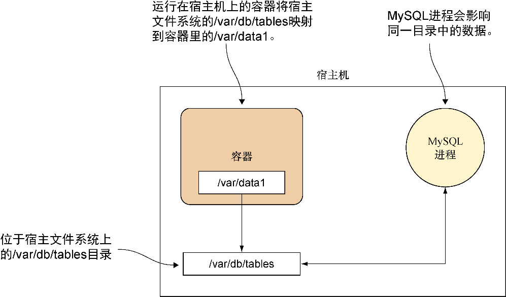

### 技巧34　Docker卷——持久化的问题

容器的大部分力量源自它们能够尽可能多地封装运行时环境里的文件系统状态，这一点的确很有用处。

然而，有时候用户并不想把文件放到容器里。用户可能想要在容器之间共享或者单独管理一些大文件。一个经典的例子便是想要在容器里访问一个大型的集中式数据库，但是又希望其他的（也许是更传统的）客户端也能和新容器一样访问它。

解决方案便是 **卷** ，一种Docker用来管理容器生命周期之外的文件的机制。尽管这有悖于容器“可以在任意地方部署”的原则（例如，用户将无法在不兼容数据库挂载的地方部署有数据库依赖的容器），但是在实际的Docker使用中这仍然是一个很有用的功能。

#### 问题

想要在容器里访问宿主机上的文件。

#### 解决方案

使用Docker的volume标志，在容器里访问宿主机上的文件。图5-3演示了使用volume标志和宿主机上的文件系统交互的例子。

下面的命令展示了如何将宿主机上的/var/db/tables目录挂载到容器里的/var/data1目录，该命令在图5-3里启动容器时被执行：

```c
$ docker run -v /var/db/tables:/var/data1 -it debian bash
```


<center class="my_markdown"><b class="my_markdown">图5-3　容器里的一个数据卷</b></center>

`-v` 标志（ `--volume` 的简写）表示容器指定的一个外部卷。随后的参数以冒号分隔两个目录的形式给出了卷的挂载配置，告知Docker将外部的/var/db/tables目录映射到容器里的/var/data1目录。外部目录和容器目录两者任一不存在的话均会被创建。

对已经存在的目录建立映射时要小心。即便镜像里已经存在需要映射的目录，该目录依旧会映射到宿主机上的对应目录。这意味着容器里映射目录的原本内容将会消失。如果用户试图映射一个关键目录，将会发生一些有趣的事情！例如，试试挂载一个空目录到/bin。

另外要注意的一点是，Dockerfile里的卷被设定为不是持久化的。如果用户添加了一个卷，然后在一个Dockerfile里对该目录做了一些更改，那么这些变化将不会被持久化到最终生成的镜像里。


**警告**

如果宿主机上有运行SELinux，可能会遇到一些问题。如果SELinux的策略是enforced，容器可能会无法写入数据到/var/db/tables目录。用户将会看到一个“permission denied”的报错。要想解决这个问题，必须联系系统管理员（如果有）或者关掉SELinux（仅用于开发目的）。查看技巧113可以了解关于SELinux的更多内容。


#### 讨论

在单个容器里做实验时把宿主机上的文件公开到容器里是我们经常执行的操作之一——容器本来就是临时性的，在花费大量时间处理某些文件后很容易把它弄丢。因此，可以的话最好是确信文件都是安全的。

这样做还有一个好处，那便是技巧114里提到的把文件复制到容器里的方法带来的正常开销不复存在。如果像技巧77提到的数据库变得很大，它们显然也会是受益者。

最后还有一点，用户将会看到不少技巧里用到了 `-v /var/run/docker.sock:/var/run/docker.sock` ，技巧45就是其中的一个。这样做会把特殊的Unix套接字文件公开到容器里，并且展示出此项技巧的一个重要功能——用户不必局限于所谓的“常规”文件，还可以应用更多不常见的文件系统层面的用例。但是，如果用户遇到设备节点的权限问题（举个例子），可能需要参考技巧93，了解一下 `--privileged` 标志的作用。

