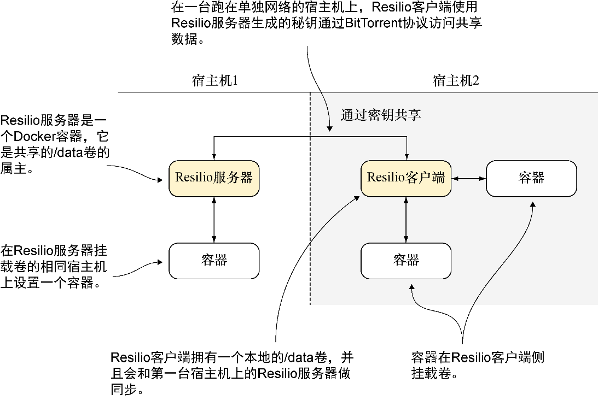

### 技巧35　通过Resilio Sync实现的分布式卷

在一个团队里试用Docker时，用户可能希望能够在团队成员之间共享大量的数据，但是可能又没办法为共享服务器申请到足够容量的资源。对此最懒的解决办法便是在需要它们的时候从其他团队成员那里复制最新的文件——对规模更大的团队来说很快便会失控。

解决方案便是用一个去中心化的工具来共享文件——无须专门的资源。

#### 问题

想要在互联网上跨宿主机共享卷。

#### 解决方案

使用一项叫Resilio的技术在互联网上共享数据卷。图5-4展示了达成这一目标所需的设置。


<center class="my_markdown"><b class="my_markdown">图5-4　使用Resilio</b></center>

最终结果便是一个数据卷（ `/data` ）可以很方便地通过互联网同步数据，而无须进行任何复杂的设置。

在用户的主服务器上，执行如下命令来设置第一台宿主机上的容器：

```c
[host1]$ docker run -d -p 8888:8888 -p 55555:55555 \　　⇽---　将已经发布的ctlc/btsync镜像作为一个常驻容器运行，调用btsync二进制文件，然后开放所需的端口
 --name resilio ctlc/btsync
$ docker logs resilio　　⇽---　获取resilio容器的输出结果，以便可以记下它的秘钥
 Starting btsync with secret: \
 ALSVEUABQQ5ILRS2OQJKAOKCU5SIIP6A3　　⇽---　记下秘钥的内容——运行结果可能会有所不同
 By using this application, you agree to our Privacy Policy and Terms.
http://www.××××××/privacy
http://www.××××××/terms-of-use
total physical memory 536870912 max disk cache 2097152
Using IP address 172.17.4.121
[host1]$ docker run -i -t --volumes-from resilio \　　⇽---　启动一个交互容器并挂载resilio服务器的卷
 ubuntu /bin/bash
$ touch /data/shared_from_server_one　　⇽---　把一个文件加到/data卷
$ ls /data
shared_from_server_one
```

在第二台服务器上，打开一个终端然后执行如下命令做卷的同步：

```c
[host2]$ docker run -d --name resilio-client -p 8888:8888 \
 -p 55555:55555 \
 ctlc/btsync ALSVEUABQQ5ILRS2OQJKAOKCU5SIIP6A3　　⇽---　带上host1上运行的守护进程生成的秘钥，以守护进程的方式启动一个resilio客户端容器
[host2]$ docker run -i -t --volumes-from resilio-client \
ubuntu bash　　⇽---　启动一个交互式容器，从客户端守护进程挂载数据卷
 $ ls /data
 shared_from_server_one　　⇽---　 host1上创建的文件被传送到了host2
 $ touch /data/shared_from_server_two　　⇽---　在host2上创建一个二号文件
 $ ls /data
 shared_from_server_one shared_from_server_two
```

回到host1上运行的容器，用户应该可以看到文件已经完成了宿主机之间的同步，它和第一份文件完全相同：

```c
[host1]$ ls /data
shared_from_server_one shared_from_server_two
```

#### 讨论

这些文件的同步没有时序保证，因此用户可能不得不等待数据同步完成，尤其是在文件较大的情况下。


**警告**

由于数据是通过互联网传输的，而且是由一个无法管控的协议来处理的，因此如果有任何安全性、扩展性或性能要求，最好不要依赖这个技巧。


正如一开始所提到的那样，我们仅演示了本技巧可以在两个容器间工作，但是它应该也可以在一个拥有许多成员的团队里起作用。除了明显的不适合版本控制的大文件用例外，分发的可选对象还包括备份，可能还包括Docker镜像本身，特别是这项技巧搭配一个有效的压缩机制（如技巧72所展示的那样）的情况。为了避免冲突，请确保镜像始终沿着一个方向传输（举个例子，从一台构建机器到多台服务器），或者遵循一个约定俗成的流程执行更新。

