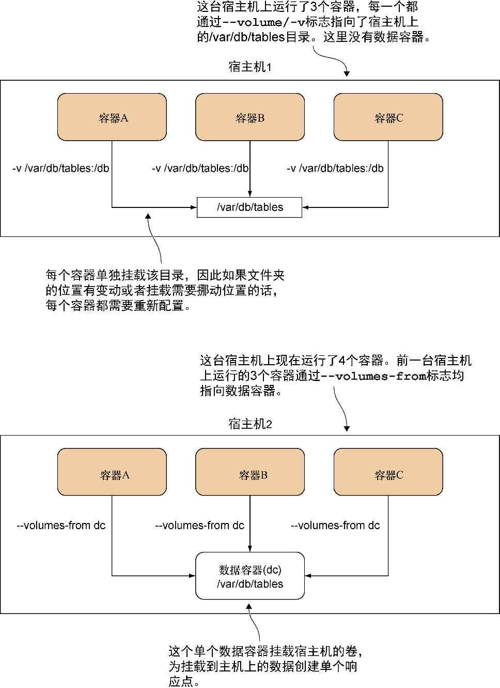

### 技巧37　数据容器

如果在一台宿主机上大量用到卷，容器启动的管理可能会变得很麻烦。用户可能也希望用Docker来专门管理数据，而不是通过宿主机进行访问。更干净地管理这些东西的一种办法便是使用纯数据容器（data-only container）的设计模式。

#### 问题

想要在容器里使用一个外部卷，但是希望只允许Docker访问这些文件。

#### 解决方案

启动一个数据容器，然后在运行其他容器时带上 `--volumes-from` 标志。

图5-5展示了数据容器模式的结构，并且解读了它的工作原理。有个要注意的关键点是，在第二台宿主机里，容器并不需要知道数据位于磁盘的哪个具体位置。它们只需要知道数据容器的名字，一切便准备就绪。这样做可以使容器的操作更加具备可移植性。

与直接映射宿主机目录的方式相比，这个方案的另一个好处是这些文件的访问是由Docker管理的，这也就意味着不太可能出现非Docker进程影响其内容的情况。


**注意**

一个常常让人困惑不解的问题便是纯数据容器是否需要运行起来。答案是，不需要！它只需要存在，在宿主机上运行过，而且没有被删除。


让我们通过一个简单的例子直观地展示一下该如何使用这一技巧。首先，运行一个数据容器：

```c
$ docker run -v /shared-data --name dc busybox \
 touch /shared-data/somefile
```

`-v` 参数并没有将卷映射到一个宿主机目录，因此它将会在这个容器的管辖范围内创建一个目录。这个目录通过 `touch` 填充了一个文件，然后容器立刻退出了—— 一个数据容器在使用的时候不需要处于运行状态。我们使用了一个小而实用的busybox镜像来减少我们数据容器所需的额外成本。


<center class="my_markdown"><b class="my_markdown">图5-5　数据容器模式</b></center>

然后便可以运行其他容器来访问刚创建的文件：

```c
docker run -t -i --volumes-from dc busybox /bin/sh
/ # ls /shared-data
somefile
```

#### 讨论

`--volumes-from` 标志允许用户通过把它们挂载到当前容器的形式来引用数据容器里的文件——只需要传入定义卷的容器ID即可。busybox镜像里没有bash，因此必须启动一个简化版shell来确认dc容器里的/shared-data目录对用户而言是的确可用的。

用户可以启动任意数量的容器，它们都从指定数据容器的卷里做读和写。

要用卷就无须使用这个模式——读者可能会发现这个方案比直接挂载一个宿主机目录管理起来要更困难些。但是，如果想要将管理数据的职责完全委派给Docker进行单点管理而不受其他宿主机进程干扰，数据容器也许能够满足这一需求。


**警告**

如果应用程序从多个容器写日志到同一数据容器，很重要的一点便是要确保每个容器日志文件写入的是一个唯一的文件路径。如果无法确保这一点，不同的容器便有可能覆盖或截断该文件，从而造成数据的丢失，或者可能写入的数据是交错混杂的，这就很难解析文件中的内容。类似地，如果对数据容器调用 `--volumes-from` ，就是允许该容器潜在地覆盖自己的目录，因此也要小心这里的命名冲突。


重要的是要了解，采用这种模式可能会导致占用大量的磁盘空间，而且调试起来可能相对困难些。由于Docker仅在数据容器里管理该卷，并且在引用该数据卷的最后一个容器退出时也不会把卷删掉，因此任何放到卷里的数据都将得到保留。这是为了防止意外的数据丢失。关于管理这项操作的建议，参见技巧43。

