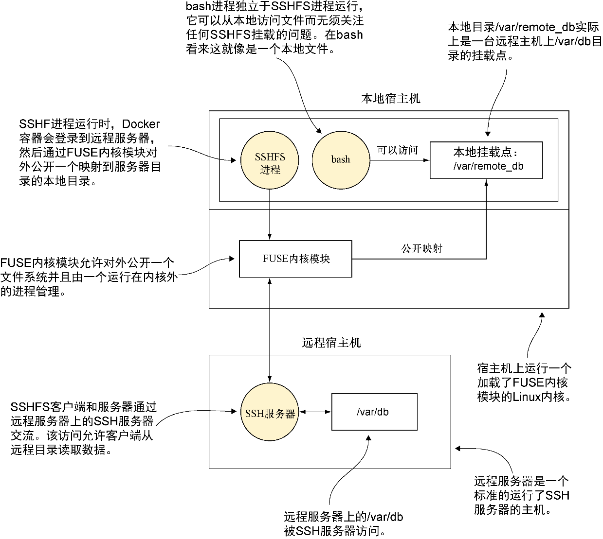

### 技巧38　使用SSHFS挂载远程卷

前面我们讨论了该怎样挂载本地文件，但是很快又出现了如何挂载远程文件系统的问题。也许用户想要在一台远程服务器上共享一个引用的数据库，并且把它当成本地文件系统对待。

尽管从理论上来说，可以在宿主机系统及服务器上配置NFS，然后通过挂载该目录来访问远程文件系统，但是对于大多数用户而言这里有一种更为快捷和简单的方式，无须在服务器上做任何配置（只要有SSH访问权限）。


**注意**

用户需要有root权限才能使用本技巧，而且需要安装FUSE（Linux的“用户空间级的文件系统”内核模块）。可以通过在一个终端里运行 `ls/dev/fuse` 查看文件是否存在来确认当前系统是否支持。


#### 问题

想要挂载一个远程文件系统，同时无须任何服务器的配置。

#### 解决方案

使用一种叫SSHFS的技术来挂载远程文件系统，这样一来它就会出现在机器本地。

本技巧借助FUSE内核模块，通过SSH协议提供一个标准的文件系统接口，后台的所有通信都是通过SSH完成的。SSHFS后台还提供了各种功能（如预读取远程文件），从而让用户产生一种文件就在本地的错觉。结果便是用户一旦登录到远程服务器，就可以看到上面的文件，就像这些文件在本地一样。图5-6帮助诠释了这一点。


<center class="my_markdown"><b class="my_markdown">图5-6　使用SSHFS挂载一个远程文件系统</b></center>


**警告**

尽管这一技巧没有用到Docker卷的功能，并且这些文件在文件系统上也是可见的，但是这一技巧并不会提供任何容器级别的持久化。任何变更都将只作用到远程服务器的文件系统。


用户可以从执行如下命令开始，命令内容视具体环境做相应调整。

第一步便是在宿主机上启动一个容器并带上 `--privileged` ：

```c
$ docker run -t -i --privileged debian /bin/bash
```

在它启动后，在容器里执行 `apt-get update && apt-get install sshfs` 来安装SSHFS。

在SSHFS安装成功后，按照如下步骤登录到远程宿主机：

```c
$ LOCALPATH=/path/to/local/directory　　⇽---　选择一个远程位置对应的挂载目录
$ mkdir $LOCALPATH　　⇽---　创建本地挂载目录
$ sshfs user@host:/path/to/remote/directory $LOCALPATH　　⇽---　将这里的对应值替换成远程宿主机用户名、远程宿主机的地址以及远程路径
```

现在可以在刚刚创建的那个文件夹里看到远程服务器对应路径下的内容了。


**提示**

最简单的做法是挂载一个新创建的目录，但是如果使用 `-o nonempty` 选项，也可以挂载一个已经存在一些文件的目录。可以查阅SSHFS的帮助手册来了解更多信息。


要干净地卸载这些文件，可以按照如下方式使用 `fusermount` 命令，根据需要替换成相应的路径：

```c
fusermount -u /path/to/local/directory
```

#### 讨论

这是一个很不错的方式，以最小的成本在容器（和标准的Linux机器）里完成远程挂载。

尽管我们在本技巧中只讨论了SSHFS，但是它成功地实现了在Docker里使用FUSE系统，这打开了一个奇妙的（有时候甚至有些怪异的）的新世界。从存放个人数据的Gmail到跨多台机器存放PB级数据的分布式GlusterFS文件系统，你还有很多机会。

