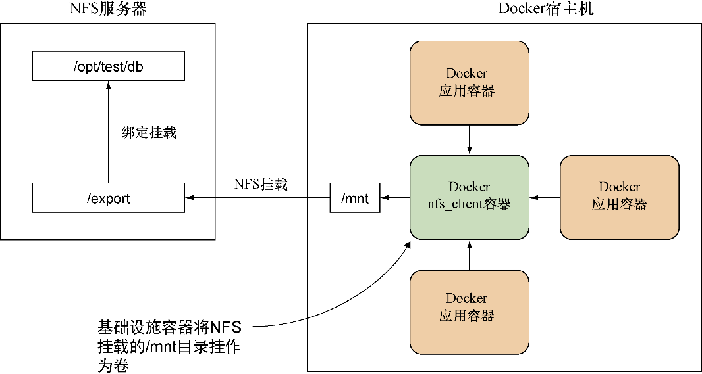

### 技巧39　通过NFS共享数据


在一个大型企业里，很有可能已经在使用NFS共享目录——NFS是一种经过验证的方案，用于从一个中央位置提取文件。对Docker而言，能够访问这些共享文件是一件非常重要的事情。

Docker并没有原生支持NFS，并且在每个容器上安装一个NFS客户端来挂载远程文件夹也不见得是一个最佳实践。相反，推荐的方案是设置一个容器，充当从NFS到一个更为Docker友好的概念——卷的中转站。

#### 问题

想要通过NFS无缝访问远程文件系统。

#### 解决方案

使用一个基础设施数据容器来中转访问。

本技巧建立在技巧37的基础上，我们创建了一个数据容器来管理一个正在运行的系统里的数据。

图5-7从概念层面展示了其理念。NFS服务器将一个内部目录公开为/export，它会被绑定挂载到NFS服务器宿主机上。Docker宿主机随后会使用NFS协议将该目录挂载到它的/mnt文件夹，然后再创建一个所谓的基础设施容器来绑定挂载的文件夹。


<center class="my_markdown"><b class="my_markdown">图5-7　一个用作NFS访问中转的基础设施容器</b></center>

乍看上去这样做好像有一点过度设计，但是这样做的好处是，对Docker容器而言它提供了一个中间层：它们需要做的就是从一个预先约定好的基础设施容器挂载卷，然后由基础设施容器来处理内部设备的管道、可用性和网络等。

如何深入了解NFS超出了本书的讨论范畴。在本技巧中，我们将通过一系列步骤在单台宿主机上配置这样的一个共享，NFS服务器的组件作为Docker容器运行在同一台宿主机上。该项实验已经在Ubuntu 14.04上测试通过。

假设用户想要共享宿主机上/opt/test/db目录里的内容，它里面有一个mybigdb.db的文件。

以root身份安装一个NFS服务器，然后创建一个开放权限的export目录：

```c
# apt-get install nfs-kernel-server
# mkdir /export
# chmod 777 /export
```


**注意**

我们创建了一个开放权限的NFS共享，这对于生产系统来说不是一个安全的方式。为了简化起见，我们倾向于采用这种方法。NFS安全性是一个复杂多样的主题，它已经超出了本书讨论的范畴。有关Docker 和它的安全性相关信息参见第14章。


现在可以将该db目录绑定挂载到export目录：

```c
# mount --bind /opt/test/db /export
```

应该可以在/export里看到/opt/test/db目录下的内容。


**提示**

如果想要在下次重启的时候持久化这一操作，需要将 `opt/test/db/exportnonebind0 0` 这一行加到/etc/fstab文件中。


现在将这一行内容添加到/etc/exports文件中：

```c
/export         127.0.0.1(ro,fsid=0,insecure,no_subtree_check,async)
```

针对这个概念性验证示例，我们在 `127.0.0.1` 上做了本地挂载，这可能和目标有点差距。在一个真实场景里，用户可能会把这个锁定到一类 IP 地址，如192.168.1.0/24。不要将 `127.0.0.1` 替换为 `*` ，对外界完全开放，这是在玩火！为了安全起见，我们这里做了只读（ `ro` ）挂载，但是用户可以通过将 `ro` 替换成 `rw` 做可读写挂载。别忘了如果要这么做，需要在 `async` 标志后面加上一个 `no_root_squash` 标志，但是在实施之前请先考虑一下安全性。

将NFS上共享的目录挂载到/mnt文件夹下，导出之前在/etc/exports里指定的文件系统，然后重启NFS服务以生效：

```c
# mount -t nfs 127.0.0.1:/export /mnt
# exportfs -a
# service nfs-kernel-server restart
```

现在准备好运行基础设施容器：

```c
# docker run -ti --name nfs_client --privileged
➥ -v /mnt:/mnt busybox /bin/true
```

现在可以运行容器了——不需要权限也无须拥有底层实现的知识就可以访问目录：

```c
# docker run -ti --volumes-from nfs_client debian /bin/bash
root@079d70f79d84:/# ls /mnt
myb
root@079d70f79d84:/# cd /mnt
root@079d70f79d84:/mnt# touch asd
touch: cannot touch 'asd': Read-only file system
```

#### 讨论

这种挂载一个中央授权访问的共享资源供其他人在多个容器中使用的模式真的很强大，它可以使开发工作流变得更加简单。


**提示**

如果有大量的这种容器需要管理，可以通过设定一个命名规范，例如，将一个公开了/opt/database/live路径的容器起名为 `--name nfs_client_opt_database_live` 来简化管理。

**提示**

请记住这一技巧只提供隐晦的（近乎没有）安全性保证。正如最后将看到的那样，任何人只要能够运行Docker便拥有宿主机上的root权限。


在某些方面，用于中转访问和抽象细节的基础设施容器其实等同于一个网络层面的服务发现工具，服务是如何运行的或者它存在的具体位置等精确的详细信息并不重要。用户只需要知道它的名字即可。

巧的是，之前在技巧35看到的 `–volumes-from` 的用法就是这样。细节上有一些出入，因为它是访问被中转到了运行在容器里的基础设施，而不是宿主机上，但是原理上仍然是使用名字来引用可用卷。用户甚至可以把该容器替换成本技巧里提到的这个，如果配置得当，应用程序应当不会在查找文件位置时发现差异。

