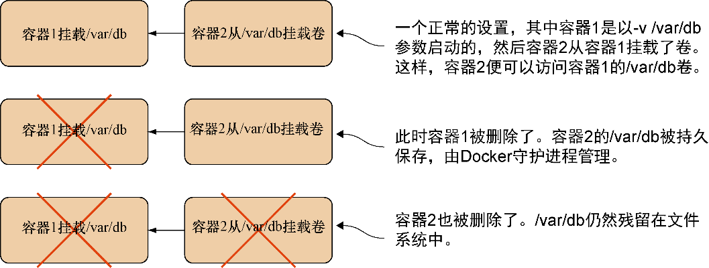

### 技巧43　清理卷

尽管卷是Docker提供的一个强大功能，与之伴随而来的也有一些显著的运维缺陷。由于卷可以在不同的容器之间共享，因此在挂载它们的容器被删除时无法清空这些卷。试想一下图6-1中描述的场景。


<center class="my_markdown"><b class="my_markdown">图6-1　当容器被删除时/var/db下会发生什么</b></center>

“简单！”你可能会这样想，“在最后一个引用的容器被删除时把卷删掉不就行了！”事实上，Docker可以采取这种手段，这也是垃圾回收式编程语言从内存中删除对象时所采用的方法：当没有其他对象引用它时，它便可以被删除。

但是Docker认为这可能会让人们不小心丢失重要的数据，而且最好把是否在删除容器的时候删除卷的决定权交给用户。这样做带来的一个不幸的副作用便是，默认情况下，卷会一直保留在Docker守护进程所在的宿主机磁盘上，直到它们被手动删除。

如果这些卷填满了数据，磁盘可能会被装满，因此最好关注一下管理这些孤立卷的方法。

#### 问题

挂载到宿主机上的孤立Docker卷用掉了大量的磁盘空间。

#### 解决方案

在调用 `docker rm` 命令时加上 `-v` 标志，或者如果忘记了，使用 `docker volumes` 子命令来销毁它们。

在图6-1描述的场景中，如果在调用 `docker rm` 时总是加上 `-v` 标志可以确保/var/db最后被删除掉。 `-v` 标志会将那些没有被其他容器挂载的关联卷一一删除。幸好，Docker很聪明，它知道是否有其他容器挂载该卷，因此不会出现什么意外尴尬的情形。

最简单的方式莫过于养成在删除容器时加上 `-v` 标志这样的好习惯。这样可以保留对容器是否删除卷的控制权。而这种做法的问题在于用户可能不想每次都删除卷。如果用户正在写入大量数据到这些卷，极有可能不希望丢失这些数据。此外，如果养成了这样的习惯，很有可能就会变成自动的了，而用户将会在删除某些重要东西之后才反应过来，但为时已晚。

在这类情况下，用户可以使用一个经过许多人抱怨并且涌现出众多第三方解决方案之后添加到Docker的命令： `docker volume prune` 。这条命令将会删除所有未使用的卷：

```c
$ docker volume ls　　⇽---　执行命令列出Docker所知的卷
 DRIVER             VOLUME NAME
 local              80a40d34a2322f505d67472f8301c16dc75f4209b231bb08faa8ae48f
➥ 36c033f　　⇽---　
 local              b40a19d89fe89f60d30b3324a6ea423796828a1ec5b613693a740b33
➥ 77fd6a7b
 local              bceef6294fb5b62c9453fcbba4b7100fc4a0c918d11d580f362b09eb
➥ 58503014　　⇽---　宿主机上存在的卷，无论是否在使用
$ docker volume prune　　⇽---　执行命令删除未使用的卷
 WARNING! This will remove all volumes not used by at least one container.
Are you sure you want to continue? [y/N] y　　⇽---　确认删除卷
 Deleted Volumes:
 80a40d34a2322f505d67472f8301c16dc75f4209b231bb08faa8ae48f36c033f　　⇽---　
 b40a19d89fe89f60d30b3324a6ea423796828a1ec5b613693a740b3377fd6a7b　　⇽---　已经被删除的卷
Total reclaimed space: 230.7MB
```

如果想要跳过提示确认步骤，也许可以用一个自动化脚本，在执行 `docker volume prune` 时带上 `-f` 选项来跳过这一步。


**提示**

如果想要恢复一个未被删除但是已经不再被任何容器引用的卷里的数据，可以使用 `docker volume inspect` 来找出卷所在的目录（像是/var/lib/docker/volumes下）。随后可以用root用户的身份浏览。


#### 讨论

删除卷可能不是需要经常执行的操作，因为容器里的大文件通常是从宿主机挂载的，并不会存放在Docker数据目录里。但是值得大约每周清理一次，避免它们堆积，尤其是当你使用技巧37里的数据容器时。

