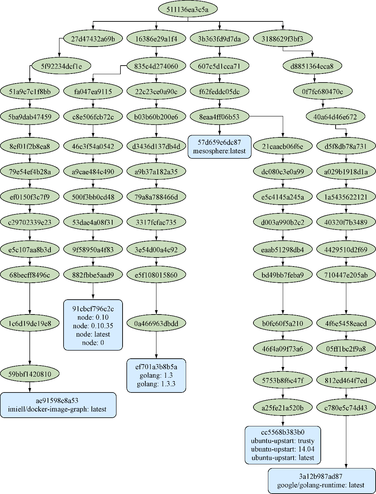

### 技巧46　生成Docker镜像的依赖图

Docker的文件分层系统是一个非常强大的理念，它可以节省空间，而且可以让软件的构建变得更快。但是一旦启用了大量的镜像，便很难搞清楚镜像之间是如何关联的。 `docker images -a` 命令会返回系统上所有镜像层的列表，但是对于理解它们之间的关联关系而言，这不是一个友好的方式——使用Graphviz可以更方便地通过创建一个镜像树并做成镜像的形式来可视化镜像之间的关系。

这也展示了Docker在把复杂的任务变得简单方面的强大实力。在宿主机上安装所有的组件来生产镜像时，老的方式可能会包含一长串容易出错的步骤，但是对Docker来说，这就变成了一条相对失败较少的可移植命令。

#### 问题

想要以树的形式将存放在宿主机上的镜像可视化。

#### 解决方案

使用一个我们之前创建的镜像（基于CenturyLink Labs的一个镜像）配合这项功能输出一个PNG图片或者获取一个Web视图。此镜像包含了一些使用Graphviz生成PNG图片文件的脚本。

本技巧使用的Docker镜像放在dockerinpractice/docker-image-graph。时间长了该镜像可能会过期然后停止工作，可以通过执行代码清单6-1中的命令确保生成最新的镜像。

代码清单6-1　构建一个最新的docker-image-graph镜像（可选）

```c
$ git clone https://github.com/docker-in-practice/docker-image-graph
$ cd docker-image-graph
$ docker build -t dockerinpractice/docker-image-graph
```

在 `run` 命令里需要做的就是挂载Docker服务器套接字，然后一切便准备就绪，如代码清单6-2所示。

代码清单6-2　生成一个镜像的层树

```c
$ docker run --rm \　　⇽---　在生成镜像之后删除容器
 -v /var/run/docker.sock:/var/run/docker.sock \　　⇽---　挂载 Docker 服务器的Unix 域套接字，以便可以在容器里访问Docker服务器。如果已经更改了Docker守护进程的默认配置，这将不会奏效
 dockerinpractice/docker-image-graph > docker_images.png　　⇽---　指定一个镜像然后生成一个PNG图片作为制品
```

图6-2以PNG图片形式展示了一台机器的镜像树。从这张图片可以看出，node和golang:1.3镜像拥有一个共同的根节点，然后golang:runtime只和golang:1.3共享全局的根节点。类似地，mesosphere镜像和ubuntu-upstart镜像也是基于同一个根节点构建的。

读者可能会好奇这棵树上的全局根节点是什么。它是一个叫作scratch的伪镜像，实际上大小为0字节。

#### 讨论

在构建更多的Docker镜像时，也许作为第9章里持续交付的一部分，跟踪一个镜像的历史以及它所基于的内容可能会很麻烦。如果试图通过共享更多层精简镜像大小的方式来加快交付速度，这一点尤为重要。定期拉取所有镜像并生成图谱是一个追踪的好办法。


<center class="my_markdown"><b class="my_markdown">图6-2　一棵镜像树</b></center>

