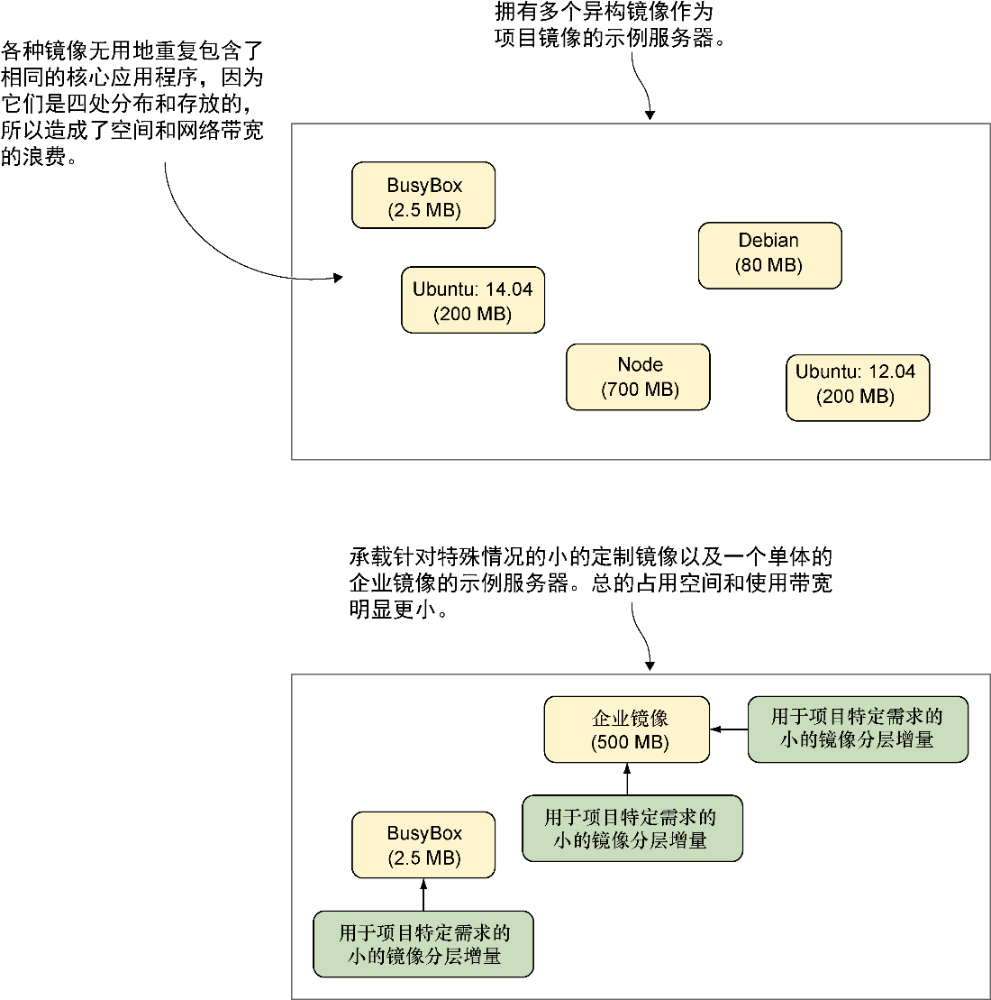

### 技巧60　大也可以美

尽管本节是关于如何保持镜像小的，但值得铭记的是小也不一定就是更好的。正如我们接下来将讨论的那样，一个相对较大的单体镜像可以比一个小镜像更加高效。

#### 问题

想要降低由于Docker镜像导致的磁盘空间占用和网络带宽。

#### 解决方案

为组织内部创建一个统一的、较大的、单体的基础镜像。

这是一个两难的取舍，但是使用一个大的单体镜像可以帮用户节省磁盘空间和网络带宽。

回想一下，Docker在容器正在运行时使用的是写时复制机制。这意味着用户可以运行数百个Ubuntu容器，而在每个容器启动后只需要占用少量额外的磁盘空间。

如图7-1所示，如果用户在Docker服务器上运行了大量不同的较小的镜像，那么使用的磁盘空间甚至可能会比运行一个大一些的将一切所需都包揽到其中的单体镜像还要多。

<b class="my_markdown">图7-1　许多小的基础镜像与较少的大的基础镜像的对比</b>

你可能会想起共享库的原理。一个共享库可以一次性被多个应用程序加载，这减少了要运行这些程序所需的磁盘空间和内存的使用量。同理，一个组织内共享的基础镜像可以节省空间，因为它只需要被下载一次，而且应该囊括了所需的一切。之前多个镜像里需要用到的程序和库现在只需要引用一次。

此外，这样做的另外一个好处是可以有一个跨团队共享的单体的、集中管理的镜像。该镜像的维护可以是集中式的，一些改进也是共享的，并且构建中遇到的问题只需要解决一次。

要采用本技巧，需要注意下列事项。

+ 基础镜像首先应该是可靠的。如果它的行为不一致，应当避免使用。
+ 对基础镜像的更改应该在某处可以可视化地跟踪到，以便用户可以自行调试。
+ 在更新香草（vanilla）镜像时，一些回归测试是至关重要的，这样可以减少麻烦。
+ 在添加内容到基础镜像时要谨慎—— 一旦添加到了基础镜像，它便很难删除，而且镜像会膨胀得很快。

#### 讨论

我们在自己600强的开发公司里使用了本技巧，产生的效果非常好。每月构建的核心应用会被打包到一个大的镜像并发布到内部的Docker注册中心。默认情况下，团队将会在所谓的“香草”企业镜像上构建应用，有必要的话再在上面创建定制镜像层。

技巧12中有一些关于单体镜像的额外细节值得一看——尤其是关于phusion/base镜像，它是一个在设计时就考虑运行多个进程的镜像。

