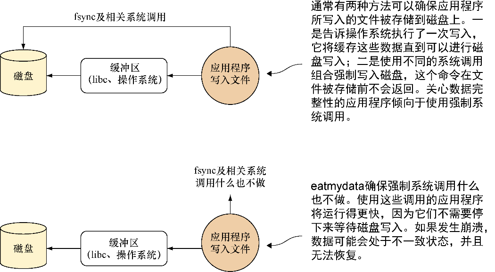

### 技巧62　使用eatmydata为I/O密集型构建提速

因为Docker非常适合用于自动化构建，随着时间推移，可能会用它来执行大量的I/O密集型构建。Jenkins作业、数据库重建脚本以及大量的代码签出都将对磁盘造成冲击。在这种情况下，任何能获得的速度提升对用户来说都大有裨益，这不仅能节省时间，还能极大减少资源竞争造成的大量额外开销。

本技巧已经被证实可以提升高达1/3的速度，而实际经验也支持这一点。其作用不容小觑。

#### 问题

想要加快I/O密集型构建的速度。

#### 解决方案

eatmydata是一个使用系统调用来写入数据，并通过绕开持久化变更所需工作从而大大提升速度的程序。这会造成部分安全性的缺失，因此不建议作为常规使用，不过对于那些不需要持久化的环境，如测试环境，这就非常有用了。

##### 1．安装eatmydata

要在容器中安装eatmydata，有很多种选择。

+ 如果运行的是基于deb的发行版，可以执行 `apt-get install` 来安装。
+ 如果运行的是基于rpm的发行版，可以在网站上搜索并下载它，然后执行 `rpm --install` 来安装。类似Rpmfind这样的网站是一个不错的入口。
+ 在不得已的情况下，如果安装了一个编译器，可以按代码清单8-2所示代码直接下载并编译它。

代码清单8-2　编译并安装eatmydata

```c
$ url=https://www.flamingspork.com/projects/libeatmydata
➥ /libeatmydata-105.tar.gz　　⇽---　 flamingspork.com是其维护人员的网站
$ wget -qO- $url | tar -zxf - && cd libeatmydata-105　　⇽---　如果无法下载这个版本，请到其网站上检查它是否已经更新到105之后的版本
$ ./configure --prefix=/usr　　⇽---　如果想把eatmydata可执行文件安装在/usr/bin之外的其他地方，可修改此前缀目录
$ make　　⇽---　构建eatmydata可执行文件
$ sudo make install　　⇽---　安装该软件，这一步要求使用root权限
```

##### 2．使用eatmydata

一旦libeatmydata被安装到镜像上（不论是使用软件包或是源文件），就可以在任何命令之前运行eatmydata包装脚本来使用它：

```c
docker run -d mybuildautomation eatmydata /run_tests.sh
```

图8-1从高层次展示了eatmydata是如何节省处理时间的。


**警告**

eatmydata跳过了用于保证数据被安全地写入磁盘的步骤，因此存在一定的风险，即在程序认为数据已经写入磁盘时可能这一步还没完成。对于测试环节而言，这通常无关紧要，因为其数据可任意处理，但不要在任何数据很重要的环境中使用eatmydata来提升速度！


需要注意的是，由于第2章所描述的Docker客户端/服务端架构，在宿主机上安装eatmydata或挂载Docker套接字之后执行 `eatmydata docker run …` 来启动Docker容器将不会产生预期的效果。与之相反，你需要在每个想使用eatmydata的容器里安装它。

#### 讨论

尽管确切的用例各有不同，但技巧68是你可以马上应用本技巧的一个地方。CI作业中的数据完整性很少出现问题，你一般只关心成功还是失败，以及失败时的日志。


<center class="my_markdown"><b class="my_markdown">图8-1　应用程序写入磁盘时不使用（上）和使用（下）eatmydata的对比</b></center>

还有一个相关的技巧是技巧77。数据库是数据完整性真正影响巨大的一个地方（所有主流数据库都设计成在机器断电时不会丢失数据），不过如果你只是在运行测试或实验，这是不必要的额外开销。

