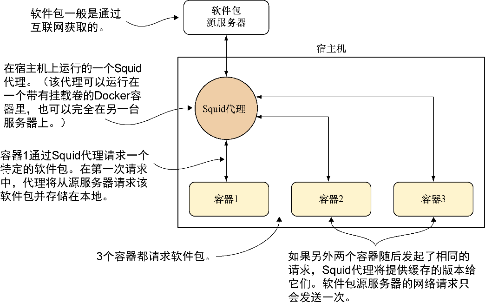

### 技巧63　设置一个软件包缓存用于加快构建速度

由于Docker非常适合开发环境、测试环境和生产环境服务的频繁重新构建，读者很快会发现这会对网络反复造成冲击。其中的主要原因之一是从互联网下载软件包文件。即使是在一台机器上，这也可能是一个缓慢（且昂贵）的开销。本技巧展示了如何为软件包下载设置一个本地缓存，同时涵盖apt与yum。

#### 问题

想要通过减少网络I/O来加快构建速度。

#### 解决方案

为包管理器安装一个Squid代理。图8-2展示了本技巧是如何工作的。

因为软件包的调用会首先到达本地Squid代理，而只有第一次会通过互联网进行请求，对每一个软件包而言，只会有一次互联网请求。如果有数百个容器全部都在从互联网拉取相同的大型软件包，这将节省大量的时间和金钱。


<center class="my_markdown"><b class="my_markdown">图8-2　使用一个Squid代理来缓存软件包</b></center>


**注意**

在宿主机上进行安装时可能会碰到网络配置问题。后续几节会给出用以判定这种情况的建议，不过如果读者不确定如何处理，可能需要寻求来自友好的网络管理员的帮助。


##### 1．Debian

对于Debian（或通常所说的apt或.deb）软件包，安装要简单得多，因为存在一个打包好的版本。

在基于Debian的宿主机上执行下面这条命令：

```c
sudo apt-get install squid-deb-proxy
```

通过telnet连接到8000端口来确认该服务已经启动：

```c
$ telnet localhost 8000
Trying ::1...
Connected to localhost.
Escape character is '^]'.
```

如果看到了上述输出，可按组合键Ctrl+]再按组合键Ctrl+D退出。如果没看到这个输出，则要么Squid未被正确安装，要么它被安装在了一个非标准端口上。

为了设置容器使用这个代理，这里提供了如代码清单8-3所示的示例Dockerfile。需要注意的是，从容器的角度看，宿主机的IP地址每次运行都可能发生改变。出于这个原因，在安装新软件前，可能需要将这个Dockerfile转换成一个在容器里运行的脚本。

代码清单8-3　配置Debian镜像使用apt代理

```c
FROM debian
RUN apt-get update -y && apt-get install net-tools　　⇽---　确保route工具已安装
RUN echo "Acquire::http::Proxy \"http://$( \
 route -n | awk '/^0.0.0.0/ {print $2}' \　　⇽---　为了确定从容器角度看到的宿主机IP地址，执行route命令，并使用awk从输出中提取相关IP地址（见技巧67）
 ):8000\";" \　　⇽---　8000端口用于连接宿主机上的Squid代理
 > /etc/apt/apt.conf.d/30proxy　　⇽---　带有正确的 IP 地址和配置的输出行被添加到apt的代理配置文件中
RUN echo "Acquire::http::Proxy::ppa.launchpad.net DIRECT;" >> \
    /etc/apt/apt.conf.d/30proxy
CMD ["/bin/bash"]
```

##### 2．yum

在宿主机上，使用软件包管理器安装squid软件包，确保Squid安装就位。

然后需要修改Squid配置文件来创建一个更大的缓存空间。打开/etc/squid/squid.conf文件并用 `cache_dir ufs /var/spool/squid 10000 16 256` 替换以 `#cache_dir ufs/var/spool/squid` 开头的那行注释。这将创建一个10 000 MB的空间，应该够用了。

通过telnet连接到3128端口来确保服务已经启动：

```c
$ telnet localhost 3128
Trying ::1...
Connected to localhost.
Escape character is '^]'.
```

如果看到了上述输出，可按组合键Ctrl+]再按组合键Ctrl+D退出。如果没看到这个输出，则要么Squid未被正确安装，要么它被安装在了一个非标准端口上。

为了设置容器使用这个代理，这里提供了代码清单8-4所示的示例Dockerfile。需要注意的是，从容器的角度看，宿主机的IP地址每次运行都可能发生改变。在安装新软件前，可能需要将这个Dockerfile转换成一个在容器里运行的脚本。

代码清单8-4　配置CentOS镜像使用yum代理

```c
FROM centos:centos7
RUN yum update -y && yum install -y net-tools　　⇽---　确保route工具已安装
RUN echo "proxy=http://$(route -n | \　　⇽---　为了确定从容器角度看到的宿主机IP地址，执行route命令，并使用awk从输出中提取相关IP地址
awk '/^0.0.0.0/ {print $2}'):3128" >> /etc/yum.conf　　⇽---　3128端口用于连接宿主机上的Squid代理
RUN sed -i 's/^mirrorlist/#mirrorlist/' \
/etc/yum.repos.d/CentOS-Base.repo　　⇽---　
RUN sed -i 's/^#baseurl/baseurl/' \
/etc/yum.repos.d/CentOS-Base.repo　　⇽---　为了避免可能出现的缓存未命中，移除镜像清单，只使用基础的URL。这将确保只会命中一组URL用于获取软件包，从而更有可能命中缓存的文件
RUN rm -f /etc/yum/pluginconf.d/fastestmirror.conf　　⇽---　移除fastest- mirror插件，因为已经不再需要它了
RUN yum update -y　　⇽---　确保检查所有镜像。在执行yum update时，配置文件里列出的镜像可能包含了过期信息，因此第一次更新可能会很慢
CMD ["/bin/bash"]
```

如果按这种方式设置两个容器，并依次在上面安装相同的大型软件包，就会发现第二次安装在下载它的必要软件时比第一次快得多。

#### 讨论

读者可能已经注意到可以在一个容器里而不在宿主机上运行Squid代理。为了保持说明简单，这里没有展示这一做法（在某些情况下，要让Squid工作在一个容器里需要更多步骤）。

