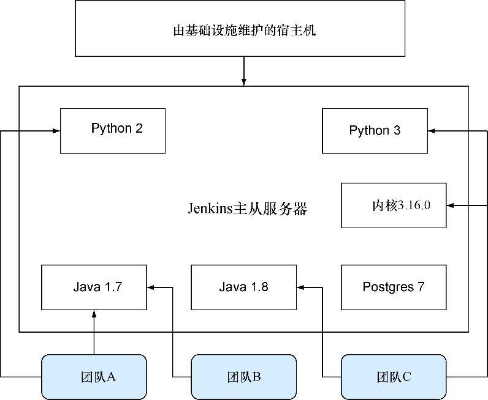
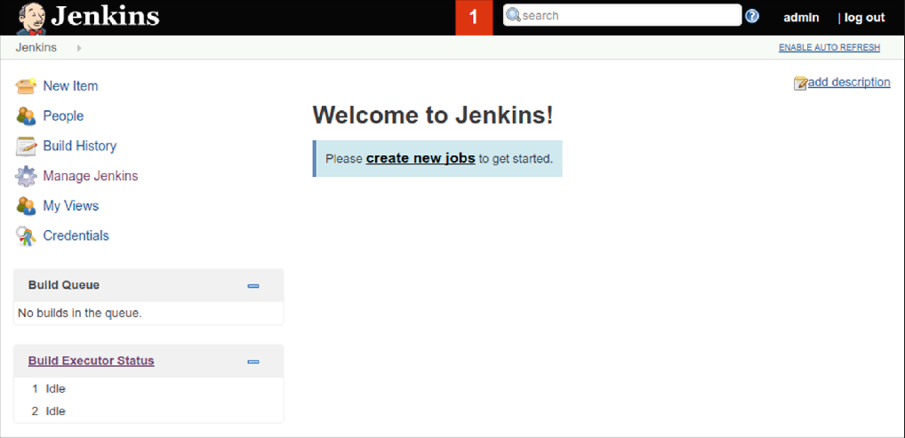
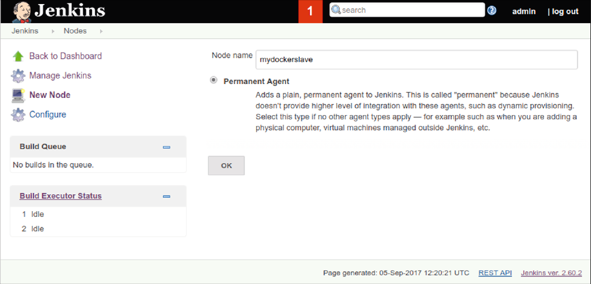
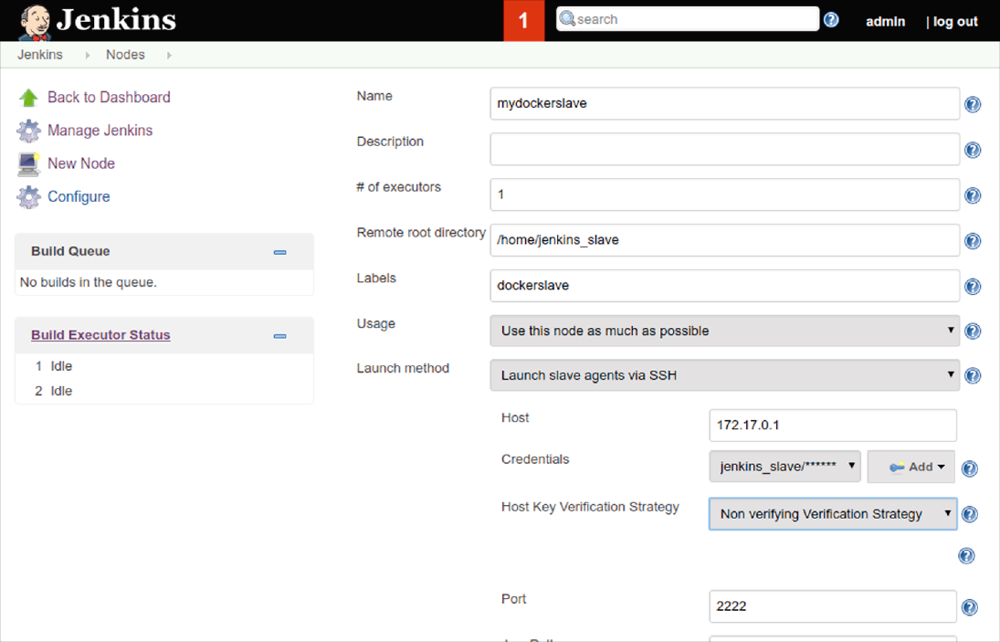

### 技巧67　包含一个复杂的开发环境

Docker的可移植性和轻量性，使其成为CI从节点（一台供CI主服务器连接以便执行构建的机器）的理想选择。与虚拟机从节点相比，Docker CI从节点向前迈了一大步（相对构建裸机更是一个飞跃）。它可以使用一台宿主机在多种环境上执行构建、快速销毁并创建整洁的环境来确保不受污染的构建，并使用所有熟悉的Docker工具来管理构建环境。

能把CI从节点当作另一个Docker容器这一点特别有趣。在其中一台Docker CI从节点上出现了神秘的构建失败？把镜像拉取下来，并自己尝试这个构建。

#### 问题

想要扩展并修改Jenkins从节点。

#### 解决方案

使用Docker将从节点配置封装在一个Docker镜像中，然后部署。

很多组织会建立一个重量级的Jenkins从节点（通常与主服务器在一台宿主机上），由一个集中的IT职能部门维护，这在一段时间内会起到很有益的作用。随着时间推移，团队在不断壮大他们的代码库和分支，为了保证作业运行，需要安装、更新或变更越来越多的软件。

图8-3展示的是这种情景的一个简化版本。想象一下，数百个软件包及多重的新请求将让早已疲惫不堪的基础设施团队头痛不已。


<center class="my_markdown"><b class="my_markdown">图8-3　一台超负荷的Jenkins服务器</b></center>


**注意**

制定这个技巧是为了展示在一个容器内运行Jenkins从节点的基本要素。其结果的可移植性差一些，但是课程更易于掌握。一旦读者理解了本章的所有技巧，就能够创建一个更具可移植性的版本。


僵持局面随之而来，因为系统管理员担心打乱其他人的构建，可能不愿意为一群人更新他们的配置管理脚本，而变更的迟缓将使各个团队变得越来越沮丧。

Docker（天然地）提供了一个解决方案，多个团队可以使用一个基础镜像作为自己的个人Jenkins 从节点，与此同时使用与之前相同的硬件。可以创建一个具有必要的共享工具的镜像，并且允许团队对其进行变更以满足他们自己的需要。

有些贡献人员已经在Docker Hub上传了他们自用的从节点，可以在Docker Hub上通过搜索“jenkins slave”查找。代码清单8-12展示了一个最小的Jenkins从节点Dockerfile。

代码清单8-12　基础的Jenkins从节点Dockerfile<sup class="my_markdown">[5]</sup>

```c
FROM ubuntu:16.04
ENV DEBIAN_FRONTEND noninteractive
RUN groupadd -g 1000 jenkins_slave　　⇽---　
RUN useradd -d /home/jenkins_slave -s /bin/bash \
 -m jenkins_slave -u 1000 -g jenkins_slave　　⇽---　创建Jenkins从节点用户与用户组
RUN echo jenkins_slave:jpass | chpasswd　　⇽---　设置Jenkins用户密码为jpass。在更复杂的设置中，最好使用其他认证方式
RUN apt-get update && apt-get install -y \
 openssh-server openjdk-8-jre wget iproute2　　⇽---　安装Jenkins从节点工作所需的软件
RUN mkdir -p /var/run/sshd　　⇽---　
CMD ip route | grep "default via" \　　⇽---　在启动时，输出以容器的角度看到的宿主机的IP地址，并启动SSH服务器
 | awk '{print $3}' && /usr/sbin/sshd -D
```

构建该从节点镜像，并给它打上 `jenkins_slave` 标签：

```c
$ docker build -t jenkins_slave .
```

使用如下命令来运行它：

```c
$ docker run --name jenkins_slave -ti -p 2222:22 jenkins_slave
172.17.0.1
```


**Jenkins服务器必须处于运行状态**

如果在宿主机上还未运行Jenkins服务器，利用技巧66设置其中的一个Jenkins服务器。如果读者比较心急，可执行下面这个命令：

```c
$ docker run --name jenkins_server -p 8080:8080 -p 50000:50000 \
 dockerinpractice/jenkins:server
```

如果是在本地机器上执行这个命令，可通过http://localhost:8080访问Jenkins服务器。在使用之前，你需要先完成安装过程。


如果浏览Jenkins服务器，将看到图8-4所示的欢迎页。


<center class="my_markdown"><b class="my_markdown">图8-4　Jenkins的主页</b></center>

要添加一个从节点，可以点击“Build Executor Status”（构建执行状态）>“New Node”（新建节点），并添加节点的名字作为“Permanent Agent”（永久性代理），如图8-5所示。将其命名为 `mydockerslave` 。


<center class="my_markdown"><b class="my_markdown">图8-5　命名一个新节点</b></center>

点击“OK”并使用如下设置来配置它，如图8-6所示：

+ 设置“Remote Root Directory”（远程工作目录）为/home/jenkins_slave；
+ 设置“Label”（标签）为“dockerslave”；
+ 确保“Launch Slave Agents Via SSH”（通过SSH启动从代理）选项被选中；
+ 将Host（主机）设置成容器内看到的路由器的IP地址（此前 `docker run` 命令的输出）；
+ 点击“Add”（添加）来添加凭证，并将用户名设置为 `jenkins_slave` ，密码设置为 `jpass` ，然后从下拉框列表中选中该凭证；
+ 将“Host Key Verification Strategy”（主机密钥验证策略）设置为“Manually Trusted Key Verification Strategy”（手动信任密钥验证策略，接受首次连接时的SSH密钥）或“Non Verifying Verification Strategy”（不验证验证策略，不执行SSH主机密钥检查）；
+ 点击“Advanced”（高级）以显示“Port”（端口）字段，并将其设置为2222；
+ 点击“Save”（保存）。


<center class="my_markdown"><b class="my_markdown">图8-6　配置新的节点</b></center>

现在点击进入新的从节点，点击“Launch Slave Agent”（启动从节点代理）（假设其未自动启动）。之后将看到该从节点代理被标记为在线状态。

点击左上角的“Jenkins”返回到首页，并点击“New Item”（新建）。创建一个名为 `test` 的“Freestyle Project”（自由风格的项目），点击“Build”（构建）区域下方的“Add Build Step”（增加构建步骤）>“Execute shell”（执行shell），并填入命令 `echo done` 。滚动到上方并选中“Restrict Where Project Can Be Run”（限制项目可运行的位置），并在“Label Expression”（标签表达式）中输入 `dockerslave` 。将看到“Slaves In Label”（标签中的从节点）被设置为 `1` ，这意味着该作业现在被链接到Docker从节点上了。点击“Save”（保存）以创建该作业。

点击“Build Now”（立即构建），然后点击左侧下方出现的构建“#1”链接，然后点击“Console Output”（控制台输出），将在主窗口中看到类似这样的输出：

```c
Started by user admin
Building remotely on mydockerslave (dockerslave)
➥ in workspace /home/jenkins_slave/workspace/test
[test] $ /bin/sh -xe /tmp/jenkins5620917016462917386.sh
+ echo done
done
Finished: SUCCESS
```

干得漂亮！你已经成功创建了自己的Jenkins从节点。

现在如果读者想创建个人定制的从节点，只需要根据自己的需要修改从节点镜像的Dockerfile，并代替示例中的版本进行运行即可。


**注意**

本技巧及其相关内容的代码可从 GitHub 获取，地址是 https://github.com/docker-in-practice/ jenkins。


#### 讨论

本技巧带你逐步创建一个表现得像虚拟机的容器，与技巧12相似，不过增加了Jenkins集成的复杂度。一个特别有用的策略是将Docker套接字也挂载到容器里，然后安装Docker客户端程序以便执行Docker构建。请阅读技巧45以了解挂载Docker套接字（用于不同目的）的信息，附录A则说明了安装的细节信息。

