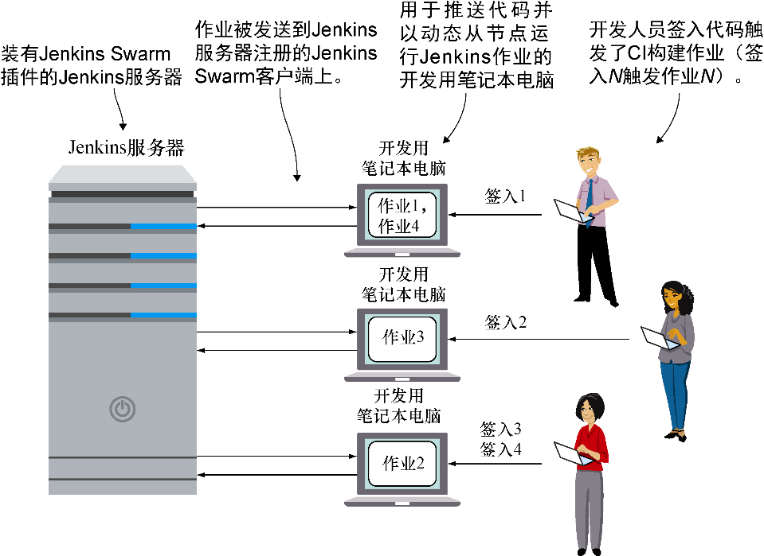

### 技巧68　使用Jenkins的Swarm插件扩展CI

能再现环境是一个巨大的胜利，但构建能力还是受限于所拥有的专用于构建的机器的数量。如果想借用新发现的Docker从节点的灵活性在不同的环境上做实验，其结果可能会让人沮丧。构建能力可能也会因为更现实的原因——团队的成长，而变成一个问题！

#### 问题

想要一起提高CI运算能力与开发工作效率。

#### 解决方案

使用Jenkins的Swarm插件及一个Docker Swarm从节点来动态地配备Jenkins从节点。


**注意**

此前提过，不过这里还是值得重复说明下：Jenkins的Swarm插件与Docker的Swarm技术一点关系都没有。它们是碰巧使用了相同字眼的两个完全不相关的东西。它们可以在此一起使用纯属巧合。


很多中小型企业具有这样的CI模型：一台或多台Jenkins服务器致力于提供运行Jenkins作业所需的资源。图8-7展示了这一点。

这在一段时间内可以运行良好，但随着CI过程变得越来越内嵌，经常会达到其容量限制。多数的Jenkins工作负载是受代码控制的签入动作触发的，因此当更多的开发人员进行签入时，其工作负载将上升。由于忙碌的开发人员对构建结果的等待忍耐有限，对运维团队的投诉数量将会激增。


<center class="my_markdown"><b class="my_markdown">图8-7　之前：Jenkins服务器——只有一个开发人员时没问题，但无法扩展</b></center>

一个巧妙的解决方案是运行与签入代码人数相当的Jenkins从节点，如图8-8所示。


<center class="my_markdown"><b class="my_markdown">图8-8　之后：运算能力随着团队提升</b></center>

代码清单8-13中所示的Dockerfile创建的是一个安装了Jenkins Swarm客户端插件的镜像，允许具有恰当的Jenkins Swarm服务器插件的Jenkins主服务器进行连接并运行作业。它与技巧67中正常的Jenkins从节点Dockerfile的启动方式相同。

代码清单8-13　Dockerfile<sup class="my_markdown">[6]</sup>

```c
FROM ubuntu:16.04
ENV DEBIAN_FRONTEND noninteractive
RUN groupadd -g 1000 jenkins_slave
RUN useradd -d /home/jenkins_slave -s /bin/bash \
-m jenkins_slave -u 1000 -g jenkins_slave
RUN echo jenkins_slave:jpass | chpasswd
RUN apt-get update && apt-get install -y \
openssh-server openjdk-8-jre wget iproute2
RUN wget -O /home/jenkins_slave/swarm-client-3.4.jar \　　⇽---　获取Jenkins Swarm插件
 https://repo.jenkins-ci.org/releases/org/jenkins-ci/plugins/swarm-client
➥ /3.4/swarm-client-3.4.jar
COPY startup.sh /usr/bin/startup.sh　　⇽---　将启动脚本复制到容器中
RUN chmod +x /usr/bin/startup.sh　　⇽---　将启动脚本标记为可执行
ENTRYPOINT ["/usr/bin/startup.sh"]　　⇽---　将启动脚本设置为默认的运行命令
```

代码清单8-14给出的是复制到上述Dockerfile的启动脚本。

代码清单8-14　startup.sh

```c
#!/bin/bash
export HOST_IP=$(ip route | grep ^default | awk '{print $3}') 　　⇽---　确定宿主机的IP地址
export JENKINS_IP=${JENKINS_IP:-$HOST_IP}　　⇽---　除非在调用该脚本的环境变量中设置了DOCKER_IP，否则使用宿主机ID作为Jenkins服务器IP
export JENKINS_PORT=${JENKINS_PORT:-8080}　　⇽---　设置Jenkins端口为默认的8080
export JENKINS_LABELS=${JENKINS_LABELS:-swarm}　　⇽---　设置该从节点的Jenkins标签为swarm
export JENKINS_HOME=${JENKINS_HOME:-$HOME}　　⇽---　设置Jenkins主目录默认为jenkins_slave用户的主目录
echo "Starting up swarm client with args:"
echo "$@"
echo "and env:"
echo "$(env)"
set -x　　⇽---　从此处开始将执行的命令作为脚本的输出部分进行记录
 java -jar \　　⇽---　运行Jenkins Swarm客户端
 /home/jenkins_slave/swarm-client-3.4.jar \
  -sslFingerprints '[]' \
  -fsroot "$JENKINS_HOME" \　　⇽---　将Jenkins的主目录设置为根目录
  -labels "$JENKINS_LABELS" \　　⇽---　设置用于识别作业客户端的标签
  -master http://$JENKINS_IP:$JENKINS_PORT "$@"　　⇽---　设置从节点所要指向的Jenkins服务器
```

上述脚本的大部分是在为最后的Java调用设置和输出环境变量。此Java调用将运行Swarm客户端，把运行它的机器转换成一个动态Jenkins从节点，其根目录在 `-fsroot` 标志中指定，运行由 `-labels` 标志标记的作业并指向由 `-master` 标志指定的Jenkins服务器。具有 `echo` 的几行只是提供一些参数和环境设置的调试信息。

构建和运行该容器很简单，按众所周知的样板运行即可：

```c
$ docker build -t jenkins_swarm_slave .
$ docker run -d --name \
jenkins_swarm_slave jenkins_swarm_slave \
-username admin -password adminpassword
```

这里的用户名和密码是Jenkins实例中具有创建从节点权限的账号——admin账号没问题，不过你也可以创建一个专用的账号。

现在已经在这台机器上设置了一个从节点，可以在其上面运行Jenkins作业了。可像平常那样设置一个Jenkins作业，只不过在Restrict Where This Pruject Can Be Run（限制项目可运行的位置）中添加 `swarm` 作为一个标签表达式（见技巧67）。


**警告**

Jenkins作业可能是一些繁重的进程，其运行非常有可能对笔记本电脑造成负面影响。如果该作业很繁重，可以在作业和相应的Swarm客户端上设置标签。例如，可以设置一个作业的标签为4CPU8G，并将它匹配到运行在具有8 GB内存、4个CPU的机器的Swarm容器。


本技巧对Docker概念做了一些展示。一个可预测、可移植的环境可以放置在多台宿主机上，从而降低昂贵的服务器的负载，并将所需配置降到最低。

尽管本技巧实施时不能不考虑性能，我们还是认为这里面有很大的发挥空间，可以将开发人员的计算机资源转换成某种形式的游戏，从而提升开发组织的工作效率，而无须昂贵的新硬件。

#### 讨论

你可以在所有PC上将其设置成受控系统服务以便实现该过程的自动化（参见技巧82）。


**注意**

本技巧及其相关内容的代码可从GitHub获取，地址是https://github.com/docker-in-practice/ jenkins。


