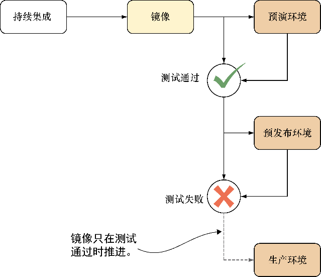

### 第9章　持续交付：与Docker原则完美契合

**本章主要内容**

+ 开发与运维之间的Docker契约
+ 掌控跨环境的构建可用性
+ 通过低带宽连接在不同环境间迁移构建
+ 集中配置一个环境中的所有容器
+ 使用Docker实现零停机时间部署

一旦确信使用一致的持续集成（CI）过程对所有的构建都进行了质量检验，下一步自然是开始着手将每个良好的构建部署给用户。这个目标称为持续交付（continuous delivery，CD）。

本章涉及的就是“CD流水线”——构建从“CI流水线”出来后所经历的过程。这两者的分界点有时会比较模糊，不过可以这么认为，在构建过程中通过初始测试获得最终镜像的那一刻即是CD流水线开始的时刻。图9-1演示了镜像在到达生产环境（但愿如此）之前是如何通过CD流水线的。

<b class="my_markdown">图9-1　一个典型的CD流水线</b>

最后一点值得再提一下，在CD全过程中，从CI产出的镜像必须是最终的、不可修改的！Docker通过不可变镜像及状态封装很容易实现这一点，因此使用Docker已经让你在CD的路上前进了一步。

在本章结束时，你将完全理解为何Docker的不可变性会让它变成CD策略的绝佳伴侣。也因此，Docker可以成为任何组织中DevOps策略的关键推动者。

