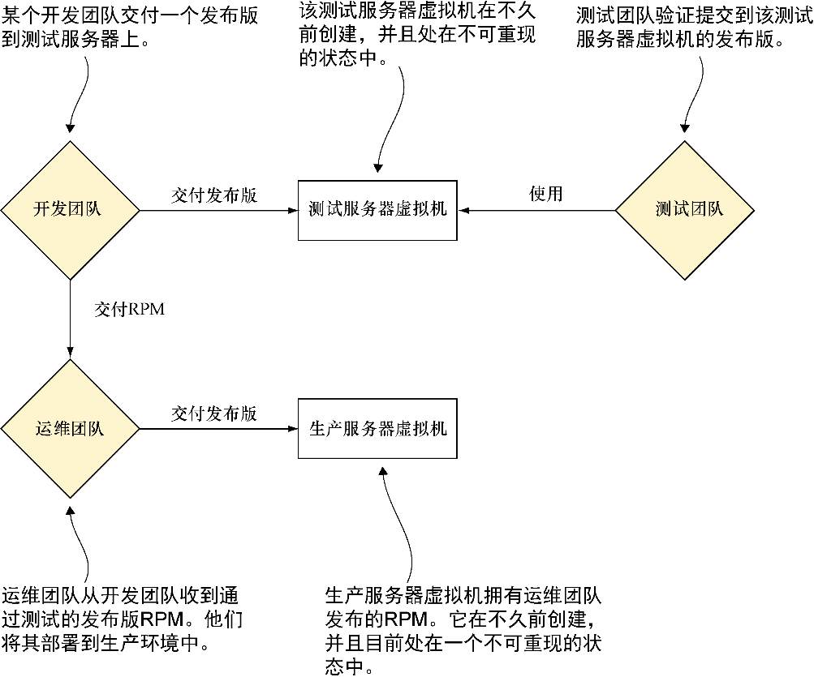
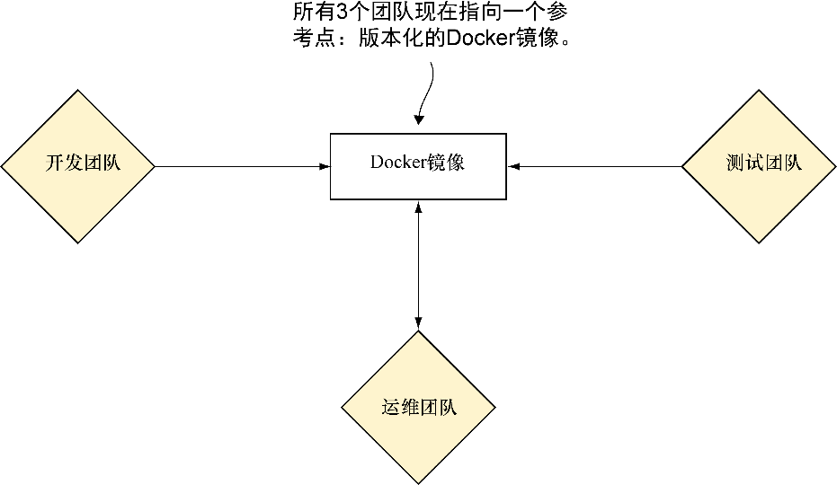

### 技巧70　Docker契约：减少摩擦

Docker 的目标之一是让与包含单个应用程序的容器相关联的输入与输出易于表达。在与其他人一起工作时这可以增加透明度——沟通是合作的重要环节之一，而理解Docker如何通过提供一个参考点来简化事务将有助于赢得不信任Docker的人的支持。

#### 问题

想要合作团队的可交付成果是整洁的、明确的，从而减少交付流水线里的摩擦。

#### 解决方案

使用Docker **契约** 来推动团队间产出整洁的可交付成果。

随着公司规模扩大，经常可以看到其曾经拥有的扁平化的、精益化的组织架构——几个关键的个人“了解整个系统”，让位给了一个更加结构化的组织架构——不同的团队具有不同的职责和能力。我们在效力过的组织中都对此有过切身体会。

如果没有进行技术投入，随着团队之间相互交付的增多，摩擦也会不断升级。对日益增长的复杂度的抱怨——“把这个版本扔出去！”以及问题一堆的升级将变得稀松平常。“呃，在我们的机器上是正常的！”这样的叫喊声不绝于耳，所有各方都感到失望。图9-2展示了这个场景的一个简化了但具有代表性的情形。

图9-2中的工作流有几个大家熟知的问题。这些问题最终都归结于状态管理的困难。测试团队可能在一台不是运维团队所设置的机器上进行测试。理论上，对所有环境的修改都应仔细地记录下来，并在出现问题时进行回滚以保持一致性。但是，商业压力与人类行为的现实存在总是破坏这个目标，造成环境性漂移。

<b class="my_markdown">图9-2　之前：一个典型的软件工作流</b>

对这一问题的现有解决方案包括虚拟机及RPM。虚拟机通过交付完整的机器表示来减少环境引发风险的可能性。其缺点在于虚拟机是相对单一的实体，对各个团队来说很难有效地进行操作。RPM提供了一种打包应用程序的标准方法，可以在交付软件时定义其依赖。这并未消除配置管理的问题，交付兄弟团队创建的RPM要远比使用互联网上久经考验的RPM问题多得多。

##### Docker契约

Docker所能做的是在团队之间划出清晰的分界线，Docker镜像既是分界线，又是交换的单位。我们称其为Docker **契约** ，如图9-3所示。

使用Docker，所有团队的参考点变得更加清晰了。与处理处于不可重现状态的庞大的单体虚拟机（或真机）不同，所有团队面对的是相同的代码，而不论是在测试环境、生产环境还是开发环境。此外，代码与数据有了一个清晰的分离，更易于推断问题是由数据的变化造成的还是由代码的变化造成的。

因为Docker使用非常稳定的Linux API作为环境，交付软件的团队具有更大的自由度使用他们喜欢的风格来构建软件和服务，并确信它可在不同环境中按预期运行。这不代表可以忽略它运行所在的环境，但它确实减少了环境差异造成问题的风险。

<b class="my_markdown">图9-3　之后：Docker契约</b>

这样单一参考接触点带来的是各种运维效率的提升。问题重现变得更加简单，所有团队都能从一个已知的起点描述并重现问题。升级变成了交付变更的团队的责任。简而言之，状态由那些做变更的人管理。所有这些优点极大地降低了沟通开销，让各个团队能继续他们的工作。沟通开销的降低还有助于向微服务构架进行迁移。

这不只是理论上的好处：我们在一家拥有超过500名开发人员的公司亲身体验了这种提升，它也是各类Docker技术聚会中一个频繁讨论的话题。

#### 讨论

本技巧概述了一个用于鉴别其他技巧如何适应这个新世界的策略，记住这一点对阅读全书将很有帮助。比如说，技巧76描述的是在生产系统上以相同跨容器方式运行微服务应用程序的方法，消除了配置文件调整的源头。当你发现自己在不同环境使用外部URL或其他不变因素时，技巧85将呈上有关服务发现（一种将大量配置文件转变为单一真实来源的好方法）的信息。

