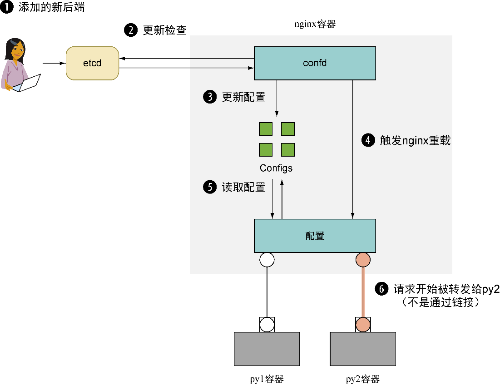

### 技巧75　使用confd启用零停机时间切换

由于容器在一台宿主机上可以共存，删除一个容器并启动一个新容器这样的简单切换方式可以在几秒内完成（同样可以实现快速回滚）。

对大多数应用程序来说，这可能已经够快了，但那些具有较长启动时间或高可用需求的应用程序则需要另外一种方法。有时，这是一个要求应用程序自身做特殊处理的不可避免的复杂过程，不过面向Web的应用程序有一个方案可以优先考虑。

#### 问题

想要在升级面向Web的应用程序时做到零停机时间。

#### 解决方案

在宿主机上使用nginx和confd来执行两阶段切换。

nginx是一个非常流行的Web服务器，它具有一项重要的内置功能——它可以在不断开客户端与服务器连接的情况下重新加载配置文件。通过将其与confd—— 一个可从中央数据仓库（如etcd）获取信息并对配置文件进行相应修改的工具——组合，即可使用最新的设置对etcd进行更新，然后由其完成后续处理。


**注意**

Apache HTTP服务器与HAProxy二者也提供了零停机时间重载功能，有相应配置经验的用户也可以用其替代nginx。


第一步是启动一个应用程序作为最终将更新的旧应用程序。Ubuntu附带的Python具有一个内置的Web服务器，可以使用它作为示例，如代码清单9-13所示。

代码清单9-13　在容器里启动一个简单的文件服务器

```c
$ ip addr | grep 'inet ' | grep -v 'lo$\|docker0$'
    inet 10.194.12.221/20 brd 10.194.15.255 scope global eth0
$ HTTPIP=http://10.194.12.221
$ docker run -d --name py1 -p 80 ubuntu:14.04.2 \
  sh -c 'cd / && python3 -m http.server 80'
e6b769ec3efa563a959ce771164de8337140d910de67e1df54d4960fdff74544
$ docker inspect -f '{{.NetworkSettings.Ports}}' py1
map[80/tcp:[{0.0.0.0 32768}]]
$ curl -s localhost:32768 | tail | head -n 5
<li><a href="sbin/">sbin/</a></li>
<li><a href="srv/">srv/</a></li>
<li><a href="sys/">sys/</a></li>
<li><a href="tmp/">tmp/</a></li>
<li><a href="usr/">usr/</a></li>
```

HTTP服务器已经成功启动，这里使用了 `inspect` 命令的过滤选项将宿主机端口与内部容器映射信息提取出来。

现在确保etcd正在运行——本技巧假定工作环境与技巧74相同。为简单起见，这一次将使用etcdctl（“etcd controller”的简称）与etcd（而不是直接对etcd进行 `curl` ）进行交互，如代码清单9-14所示。

代码清单9-14　下载并使用etcdctl Docker镜像

```c
$ IMG=dockerinpractice/etcdctl
$ docker pull dockerinpractice/etcdctl
[...]
$ alias etcdctl="docker run --rm $IMG -C \"$HTTPIP:8080\""
$ etcdctl set /test value
value
$ etcdctl ls
/test
```

这将下载我们准备好的etcdctl Docker镜像，同时设置一个别名用于连接前面设置的etcd集群。现在启动nginx，如代码清单9-15所示。

代码清单9-15　启动一个nginx + confd容器

```c
$ IMG=dockerinpractice/confd-nginx
$ docker pull $IMG
[...]
$ docker run -d --name nginx -p 8000:80 $IMG $HTTPIP:8080
ebdf3faa1979f729327fa3e00d2c8158b35a49acdc4f764f0492032fa5241b29
```

这是一个我们提前准备好的镜像，它使用confd从etcd获取信息，并自动更新配置文件。传递的参数将告知容器它可以连接的etcd集群。不过这里尚未告诉它到哪去查找应用程序，因此日志中充满了错误。

下面将添加适当的信息到etcd中，如代码清单9-16所示。

代码清单9-16　演示nginx容器自动配置

```c
$ docker logs nginx
Using http://10.194.12.221:8080 as backend
2015-05-18T13:09:56Z ebdf3faa1979 confd[14]: >
ERROR 100: Key not found (/app) [14]
2015-05-18T13:10:06Z ebdf3faa1979 confd[14]: >
ERROR 100: Key not found (/app) [14]
$ echo $HTTPIP
http://10.194.12.221
$ etcdctl set /app/upstream/py1 10.194.12.221:32768
10.194.12.221:32768
$ sleep 10
$ docker logs nginx
Using http://10.194.12.221:8080 as backend
2015-05-18T13:09:56Z ebdf3faa1979 confd[14]: >
ERROR 100: Key not found (/app) [14]
2015-05-18T13:10:06Z ebdf3faa1979 confd[14]: >
ERROR 100: Key not found (/app) [14]
2015-05-18T13:10:16Z ebdf3faa1979 confd[14]: >
ERROR 100: Key not found (/app) [14]
2015-05-18T13:10:26Z ebdf3faa1979 confd[14]: >
INFO Target config /etc/nginx/conf.d/app.conf out of sync
2015-05-18T13:10:26Z ebdf3faa1979 confd[14]: >
INFO Target config /etc/nginx/conf.d/app.conf has been updated
$ curl -s localhost:8000 | tail | head -n5
<li><a href="sbin/">sbin/</a></li>
<li><a href="srv/">srv/</a></li>
<li><a href="sys/">sys/</a></li>
<li><a href="tmp/">tmp/</a></li>
<li><a href="usr/">usr/</a></li>
```

对etcd的更新已经被confd读取并应用到nginx配置文件中，让用户可以访问这个简单的文件服务器。这里包含 `sleep` 命令是因为配置了confd每10 s检查更新。在这背后，confd-nginx容器中运行着一个confd守护进程来拉取etcd集群中的变更，并只在检测到变更时使用容器内的模板重新生成nginx配置。

假设我们决定对外提供/etc目录而不是/目录。现在启动第二个应用程序并将其添加到etcd中。因为此时有两个后端，最终将得到其各自的响应，如代码清单9-17所示。

代码清单9-17　使用confd设置nginx的两个后端web服务

```c
$ docker run -d --name py2 -p 80 ubuntu:14.04.2 \
  sh -c 'cd /etc && python3 -m http.server 80'
9b5355b9b188427abaf367a51a88c1afa2186e6179ab46830715a20eacc33660
$ docker inspect -f '{{.NetworkSettings.Ports}}' py2
map[80/tcp:[{0.0.0.0 32769}]]
$ curl -s $HTTPIP:32769 | tail | head -n 5
<li><a href="udev/">udev/</a></li>
<li><a href="update-motd.d/">update-motd.d/</a></li>
<li><a href="upstart-xsessions">upstart-xsessions</a></li>
<li><a href="vim/">vim/</a></li>
<li><a href="vtrgb">vtrgb@</a></li>
$ echo $HTTPIP
http://10.194.12.221
$ etcdctl set /app/upstream/py2 10.194.12.221:32769
10.194.12.221:32769
$ etcdctl ls /app/upstream
/app/upstream/py1
/app/upstream/py2
$ curl -s localhost:8000 | tail | head -n 5
<li><a href="sbin/">sbin/</a></li>
<li><a href="srv/">srv/</a></li>
<li><a href="sys/">sys/</a></li>
<li><a href="tmp/">tmp/</a></li>
<li><a href="usr/">usr/</a></li>
$ curl -s localhost:8000 | tail | head -n 5
<li><a href="udev/">udev/</a></li>
<li><a href="update-motd.d/">update-motd.d/</a></li>
<li><a href="upstart-xsessions">upstart-xsessions</a></li>
<li><a href="vim/">vim/</a></li>
<li><a href="vtrgb">vtrgb@</a></li>
```

在上述过程中，在将新容器添加到etcd之前，会先确认它是否正确启动（见图9-4）。可以通过覆盖etcd中的 `/app/upstream/py1` 键一步完成该过程。如果要求一次只能有一个后台可供访问，这个做法就很有用。


<center class="my_markdown"><b class="my_markdown">图9-4　添加py2容器到etcd中</b></center>

使用两阶段切换，第二个阶段是删除旧的后端和容器，如代码清单9-18所示。

代码清单9-18　移除旧的上游地址

```c
$ etcdctl rm /app/upstream/py1
PrevNode.Value: 192.168.1.123:32768
$ etcdctl ls /app/upstream
/app/upstream/py2
$ docker rm -f py1
py1
```

这样，新的应用程序就启动并自己运行起来了！对用户而言，此应用程序没有不可访问的情况，并且不需要手工连接到Web服务器机器上去重载nginx。

#### 讨论

confd的使用不仅限于配置Web服务器：只要某个文件包含需要根据外部值来更新的文本，confd便可派上用场——这是存储在磁盘上的配置文件与单点真值的etcd集群之间一个有用的连接器。

技巧74中提到了etcd不能用于存储长度很大的值。因此，并不一定要将confd与etcd搭配使用，多数流行的键/值存储系统都有可用的集成方案，因此如果已经有可以正常运转的系统，则无须再添加另外的部分。

在生产环境中使用Docker时，如果需要为某个服务更新后端服务器，完全可以避免手工修改etcd，后面的技巧86就介绍了这样一种方法。

