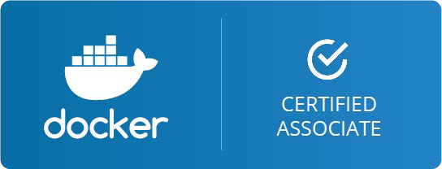
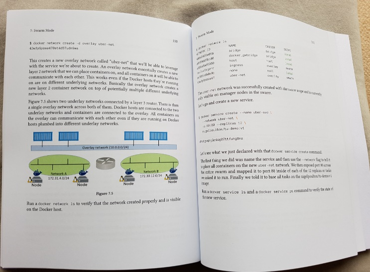
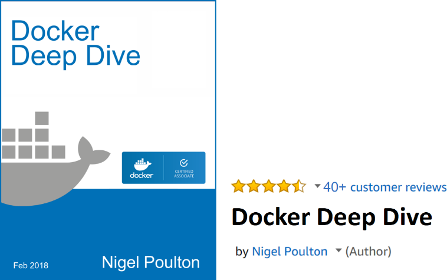

# 前言

这是一本关于Docker的图书。本书的宗旨是从零开始学习Docker，因此读者无须任何前置知识储备。

本书非常适合对Docker感兴趣，希望了解Docker工作原理以及如何正确使用Docker的读者。

如果只是学习Docker的使用方法，而不关心其内部实现机制，则本书并 **不** 适合。

## Docker认证工程师（Docker Certified Associate）

Docker于2017年秋发布了第1版专业资质认证，称为Docker认证工程师（Docker Certified Associate, DCA），面向想要评估自身Docker管理水平的人群。

本书覆盖了认证考试的所有知识点，但本书并非应试书，而是一本易于阅读的实用技术图书。

祝愿读者考试顺利！

## 纸质版本

虽然现如今电子书非常棒，但我依然钟情于油墨与纸张，当然这并无冒犯Leanpub和亚马逊Kindle之意。所以，本书的英文纸质版本在亚马逊有售（并非黑白版）。

说到亚马逊，我非常希望收到读者在亚马逊上对本书的评价，当然也包括在Leanpub上购买本书的读者的评价。感谢！

## 为什么要阅读本书，为什么要关注Docker

如今Docker无处不在，这是不争的事实。开发人员都很喜欢它，运维工程师也需要它。他们都需要深入了解如何在关键业务环境中构建和维护符合生产级别要求的容器化应用，本书将帮助读者掌握它。

## Docker仅能供开发人员所用吗

对于认为Docker是开发人员专属工具的人来说，恐怕要准备好颠覆自己的认知了。

容器化应用需要有地方运行，也需要有人来管理。如果认为只是开发人员来管理它，那就大错特错了，事实上运维需要构建和运行高性能、生产级别的Docker基础架构。对于专注于运维工作却尚未掌握Docker的朋友来说，日子恐怕不太好过。不过不必焦虑，本书将帮你掌握Docker。

## 内容组织

本书分为两部分。

+ Docker概览篇：本篇介绍Docker公司（Docker, Inc.）、Docker（Moby）项目、什么是OCI、为什么需要容器等。如果读者想要对Docker和容器有一个全面的了解，则需要阅读这些内容。
+ Docker技术篇：本篇是全书的主要内容，包含了掌握Docker所需的所有知识。这部分会详细介绍镜像、容器，以及越来越重要的关于编排的知识。此外，本书甚至还介绍了企业应用中比较关心的技术，比如TLS、RBAC、与AD的集成，以及备份。读者不仅能够了解相关的概念和原理，还能够参考本书给出的命令和例子进行练习。

Docker技术篇的多数章节都可以分为3个部分——简介、详解和命令。

“简介”部分是大约两三段的简要介绍，用于概括性地阐述相应章节的内容，也能够方便读者在复习时快速回忆相关的内容。

“详解”部分会详细介绍工作原理，并配有示例的介绍。

“命令”部分会以一种易于阅读的方式列出所有相关命令及其简要说明。

希望读者能够喜欢这种方式。

