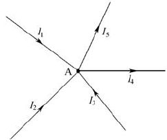

[toc]

### 1. 基本概念

在分析简单电路时，一般应用欧姆定律和电阻的串、并联规律，但用它们来分析复杂电路就比较困难。这里的简单电路通常是指只有一个电源的电路，而复杂电路通常是指有两个或两个以上电源的电路。对于复杂电路，常用到基尔霍夫定律、叠加定理和戴维南定理进行分析。在了解这些定律和定理之前先来说明几个基本概念。

#### 1.1 支路

**支路是指由一个或几个元件首尾相接构成的一段无分支的电路。在同一支路内，流过所有元件的电流相等。**在下图所示电路中，它有三条支路，即 `bafe` 支路、`be` 支路和`bcde` 支路。其中 `bafe` 支路和 `bcde` 支路中都含有电源，这种含有电源的支路称为有源支路。`be` 支路没有电源，称为无源支路。

#### 1.2 节点

三条或三条以上支路的连接点称为节点。如上图所示电路中的 b 点和 e 点都是节点。

#### 1.3 回路

电路中任意一个闭合的路径称为回路。如上图所示电路中的 `abefa`、`bcdeb`、`abcdefa` 都是回路。

#### 1.4 网孔

内部不含支路的回路称为网孔。如上图所示电路中的 `abefa`、`bcdeb` 回路是网孔，`abcdefa` 就不是网孔，因为它含有支路 `be`。

### 2. 基尔霍夫定律

**基尔霍夫定律又可分为基尔霍夫第一定律（又称基尔霍夫电流定律）和基尔霍夫第二定律（又称基尔霍夫电压定律）。**

#### 2.1 基尔霍夫第一定律（电流定律）

基尔霍夫第一定律指出，在电路中，流入任意一个节点的电流之和等于流出该节点的电流之和。下面以下图所示的电路来说明该定律。

在上图所示电路中，流入 A 点的电流有三个，即 I1、I2、I3；从 A 点流出的电流有两个，即 I4、I5。由基尔霍夫第一定律可得：
$$
I_1 + I_2 + I_3 = I_4 + I_5
$$
又可表示为
$$
\sum\nolimits{I_入} = \sum\nolimits{I_出}
$$
这里的 `Σ` 表示求和，可读作 “西格马”。

如果规定流入节点的电流为正，流出节点的电流为负，那么基尔霍夫第一定律也可以这样叙述：在电路中任意一个节点上，电流的代数和等于零，即：
$$
I_1 + I_2 + I_3 + (-I_4) + (-I_5) = 0A
$$
也可以表示成
$$
\sum\nolimits{I} = 0A
$$

<b>图1-10 封闭面电流示意图</b>

**基尔霍夫第一定律不但适合于电路中的节点，对一个封闭面也是适用的。**图1-10（a）所示示意图中流入晶体管的电流 `Ib`、`Ic` 与流出的电流 `Ie` 有以下关系
$$
I_b + I_c = I_e
$$
在图 1-10（b）所示电路中，流入三角形负载的电流I1与流出的电流 `I2`、`I3`有以下关系：
$$
I_1 = I_2 + I_3
$$

#### 2.2 基尔霍夫第二定律（电压定律）

**基尔霍夫第二定律指出，电路中任一回路内各段电压的代数和等于零**，即
$$
\sum\nolimits{U}=0V
$$

   在应用基尔霍夫第二定律分析电路时，需要先规定回路的绕行方向。当流过回路中某元件的电流方向与绕行方向一致时，该元件两端的电压取正，反之取负；电源的电动势方向（电源的电动势方向始终是由负极指向正极）与绕行方向一致时，电源的电动势取负，反之取正。下面以图1-11所示的电路来说明这个定律。

   

   
<b>图 1-11 基尔霍夫第二定律说明图</b>

   先来分析图1-11所示电路中的 BCDF 回路的电压关系。首先在这个回路中画一个绕行方向，流过 R2 的电流 I2 和流过 R3 的电流 I3 与绕行方向一致，故 I2 × R2（即为 U2 ）和 I3 × R3 （即为 U3 ）都取正；电源 E2 的电动势方向与绕行方向一致，电源 E2 的电动势取负。根据基尔霍夫第二定律可得出：
$$
   I_2\cdot{R_2}+I_3\cdot{R_3}+(-E_2)=0V
$$

   再来分析图1-11所示电路中的 ABFH 回路的电压关系。先在 ABFH 回路中画一个绕行方向，流过 R1 的电流 I1 方向与绕行方向相同；I1×R1 取正，流过 R2 的电流 I2 方向与绕行方向相反，I2×R2 取负；电源 E2 的电动势方向（负极指向正极）与绕行方向相反，E2 的电动势取正；电源 E1 的电动势方向与绕行方向相同，E1 的电动势取负。根据基尔霍夫电压定律可得出：
$$
   I_1\cdot{R_1}+(-I_2\cdot{R_2})+E_2+(-E_1)=0V
$$

#### 2.3 基尔霍夫定律的应用——支路电流法

对于复杂电路的计算常常要用到基尔霍夫第一、第二定律，并且这两个定律经常同时使用，下面介绍应用这两个定律计算复杂电路的一种方法 支路电流法。

**支路电流法使用时的一般步骤如下所述。**

**① 在电路上标出各支路电流的方向，并画出各回路的绕行方向。**

**② 根据基尔霍夫第一、第二定律列出方程组。**

**③ 解方程组求出未知量。****

下面再举例说明支路电流法的应用。

图1-12 所示为汽车照明电路，其中 E1 为汽车发电机的电动势，E1=14V；R1 为发电机的内阻，R1=0.5Ω；E2 为蓄电池的电动势，E2=12V；R2 为蓄电池的内阻，R2=0.2Ω，照明灯电阻 R=4Ω。求各支路电流 I1、I2、I 和加在照明灯上的电压 UR。

<b>图1-12 汽车照明电路</b>

解题过程如下。

第一步：在电路中标出各支路电流 I1、I2、I 的方向，并画出各回路的绕行方向。

第二步：根据基尔霍夫第一、第二定律列出方程组。

节点 B 的电流关系为：
$$
I_1+I_2-I=0A
$$
回路ABEF的电压关系为：
$$
I_1\cdot{R_1}-I_2\cdot{R_2}+E_2-E_1=0V
$$
回路BCDE的电压关系为：
$$
I_2\cdot{R_2}+I\cdot{R}-E_2=0V
$$
第三步：解方程组。

将 E1=14V、R1=0.5Ω、E2=12V、R2=0.2Ω、R=4Ω 代入上面三个式子中，再解方程组可得：
$$
I_1=3.72A, I_2=-0.69A, I=3.03A\\
U_R=I\cdot{R}=3.03\times{4V}=12.12V
$$

上面的 I2 为负值，表明 I2 电流实际方向与标注方向相反，即 I2 电流实际是流进蓄电池的，这说明发电机在为照明灯供电的同时还对蓄电池进行充电。

### 3. 叠加定理

**对于一个元件，如果它两端的电压与流过的电流成正比，这种元件就被称为线性元件。**线性电路是由线性元件组成的电路。电阻就是一种最常见的线性元件。叠加定理是反映线性电路基本性质的一个重要定理。

**叠加定理的内容是：在线性电路中，任一支路中的电流（或电压）等于各个电源单独作用在此支路中所产生的电流（或电压）的代数和。**

下面以求图1-13（a）所示电路中各支路电流 *I*1、*I*2、*I* 的大小来说明叠加定理的应用，图中的 E1=14V，R1=0.5Ω，E2=12V，R2=0.2Ω，R=4Ω。

<b>图1-13 利用叠加定理求支路电流</b>

解题过程如下：

第一步：在图1-13（a）所示电路中标出各支路电流的方向。

第二步：画出只有一个电源 E1 作用时的电路，把另一个电源当作短路，并标出这个电路各支路的电流方向，如图1-13（b）所示；再分别求出该电路各支路的电流大小：
$$
{I_1^{'}}=\frac{E_1}{R_1+\frac{R_2R}{R_2+R}}=\frac{14}{0.5+\frac{0.2\times4}{0.2+4}}A=14\times\frac{4.2}{2.9}A\approx20.28A\\
{I_2^{'}}=\frac{E_1-{I_1^{'}}R_1}{R_2}=\frac{14-20.28\times0.5}{0.2}A=19.3A\\
{I^{'}}={I_1^{'}}-{I_2^{'}}=(20.28 - 19.3)A=0.98A
$$
第三步：画出只有电源 E2 作用时的电路，把电源 E1 当作短路，并在这个电路中标出各支路电流的方向，如图1-13（c）所示；再分别求出该电路各支路的电流大小：
$$
{I_2^{"}}=\frac{E_2}{R_2+\frac{R_1R}{R_1+R}}=\frac{12}{0.2+\frac{0.5\times4}{0.5+4}}A=12\times\frac{4.5}{2.9}A\approx18.6A\\
{I_1^{"}}=\frac{E_2-{I_2^{"}R_2}}{R_1}=\frac{12-3.72}{0.5}A=16.56A\\
{I^{"}}={I_2^{"}}-{I_1^{"}}=2.04A
$$
第四步：将每一支路的电流或电压分别进行叠加。凡是与图1-13（a）所示的电路中假定的电流（或电压）方向相同的为正，反之为负。这样可以求出各支路的电流分别如下：
$$
I_1={I_1^{'}}-{I_1^{"}}=(20.28-16.56)A=3.72A\\
I_2={I_2^{"}}-{I_2^{'}}=(18.6-19.3)A=0.7A\\
I={I^{'}}+{I^{"}}=(0.98+2.04)A=3.02A
$$

### 4. 戴维南定理

对于一个复杂电路，如果需要求多条支路的电流大小，可以应用基尔霍夫定律或叠加定理。如果仅需要求一条支路中的电流大小，则应用戴维南定理更为方便。

在介绍戴维南定理之前，先来说明一下二端网络。**任何具有两个出线端的电路都可以称为二端网络。包含有电源的二端网络称为有源二端网络，否则就称为无源二端网络。**图1-14（a）所示电路就是一个有源二端网络，通常可以将它画成图1-14（b）所示的形式。

**戴维南定理的内容是：任何一个有源二端网络都可以用一个等效电源电动势E0和内阻R0串联起来的电路来代替。**根据该定理可以将图1-14（a）所示的电路简化成图1-14（c）所示的电路。

那么等效电源电动势 E0 和内阻 R0 如何确定呢？戴维南定理还指出：等效电源电动势 E0 是该有源二端网络开路时的端电压；内阻 R0 是指从两个端点向有源二端网络内看进去，并将电源均当成短路时的等效电阻。

下面以图1-15（a）所示的电路为例来说明戴维南定理的应用。在图1-15（a）所示的电路中，E1=14V，R1=0.5Ω，E2=12V，R2=0.2Ω，R=4Ω，求流过电阻R的电流I的大小。解题过程如下：

<b>图1-15 用戴维南定理求支路电流</b>

第一步：将电路分成待求支路和有源二端网络，如图1-15（a）所示。

第二步：假定待求支路断开，求出有源二端网络开路的端电压，此即为等效电源电动势E0，如图1-15（b）所示，即
$$
I_1=\frac{E_1-E_2}{R_1+R_2}=\frac{14-12}{0.5+0.2}A=\frac{2}{0.7}A=\frac{20}{7}A\\
E_0=E_1-I_1{R_1}=(14-\frac{20}{7}\times{0.5})V=\frac{88}{7}V
$$
第三步：假定有源二端网络内部的电源都短路，求出内部电阻，即为内阻值 R0，如图1-15（c）所示，即
$$
R_0=\frac{R_1R_2}{R_1+R_2}=\frac{0.5\times0.2}{0.5+0.2}\Omega=\frac{0.1}{0.7}\Omega=\frac{1}{7}\Omega
$$
第四步：画出图1-15（a）所示电路的戴维南等效电路，如图1-15（d）所示，再求出待求支路电流的大小，即
$$
I=\frac{E_0}{R_0+R}= \frac{\frac{88}{7}}{\frac{1}{7}+4}A=\frac{88}{7}\times\frac{7}{29}A\approx3.03A
$$

### 5. 最大功率传输定理与阻抗变换

#### 5.1 最大功率传输定理

在电路中，往往希望负载能从电源中获得最大的功率，怎样才能做到这一点呢？如图1-16所示，E 为电源，R 为电源的内阻，RL 为负载电阻，I 为流过负载 RL 的电流，U 为负载两端的电压。

负载 RL 获得的功率 P=UI，当增大 RL 的阻值时，电压 U 会增大，但电流 I 会减小，如果减小 RL 的阻值，虽然电流 I 会增大，但电压 U 会减小。什么情况下功率 P 的值最大呢？**最大功率传输定理的内容是：负载要从电源获得最大功率的条件是负载的电阻（阻抗）与电源的内阻相等。负载的电阻与电源的内阻相等又称两者阻抗匹配。**在图1-16所示电路中，负载 RL 要从电源获得最大功率的条件是 RL=R，此时 RL 得到的最大功率是：
$$
P=\frac{E^2}{4R_L}
$$

图1-16 简单电路功率传输

如果有多个电源向一个负载供电，如图1-17所示，负载 RL 怎样才能获得最大功率呢？这时就要先用戴维南定理求出该电路的等效内阻 R0 和等效电动势 E0，只要 RL=R0，负载就可以获得最大功率：
$$
P=\frac{E_0^2}{4R_L}
$$

图1-17 复杂电路功率传输

#### 5.2 阻抗变换

当负载的阻抗与电源的内阻相等时，负载才能从电源中获得最大功率，但很多电路的负载阻抗与电源的内阻并不相等，这种情况下怎么才仍能让负载获得最大功率呢？解决方法是进行阻抗变换，阻抗变换通常采用变压器。下面以图1-18所示电路为例来说明变压器的阻抗变换原理。

图1-18 变压器的阻抗变换原理说明图

在图1-18（a）所示电路中，要负载从电源中获得最大功率，需让负载的阻抗 Z 与电源（这里为信号源）内阻 R0 大小相等，即 Z=R0。这里的负载可以是一个元件，也可以是一个电路，它的阻抗可以用下面公式表示：
$$
Z=\frac{U_1}{I_1}
$$
现假设负载是图1-18（b）所示点画线框内由变压器和电阻组成的电路，该负载的阻抗
$$
Z=\frac{U_1}{I_1}
$$
，变压器的匝数比为 n，电阻的阻抗为 ZL，根据变压器改变电压的规律
$$
\frac{U_1}{U_2}=\frac{I_2}{I_1}=n
$$
可得到下式，即
$$
Z=\frac{U_1}{I_1}=\frac{nU_2}{\frac{1}{n}I_2}=n^2\frac{U_2}{I_2}=n^2Z_L
$$
从上式可以看出，变压器与电阻组成电路的总阻抗 Z 是电阻阻抗 ZL 的 n2 倍，即 Z=n2ZL。如果让总阻抗 Z 等于电源的内阻 R0，变压器和电阻组成的电路就能从电源获得最大功率，又因为变压器不消耗功率，所以功率全传送给真正的负载（电阻），达到功率最大程度传送的目的。由此可以看出：通过变压器的阻抗变换作用，真正负载的阻抗不需与电源内阻相等，同样能实现功率最大传输。

下面举例来说明变压器阻抗变换的应用。如图1-19所示，音频信号源内阻 R0=72Ω，而扬声器 B 的阻抗 ZL=8Ω，如果将两者按图1-19（a）所示的方法直接连接起来，扬声器将无法获得最大功率，这时可以在它们之间加一个变压器 T1，如图1-19（b）所示。至于选择匝数比 n 为多少的变压器，可用 R0=n2ZL 来计算，结果可得到 n=3。也就是说，只要在两者之间接一个 n=3 的变压器，扬声器 B 就可以从音频信号源获得最大功率，从而发出最大的声音。

图1-19 变压器阻抗变换举例

