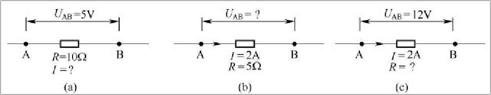

[toc]

欧姆定律分为部分电路欧姆定律和全电路欧姆定律。

### 1. 部分电路欧姆定律

部分电路欧姆定律内容是：**在电路中，流过导体的电流 <b><i>Ⅰ</i></b> 的大小与导体两端的电压 <b><i>U</i></b> 成正比，与导体的电阻 <b><i>R</i></b> 成反比**，即：

$$
I=\frac{U}{R}
$$
也可以表示为：
$$
U=IR
$$
或
$$
R=\frac{U}{I}
$$
式中，`R` 的单位是欧姆（ Ω ），`U` 的单位是伏特（ V ），`I` 的单位是安培（ A ）。

为了让大家更好地理解欧姆定律，下面以下图为例来说明：

如图（a）所示，已知电阻 R=10Ω，电阻两端电压 UAB=5V，那么流过电阻的电流为
$$
I=\frac{U_{AB}}{R}=\frac{5}{10}A=0.5A
$$
又如图（b）所示，已知电阻 R=5Ω，流过电阻的电路 I=2A，那么电阻两端的电压为：
$$
U_{AB}=I·R=(2×5)V=10V
$$
在图（c）所示电路中，流过电阻的电流 I=2A，电阻两端的电压 UAB=12V，那么电阻的大小为：
$$
R=\frac{U}{I}=\frac{12}{2}Ω=6Ω
$$
下面再来说明欧姆定律在实际电路中的应用：

在下图所示的电路中，电源的电动势 E = 12V，A、D 之间的电压 UAD 与电动势 E 相等，三个电阻 R1、R2、R3 串联起来，可以相当于一个电阻 R，R = R1 + R2 + R3 = ( 2 + 7 + 3)Ω = 12Ω。知道了电阻的大小和电阻两端的电压，就可以求出流过电阻的电流 I。

求出了流过 R1、R2、R3 的电流 I，并且它们的电阻大小已知，就可以求 R1、R2、R3 两端的电压 UR1（ UR1 实际就是 A、B 两点之间的电压 UAB ）、UR2（实际就是 UBC ） 和 UR3（实际就是 UCD ），即：
$$
U_{R1}=U_{AB}=I·R_{1}=( 1×2 )V=2V\\
U_{R2}=U_{BC}=I·R_{2}=( 1×7 )V=7V\\
U_{R3}=U_{CD}=I·R_{3}=( 1x3 )V=3V
$$
从上面可以看出 UR1 + UR2 + UR3 = UAB + UBC + UCD = UAD = 12V

在上图所示电路中如何求 B 点电压呢？首先要明白，求某点电压指的就是求该点与地之间的电压，所以 B 点电压 UB 实际就是电压 UBD。求 UB 有以下两种方法：

方法一：UB=UBD=UBC+UCD=UR2+UR3=( 7+3 )V=10V

方法二：UB=UBD=UAD-UAB=UAD-UR1=( 12-2 )V=10V

### 2. 全电路欧姆定律

全电路是指含有电源和负载的闭合回路。**全电路欧姆定律又称为闭合电路欧姆定律，其内容是：闭合电路中的电流与电源的电动势成正比，与电路的内、外电阻之和成反比**，即：
$$
I=\frac{E}{R+R_{0}}
$$
全电路欧姆定律应用如下图所示：

上图中点画线框内为电源，R0 表示电源的内阻，E 表示电源的电动势。当开关 S 闭合后，电路中有电流 I 流过，根据全电路欧姆定律可求得：
$$
I=\frac{E}{R+R_{0}}=\frac{12}{10+2}A=1A
$$
电源输出电源（也即电阻 R 两端的电压）U=IR=1x10V=10V，内阻 R0 两端的电压 U0=IR0=1x2V=2V。如果将开关 S 断开，电路中的电流 I=0A，那么内阻 R0 上消耗的电压 U0=0V，电源输出电压 U 与电源电动势相等，即 U=E=12V。

根据全电路欧姆定律不难看出以下几点：

+ 在电源未接负载时，不管电源内阻多大，内阻消耗的电压始终为 0V，电源两端电压与电动势相等。
+ 当电源与负载构成闭合电路后，由于有电流流过内阻，内阻会消耗电压，从而使电源输出电压降低。内阻越大，内阻消耗的电压越大，电源输出电压越低。
+ 在电源内阻不变的情况下，如果外阻越小，电路中的电流越大，内阻消耗的电压也越大，电源输出电压也会降低。
