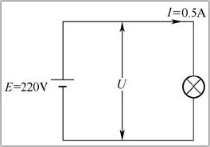

[toc]

### 1. 电功

电流流过灯泡，灯泡会发光；电流流过电炉丝，电炉丝会发热；电流流过电动机，电动机会运转。由此可以看出，**电流流过一些用电设备时是会做功的，电流做的功称为电功。用电设备做功的大小不但与加到用电设备两端的电压及流过的电流有关，还与通电时间长短有关**。电功可用下面的公式计算：
$$
W=UIt
$$
式中，W 表示电功，单位是焦（ J ）；t 表示时间，单位是秒（ s ）。

**电功的单位是焦耳（ J ），在电学中还常用到另一个单位：千瓦时（ kW·h ），也称度，1 kW·h = 1度**。千瓦时与焦耳的换算关系：
$$
1kW·h=1 × 10^{3}W × ( 60 × 60)s = 3.6 × 10^{6}W·s = 3.6 × 10{6}J
$$
1 kW·h 可以这样理解：一个电功率为 100W 的灯泡连续使用 10h，消耗的电功为 1kW·h（即消耗 1 度电）。

### 2. 电功率

电流需要通过一些用电设备才能做功。为了衡量这些设备做功能力的大小，引入一个电功率的概念。**电流单位时间做的功称为电功率**。电功率常用 P 表示，单位是瓦（ W ），此外还有千瓦（ KW ）和毫瓦（ mW ），它们之间的换算关系是：
$$
1KW = 10^{3}W = 10^{6}
$$
电功率的计算公式是：
$$
P=UI
$$
根据欧姆定律可知 U=IxR，I=U/R，所以电功率还可以用公式
$$
P=I^{2}×R
$$
和
$$
P=\frac{U^{2}}{R}
$$
来求。

下面以下图所示电路来说明电功率的计算方法：

白炽灯的功率 P = UI = 220V x 0.5A = 110W

白炽灯的电阻 R = U/I = 220V / 0.5A = 440Ω

白炽灯在 10s 做的功 W = UIt = 220V x 0.5A x 10s = 1100J

### 3. 焦耳定律

电流流过导体时导体会发热，这种现象称为电流的热效应。电热锅、电饭煲和电热水器等都是利用电流的热效应来工作的。

英国物理学家焦耳通过实验发现：电流流过导体，导体发出的热量与导体流过的电流、导体的电阻和通电的时间有关。这个关系用公式表示就是：
$$
Q=I^{2}Rt
$$
式中，Q 表示热量，单位是焦耳（ J ）；t 表示时间，单位是秒（ s ）。

**焦耳定律说明：电流流过导体产生的热量，与电流的平方及导体的电阻成正比，与通电时间也成正比**。由于这个定律除了由焦耳发现外，俄国科学家楞次也通过实验独立发现，故该定律又称焦耳-楞次定律。

举例：某台电动机额定电压是 220V，线圈的电阻为 0.4Ω，当电动机接 220V 的电压时，流过的电流是 3A，求电动机的功率和线圈每秒发出的热量。

电动机的功率是 P=U×I=220V×3A=660W

电动机线圈每秒发出的热量 Q=I2Rt=(3A)2×0.4Ω×1s=3.6J