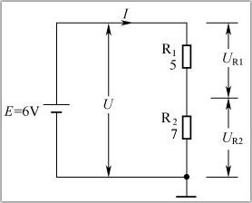
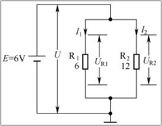
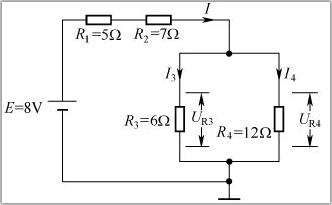

[toc]

### 1. 电阻的串联

**两个或两个以上的电阻头尾相连串接在电路中，称为电阻的串联**，如下图所示。

**电阻串联电路的特点有以下几点：**

+ 流过各串联电阻的电流相等，都为I。

+ 电阻串联后的总电阻R增大，总电阻等于各串联电阻之和，即
  $$
  R=R_{1}+R_{2}
  $$

+ 总电压U等于各串联电阻上电压之和，即
  $$
  U=U_{R1}+U_{R2}
  $$

+ 串联电阻越大，两端电压越高，因为 R1＜R2，所以 UR1＜ UR2。

在上图所示电路中，两个串联电阻上的总电压 U 等于电源电动势，即 U=E=6V；电阻串联后总电阻 R=R1+R2=12Ω；流过各电阻的电流
$$
I=\frac{U}{R_{1}+R_{2}}=\frac{6}{12}A=0.5A
$$

电阻 R1上的电压 UR1=I×R1=（0.5×5）V=2.5V，电阻 R2上的电压UR2=I×R2=（0.5×7）V=3.5V。

### 2. 电阻的并联

**两个或两个以上的电阻头尾相并接在电路中，称为电阻的并联**，如下图所示。

<b>电阻的并联</b>

电阻并联电路的特点有以下几点：

+ 并联的电阻两端的电压相等，即
  $$
  U_{R1}=U_{R2}
  $$

+ 总电流等于流过各个并联电阻的电流之和，即
  $$
  I=I_{1}+I_{2}
  $$

+ 电阻并联总电阻减小，总电阻的倒数等于各并联电阻的倒数之和，即
  $$
  \frac{1}{R}=\frac{1}{R_{1}}+\frac{1}{R_{2}}
  $$
  该式可变形为
  $$
  R=\frac{R_{1}R_{2}}{R_{1}+R_{2}}
  $$

+ 在并联电路中，电阻越小，流过的电流越大，因为 R1＜R2，所以流过 R1 的电流 I1 大于流过 R2 的电流 I2。

在上图所示电路中，并联的电阻 R1、R2 两端的电压相等，UR1=UR2=U=6V；流过 R1 的电流为
$$
I_{1}=\frac{U_{R1}}{R_{1}}=\frac{6}{6}A=1A
$$

流过 R2 的电流为
$$
I_{2}=\frac{U_{R2}}{R_{2}}=\frac{6}{12}A=0.5A
$$

总电流 I=I1 + I2=（1+0.5）A=1.5A；R1、R2 并联总电阻 R 为
$$
R=\frac{R_{1}R_{2}}{R_{1}+R_{2}}=\frac{6×12}{6+12}Ω=4Ω
$$

### 3. 电阻的混联

**一个电路中的电阻既有串联又有并联时，称为电阻的混联**，如下图所示。

对于电阻混联电路，总电阻可以这样求：先求并联电阻的总电阻，然后再求串联电阻与并联电阻的总电阻之和。在上图所示电路中，并联电阻 R3、R4 的总电阻 R0 为
$$
R_{0}=\frac{R_{3}R_{4}}{R_{3}+R_{4}}=\frac{6×12}{6+12}Ω=4Ω
$$
电路的总电阻 R 为
$$
R=R_{1}+R_{2}+R_{3}=(5+7+4)Ω=16Ω
$$
