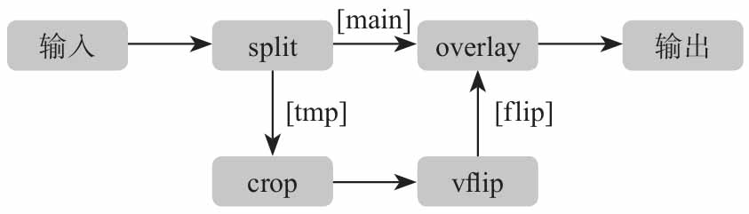

`FFmpeg` 框架的基本组成包含 `AVFormat`、`AVCodec`、`AVFilter`、`AVDevice`、`AVUtil` 等模块库。

下面针对这些模块做一个大概介绍：

（1）`FFmepg` 的封装模块 `AVFormat` 

`AVFormat` 中实现了目前多媒体领域中的绝大多数媒体封装格式，包括封装和解封装，如 `MP4`、`FLV`、`KV`、`TS` 等文件封装格式，`RTMP`、`RTSP`、`MMS`、`HLS` 等网络协议封装格式。`FFmpeg` 是否支持某种媒体封装格式，取决于编译时是否包含了该格式的封装库。根据实际需求，可进行媒体封装格式的扩展，增加自己定制的封装格式，即在 `AVFormat` 中增加自己的封装处理模块。

（2）`FFmpeg` 的编解码模块 `AVCodec`

`AVCodec` 中实现了目前多媒体领域绝大多数常用的编解码格式，既支持编码，也支持解码。`AVCodec` 除了支持 `MPEG4`、`AAC`、`MJPEG` 等自带的媒体编解码格式之外，还支持第三方的编解码器，如 `H.264（AVC）` 编码，需要使用 `x264` 编码器；`H.265（HEVC）` 编码，需要使用 `x265` 编码器；`MP3（mp3lame）` 编码，需要使用 `libmp3lame` 编码器。如果希望增加自己的编码格式，或者硬件编解码，则需要在 `AVCodec` 中增加相应的编解码模块。

（3）`FFmpeg` 的滤镜模块 `AVFilter`

`AVFilter` 库提供了一个通用的音频、视频、字幕等处理框架。在 `AVFilter` 中，滤镜框架可以有多个输入和多个输出。我们参考下面这个滤镜处理的例子：



样例中的滤镜处理将输入的视频切割成了两部分流，一部分流抛给 `crop` 滤镜与 `vflip` 滤镜处理模块进行操作，另一部分保持原样，当 `crop` 滤镜与 `vflip` 滤镜处理操作完成之后，将流合并到原有的 `overlay` 图层中，并显示在最上面一层，输出新的视频。对应的命令行如下：

```shell
./ffmpeg -i INPUT -vf "split [main][tmp]; [tmp] crop=iw:ih/2:0:0, vflip [flip]; [main][flip] overlay=0:H/2" OUTPUT
```

下面详细说明一下规则，具体如下：

+ 相同的 Filter 线性之间用逗号分隔
+ 不同的 Filter 线性之间用分号分隔

在上面示例中， `crop` 与 `vflip` 使用的是同一个滤镜处理的线性链，`split` 滤镜和 `overlay` 滤镜使用的是另外一个线性链，一个线性链与另一个线性链汇合时是通过方括号 "[]" 括起来的标签进行标示的。在这个例子中，两个流处理后是通过 `[main]` 与 `[flip]` 进行关联汇合的。

`split` 滤镜将分割后的视频流的第二部分打上标签 `[tmp]`，通过 `crop` 滤镜对该部分流进行处理，然后进行纵坐标调换操作，打上标签 `[flip]`，然后将 `[main]` 标签与 `[flip]` 标签进行合并，`[flip]` 标签的视频流从视频的左边最中间的位置开始显示，这样就出现了镜像效果。

（4）`FFmpeg` 的视频图像转换计算模块 `swscale`

`swscale` 模块提供了高级别的图像转换 API，例如它允许进行图像缩放和像素格式转换，常见于将图像从 1080p 转换成 720p 或者 480p 等的缩放，或者将图像数据从 YUV420P 转换成 YUV，或者 YUV  转 RGB 等图像格式转换。

（5）`FFmpeg` 的音频转换计算模块 `swresample`

`swresample` 模块提供了高级别的音频重采样 API。例如它允许操作音频采样、音频通道布局转换与布局调整。

