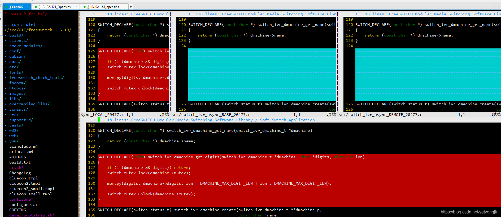

[toc]

> 摘自：https://blog.csdn.net/yetyongjin/article/details/117370301

GIT 合并时，顺利的话皆大欢喜，如果碰到冲突真是件痛苦的事。本文本描述怎样利用 vimdiff 这一强大的工具解决冲突。

### 配置git 的merge工具
git 配置文件为~/.gitconfig

执行以下命令：

```
git config --global merge.tool vimdiff
git config --global merge.conflictstyle diff3
git config --global mergetool.prompt false

#让git mergetool不再生成备份文件(*.orig)  
git config --global mergetool.keepBackup false
```

### 解决冲突

```
git mergetool filename
```


文件名参数是可选的。如果不传文件名，那么将会自动挨个打开有冲突的文件。界面如下：



上一层三个小窗口分别对应：

+ LOCAL buffer: 当前分支

+ BASE buffer: 两个分支共同祖先，代表两个分支修改前

+ REMOTE buffer: 需要合并到当前分支的分支

下层窗口为：

+ MERGED buffer: 合并后的，即有冲突的

### vimdiff使用
鼠标移动到MERGED窗口(CTRL-w切换窗口)，

```
:diffget REMOTE # 获取REMOTE的修改到MERGED文件, 忽略大小写
:diffg BASE # get from base
:diffg LOCAL # get from local
```

>  注意：通过 diffget 只能选取 local, base, remote 三种的一种，要想都需要3种或者两种，只能通过修改 MERGED 文件

修改完成后， 保存

```
:wqa
```

### 突解决完，commit

```
git commit
```


### 删除orig文件

```
find . -name "*.orig" | xargs rm
```

### vimff命令参考

```
]c      # nect difference
[c      # previous difference
zo      # open folded text
zc      # close folded text
zr      # open all folds
zm      # close all folds
:diffupdate     # re-scan the file for difference
do      # diff obtain
dp      # diff put
:set diffopt+=iwhite    # to avoid whitespace comparison
Ctrl+W+W                # toggle between the diff columns
Ctrl+W+h/j/k/l          # 移动鼠标到不同窗口
:set wrap               # wrap line
:set nowrap
:syn off                # remove colors
```


