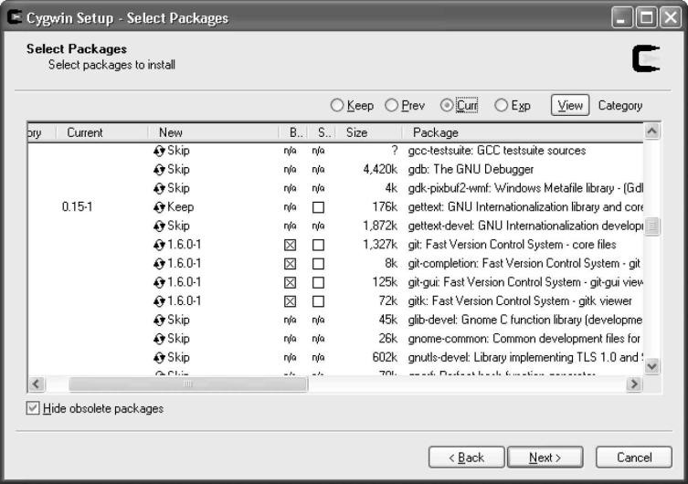

`Windows` 上有两种相互竞争的 `Git` 包：基于 `Cygwin` 的 `Git` 和称为“原生”版本的 `msysGit`。

**1. 安装 Cygwin 版本的 Git**

运行 `Cygwin` 的 `setup.ext` 程序就可以进行安装。程序可以从 http://cygwin.com 上下载。

`setup.exe` 启动后，直到你到了安装软件包列表那步，程序对于大多数选项使用默认设置。 `Git` 包在 `devel` 类别下。

选择要安装的软件包后，单击几次 `Next` 按钮直到 `Cygwin` 安装完成。然后，可以从 Start 菜单启动 Cygwin Bash Shell，现在菜单应该包括 git 命令了。

**2. 安装独立的 Git（msysGit）**

首先，从它首页 https://gitforwindows.org/ 下载最新版本的安装程序。该文件名通常类似 Git-1.5.6.1-pre-view20080701.exe。

