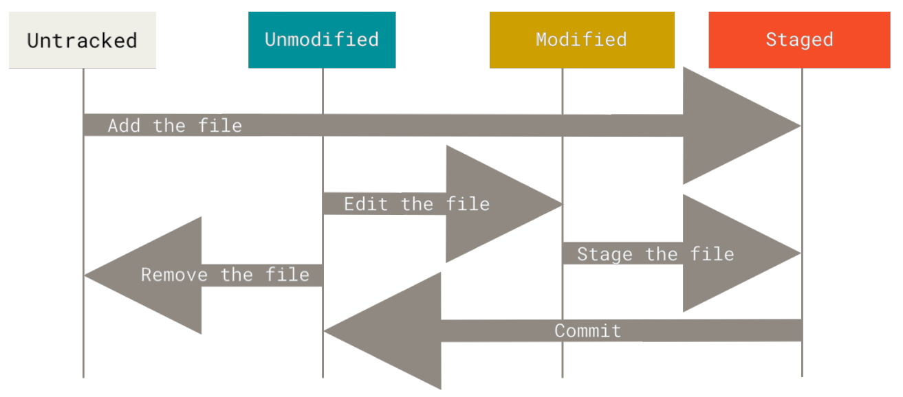

<center>文件的状态变化周期</center>

**检查当前文件状态**

可以用 git status 命令查看哪些文件处于什么状态。

```shell
$ git status
On branch master
Your branch master
nothing to commit, working directory clean
```

**跟踪新文件**

使用命令 git add  开始跟踪一个文件。

```shell
$ git add README
```

**暂存已修改的文件**

如果你修改了一个名为 CONTRIBUTING.md 的已被跟踪的文件，可以使用 git add 命令将 "CONTRIBUTING.md" 放到暂存区中。

```shell
$ git add CONTRIBUTING.md
$ git status
On branch master
Your branch is up-to-date with 'origin/master'.
Changes to be committed:
(use "git reset HEAD <file>..." to unstage)
    new file: README
    modified: CONTRIBUTING.md
```

**状态简览**

如果你使用 git status -s  命令或 git status --short 命令，你将得到一种格式更为紧凑的输出。

```shell
$ git status -s
M README
MM Rakefile
A lib/git.rb
M lib/simplegit.rb
?? LICENSE.txt
```

新添加的未跟踪文件前面有 ??  标记，新添加到暂存区中的文件前面有 A 标记，修改过的文件前面有 M 标记。

**忽略文件**

我们可以创建一个名为 .gitignore 的文件，列出要忽略的文件的模式。来看一个实际的 .gitignore 例子：

```shell
$ cat .gitignore
*.[oa]
*~
```

第一行告诉 Git 忽略所有以 .o 或 .a 结尾的文件。第二行告诉 Git 忽略所有名字以波浪符（~）结尾的文件。

文件 .gitignore 的格式规范如下：

+ 所有空行或者以 # 开头的行都会被 Git 忽略。
+ 可以使用标准的 glob 模式匹配，它会递归地应用在整个工作区中。
+ 匹配模式可以以（/）开头防止递归。
+ 匹配模式可以以（/）结尾指定目录。
+ 要忽略指定模式以外的文件或目录，可以在模式前加上叹号（!）取反。

所谓的 glob 模式是指 shell 所使用的简化了的正则表达式。星号（\*）匹配零个或多个任意字符；\[abc\] 匹配任何一个列在方括号中的字符；问号（?）只匹配一个任意字符；如果在方括号中使用短划线分隔两个字符，表示所有在这两个字符范围内的都可以匹配。使用两个星号（\*\*） 表示匹配任意中间的目录。

我们再看一个 .gitignore 文件的例子：

```
# 忽略所有的 .a 文件
*.a

# 但跟踪所有的 lib.a，即便你在前面忽略了 .a 文件
!lib.a

# 只忽略当前目录下的 TODO 文件，而不忽略 subdir/TODO
/TODO

# 忽略任何目录下名为 build 的文件夹
build/

# 忽略 doc/notes.txt，但不忽略 doc/server/arch.txt
doc/*.txt

# 忽略 doc/ 目录及其所有子目录下的 .pdf 文件
doc/**/*.pdf
```

> GitHub 有一个十分详细的针对数十种项目及语言的 .gitignore 文件列表，你可以在 <https://github.com/github/gitignore> 找到它。

> 在最简单的情况下，一个仓库可能只根目录下有一个 .gitignore 文件，它递归地应用到整个仓库中。然而，子目录下也可以有额外的 .gitignore 文件。子目录中的 .gitignore 文件中的规则只作用于它所在的目录中。

**查看已暂存和未暂存的修改**

如果 git status 命令的输出对于你来说过于简略，而你想知道具体修改了什么地方，可以用 git diff 命令。

```shell
$ git status
On branch master
Your branch is up-to-date with 'origin/master'.
Changes to be committed:
  (use "git reset HEAD <file>..." to unstage)
    modified: README
    
Changes not staged for commit:
  (use "git add <file>..." to update what will be committed)
  (use "git checkout -- <file>..." to discard changes in working
directory)
    modified: CONTRIBUTING.md
```

要查看尚未暂存的文件更新了哪些部分，不参加直接输入 git diff：

```shell
$ git diff
diff --git a/CONTRIBUTING.md b/CONTRIBUTING.md
index 8ebb991..643e24f 100644
--- a/CONTRIBUTING.md
+++ b/CONTRIBUTING.md
@@ -65,7 +65,8 @@ branch directly, things can get messy.
  Please include a nice description of your changes when you submit your
PR;
  if we have to read the whole diff to figure out why you're contributing
  in the first place, you're less likely to get feedback and have your
change
-merged in.
+merged in. Also, split your changes into comprehensive chunks if your
patch is
+longer than a dozen lines.
  If you are starting to work on a particular area, feel free to submit a
PR
  that highlights your work in progress (and note in the PR title that it's
```

若要查看已暂存的将要添加到下次提交里的内容，可以用 git diff --staged 命令。这条命令将比对已暂存文件与最后一次提交的文件差异：

```shell
$ git diff --staged
diff --git a/README b/README
new file mode 100644
index 0000000..03902a1
--- /dev/null
+++ b/README
@@ -0,0 +1 @@
+My Project
```

> 请注意，git diff 本身只显示尚未暂存的改动，而不是自上次提交以来所做的所有改动。所以有时候你一下子暂存了所有更新过的文件，运行 git diff 后却什么也没有，就是这个原因。

用 git diff --cached 查看已经暂存起来的变化（`--staged` 和 `--cached` 是同义词）：

```shell
$ git diff --cached
diff --git a/CONTRIBUTING.md b/CONTRIBUTING.md
index 8ebb991..643e24f 100644
--- a/CONTRIBUTING.md
+++ b/CONTRIBUTING.md
@@ -65,7 +65,8 @@ branch directly, things can get messy.
  Please include a nice description of your changes when you submit your
PR;
  if we have to read the whole diff to figure out why you're contributing
  in the first place, you're less likely to get feedback and have your
change
-merged in.
+merged in. Also, split your changes into comprehensive chunks if your
patch is
+longer than a dozen lines.
  If you are starting to work on a particular area, feel free to submit a
PR
  that highlights your work in progress (and note in the PR title that it's
```

**提交更新**

每次准备提交前，先用 git status 看下，你所需要的文件是不是都已暂存起来了，然后再运行提交命令 git commit：

```shell
$ git commit
```

另外，你也可以在 commit 命令后添加 `-m` 选项，将提交信息与命令放在同一行，如下所示：

```shell
$ git commit -m "Story 182: Fix benchmarks for speed"
[master 463dc4f] Story 182: Fix benchmarks for speed
  2 files changed, 2 insertions(+)
  create mode 100644 README
```

**跳过使用暂存区域**

Git 提供了一个跳过使用暂存区域的方式，只要在提交的时候，给 git commit 加上 `-a` 选项， Git 就会自动把所有已经跟踪过的文件暂存起来一并提交，从而跳过 git add 步骤：

```shell
$ git status
On branch master
Your branch is up-to-date with 'origin/master'.
Changes not staged for commit:
  (use "git add <file>..." to update what will be committed)
  (use "git checkout -- <file>..." to discard changes in working
directory)

    modified: CONTRIBUTING.md
    
no changes added to commit (use "git add" and/or "git commit -a")
$ git commit -a -m 'added new benchmarks'
[master 83e38c7] added new benchmarks
  1 file changed, 5 insertions(+), 0 deletions(-)
```

**移除文件**

要从 Git 中移除某个文件，就必须要从已跟踪文件清单中移除（确切地说，是从暂存区域移除），然后提交。可以用 git rm 命令完成此项工作，并连带从工作目录中删除指定的文件，这样以后就不会出现在未跟踪文件清单中了。

```shell
$ rm PROJECTS.md
$ git status
On branch master
Your branch is up-to-date with 'origin/master'.
Changes not staged for commit:
  (use "git add/rm <file>..." to update what will be committed)
  (use "git checkout -- <file>..." to discard changes in working
directory)

    deleted: PROJECTS.md

no changes added to commit (use "git add" and/or "git commit -a")
$ git rm PROJECTS.md
rm 'PROJECTS.md'
$ git status
On branch master
Your branch is up-to-date with 'origin/master'.
Changes to be committed:
  (use "git reset HEAD <file>..." to unstage)

    deleted: PROJECTS.md

```

如果要删除之前修改过或已经放到暂存区的文件，则必须使用强制删除选项 `-f` 。

另外一种情况是，我们想把文件从 Git 仓库中删除（亦即从暂存区域移除），但仍然希望保留在当前工作目录中。换句话说，你想让文件保留在磁盘，但是并不想让 Git 继续跟踪。当你忘记添加 .gitignore 文件，不小心把一个很大的日志文件或一堆 .a 这样的编译生成文件添加到暂存区时，这一做法尤其有用。为达到这一目的，使用 `--cached` 选项：

```shell
$ git rm --cached README
```

git rm 命令后面可以列出文件或者目录的名字，也可以使用 glob 模式。比如：

```shell
$ git rm log/\*.log
```

注意到星号 \* 之前的反斜杠 \\， 因为 Git 有它自己的文件模式扩展匹配方式，所以我们不用 shell 来帮忙展开。此命令删除 log/ 目录下扩展名为 .log 的所有文件。类似的比如：

```shell
$ git rm \*~
```

该命令删除所有名字以 ~ 结尾的文件。

**移动文件**

要对 Git 中对文件改名，可以这么做：

```shell
$ git mv README.md README
$ git status
On branch master
Your branch is up-to-date with 'origin/master'.
Changes to be committed:
  (use "git reset HEAD <file>..." to unstage)

    renamed: README.md -> README
    
```

其实，运行 git mv 就相当于运行了下面三条命令：

```shell
$ mv README.md README
$ git rm README.md
$ git add README
```

