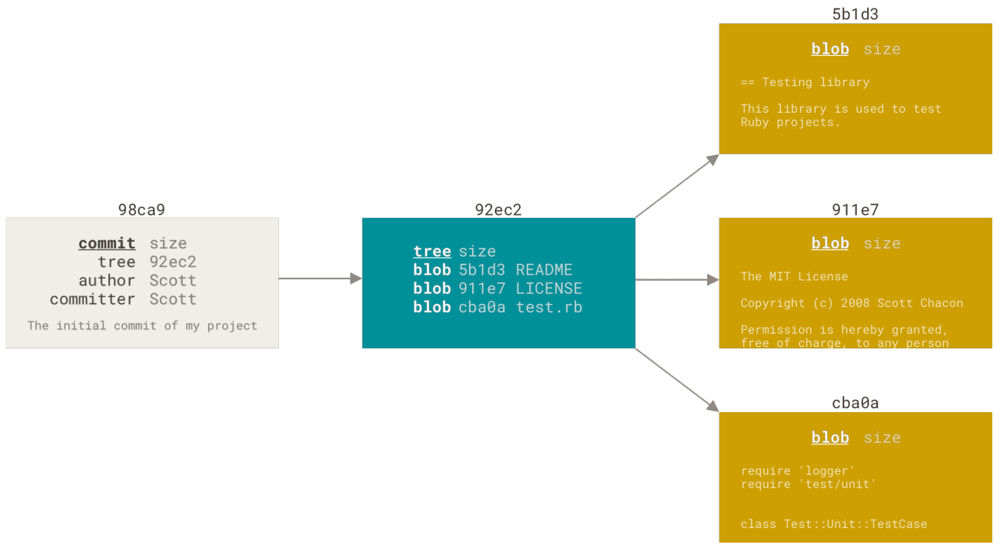
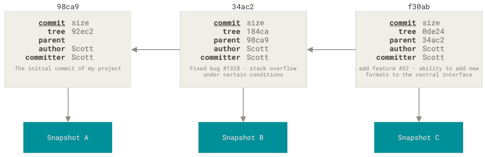
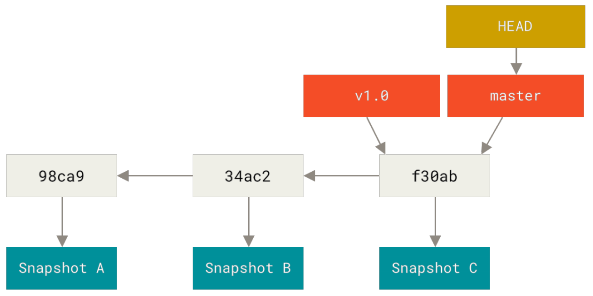
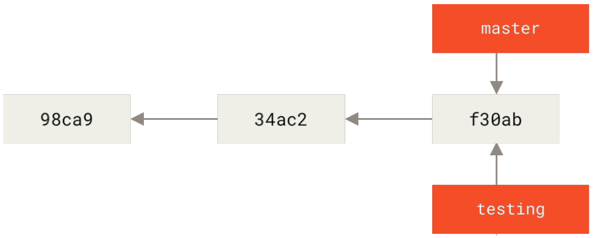
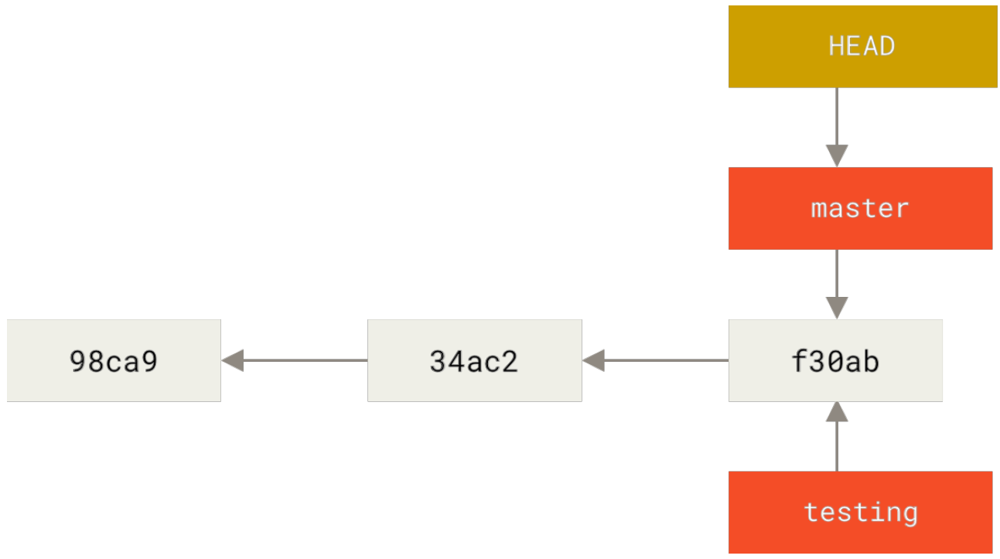
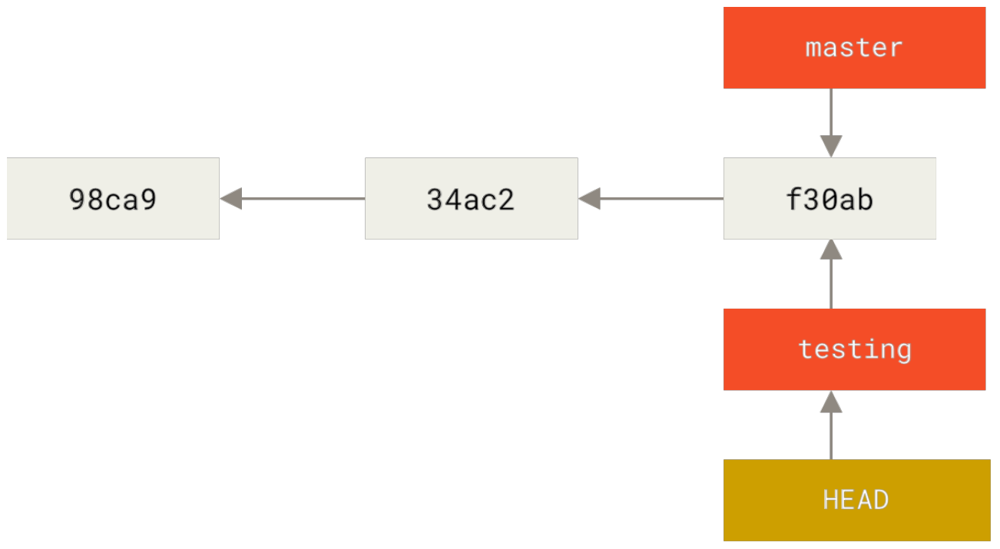
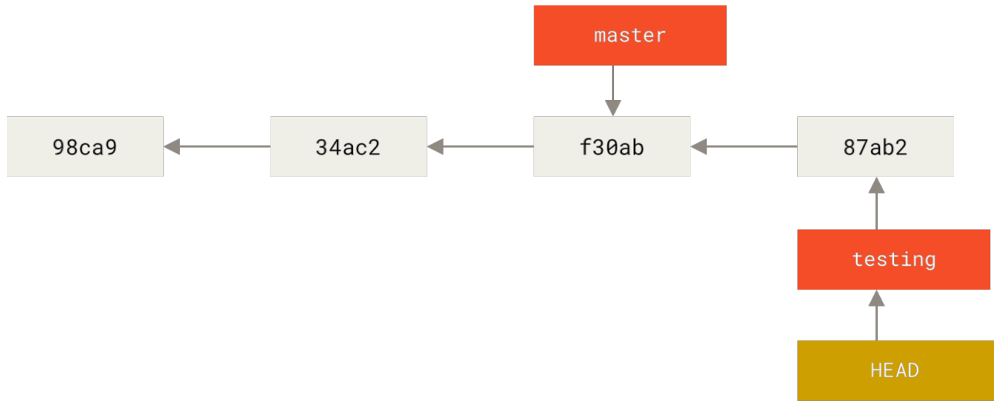
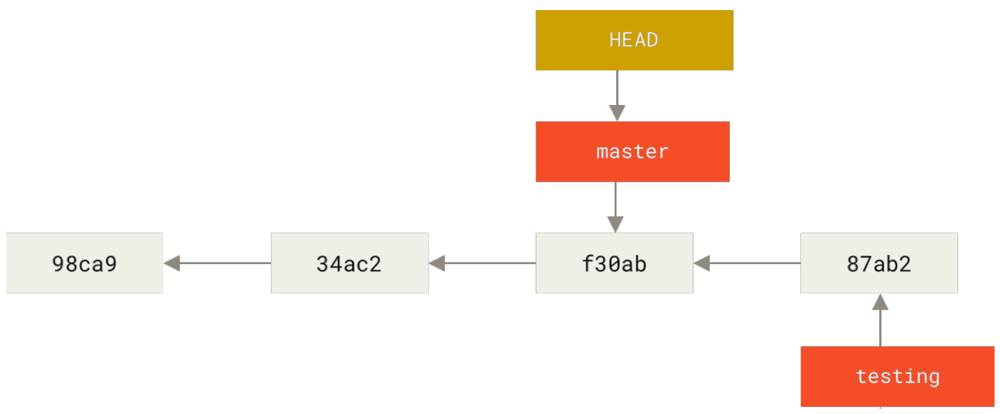
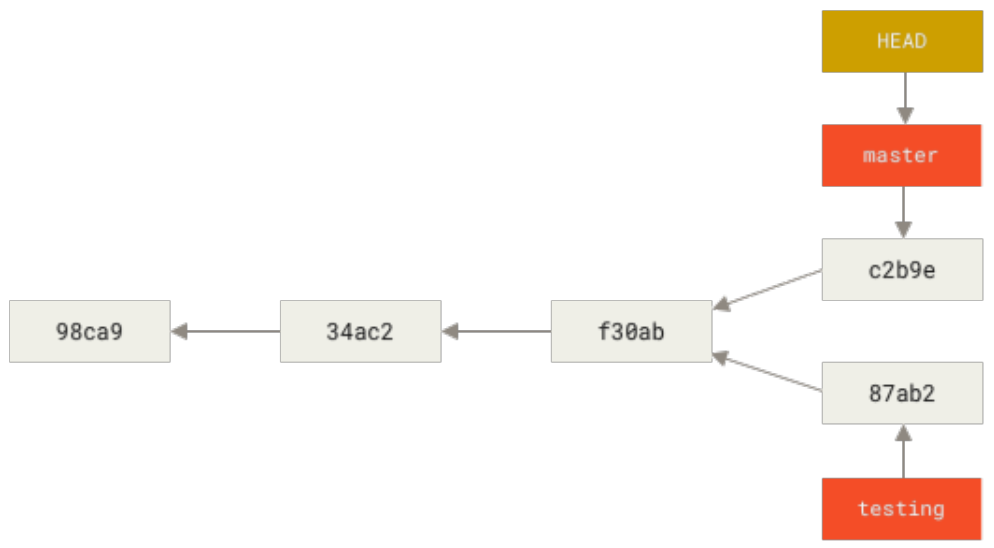

[toc]

当使用 git commit 进行提交操作时，Git 会先计算每一个子目录（本例中只有羡慕根目录）的校验和，然后在 Git 仓库中这些校验和保存为树对象。随后，Git 便会创建一个提交对象，它除了 包含上面提到的那些信息外，还包含指向这个树对象（项目根目录）的指针。如此一来，Git 就可以在需要的时候重现此次保存的快照。

现在，Git 仓库中有五个对象：三个 blob 对象（保存着文件快照）、一个 **树** 对象（记录着目录结构和 blob 对象索引）以及一个 **提交** 对象（包含着指向前述树对象的指针和所有提交信息）。



*Figure 9. 首次提交对象及其树结构*

做些修改后再次提交，那么这次产生的提交对象会包含一个指向上次提交对象（父对象）的指针。



*Figure 10. 提交对象及其父对象*

Git 的分支，其实本质上仅仅是指向提交对象的可变指针。Git 的默认分支名字是 master。在多次提交操作之后，你其实已经有一个指向最后那个提交对象的 master 分支。master 分支会在每次提交时自动向前移动。

> Git 的 master 分支并不是一个特殊分支。它就跟其它分支完全没有区别。之所以几乎每一个仓库都有 master 分支，是因为 git init 命令默认创建它，并且大多数人都懒得去改动它。



*Figure 11. 分支及其提交历史*

### 分支创建

Git 是怎么创建新分支的呢？很简单，它只是为你创建了一个可以移动的新指针。比如，创建一个 testing 分支，你需要使用 git branch 命令：

```console
$ git branch testing
```

这会在当前所在的提交对象上创建一个指针。



*Figure 12. 两个指向相同提交历史的分支*

那么，Git 又是怎么知道当前在哪一个分支上呢？也很简单，它有一个名为 HEAD 的特殊指针。请注意它和许多其他版本控制系统（如 Subversion 或 CVS）里的 HEAD 概念完全不同。在 Git 中，它是一个指针，指向当前所在的本地分支（译注：将 HEAD 想象为当前分支的别名）。在本例中，你仍然在 master 分支上。因为 git branch 命令仅仅 **创建** 一个新分支，并不会自动切换到新分支中去。



*Figure 13. HEAD 指向当前所在的分支*

你可以简单地使用 git log 命令查看各个分支当前所指的对象。提供这一功能的参数是 --decorate。

```console
$ git log --oneline --decorate
f30ab (HEAD -> master, testing) add feature #32 - ability to add new
formats to the central interface
34ac2 Fixed bug #1328 - stack overflow under certain conditions
98ca9 The initial commit of my project
```

正如你所见，当前 master 和 testing 分支均指向校验和以 f30ab 开头的提交对象。

### 分支切换

要切换到一个已存在的分支，你需要使用 git checkout 命令。我们现在切换到新创建的 testing 分支去：

```console
$ git checkout testing
```

这样 HEAD 就指向 testing 分支了。



*Figure 14. HEAD 指向当前所在的分支*

要么，这样的实现方式会给我们带来什么好处呢？现在不妨再提交一次：

```console
$ vim test.rb
$ git commit -a -m 'made a change'
```



*Figure 15. HEAD 分支随着提交操作自动向前移动*

如图所示，你的 testing 分支向前移动了，但是 master 分支却没有，它仍然指向运行 git checkout 时所指的对象。这就有意思了，现在我们切换回 master 分支看看：

```console
$ git checkout master
```



*Figure 16. 检出时 HEAD 随之移动*

这条命令做了两件事。一是使 HEAD 指回 master 分支，二是将工作目录恢复成 master 分支所指向的快照内容。也就是说，你现在做修改的话，项目将始于一个较旧的版本。本质上来讲，这就是忽略 testing 分支所做的修改，以便于向另一个方向进行开发。

> 分支切换回改变你工作目录中的文件
>
> 在切换分支时，一定要注意你工作目录里的文件会被改变。如果是切换到一个较旧的分支，你的工作目录会恢复到该分支最后一次提交时的样子。如果 Git 不能干净利落地完成这个任务，它将禁止切换分支。

我们不妨再稍微做些修改并提交：

```console
$ vim test.rb
$ git commit -a -m 'made other changes'
```

现在，这个项目的提交历史已经产生了分叉（参见 <font color="#87CEFE">项目分叉历史</font>）。因为刚才你创建了一个新分支，并切换过去进行了一些工作，随后又切换回 master 分支进行了另外一些工作。上述两次改动针对的是不同分支；你可以在不同分支间不断地来回切换和工作，并在时机成熟时将它们合并起来。而所有这些工作，你需要的命令只有 branch、checkout 和 commit。



*Figure 17. 项目分叉历史*

你可以简单地使用 git log 命令查看分叉历史。运行 git log --oneline --decorate --graph --all，它会输出你的提交历史、各个分支的指向以及项目的分支分叉情况。

```console
$ git log --oneline --decorate --graph --all
* c2b9e (HEAD, master) made other changes
| * 87ab2 (testing) made a change
|/
* f30ab add feature #32 - ability to add new formats to the
* 34ac2 fixed bug #1328 - stack overflow under certain conditions
* 98ca9 initial commit of my project
```

由于 Git 的分支实质上仅是包含所指对象校验和（长度为 40 的 SHA-1 值字符串）的文件，所以它的创建和销毁都异常高效。创建一个新分支就相当于一个文件中写入 41 个字节（40 个字节和 1 个换行符），如此的简单能不快吗？

> 创建新分支的同时切换过去
>
> 通常我们会在创建一个新分支后立即切换过去，这可以用 git checkout -b \<newbranchname\> 一条命令搞定。