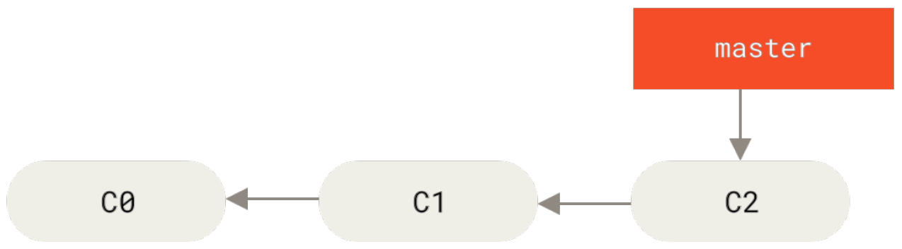
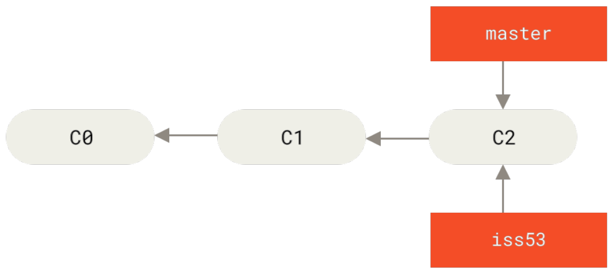
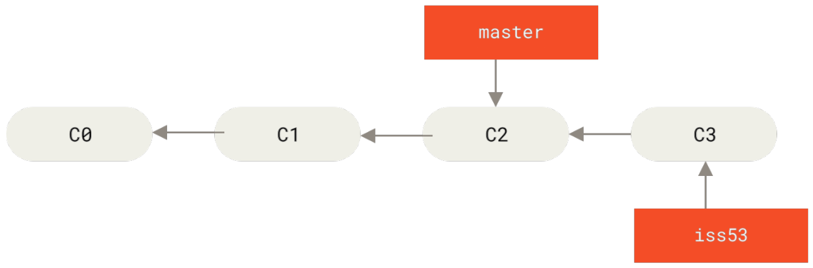
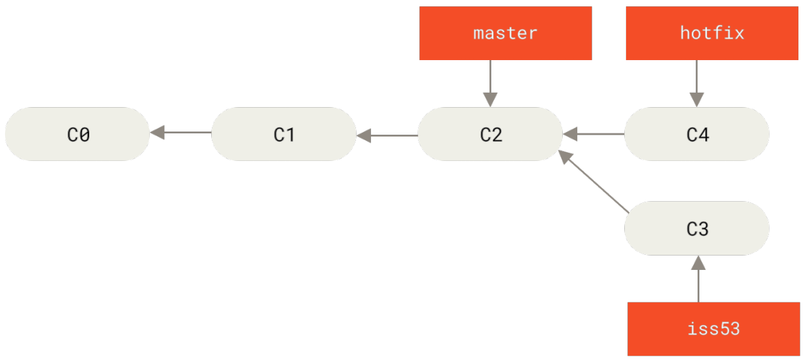

[toc]

### 新建分支

首先，我们假设你正在你的项目上工作，并且在 master 分支上已经有了一些提交。



*Figure 18. 一个简单提交历史*

现在，你已经决定要解决你的公司使用的问题追踪系统中的 #53 问题。想要新建一个分支并同时切换到那个分支上，你可以运行一个带有 -b 参数的 git checkout 命令：

```console
$ git checkout -b iss53
Switched to a new branch "iss53"
```

它是下面两条命令的简写：

```console
$ git branch iss53
$ git checkout iss53
```



*Figure 19. 创建一个新分支指针*

你继续在 #53 问题上工作，并且做了一些提交。在此过程中， iss53 分支在不断的向前推进，因为你已经检出到该分支（也就是说，你的 HEAD 指针指向了 iss53 分支）

```console
$ vim index.html
$ git commit -a -m 'added a new footer [issue 53]'
```



*Figure 20. iss53 分支随着工作进展向前推进*

现在你接到那个电话，有个紧急问题等待你来解决。有了 Git 的帮助，你不必把这个紧急问题和 iss53 的修改混在一起，你也不需要花大力气来还原关于 53# 问题的修改，然后再添加关于这个紧急问题的修改，最后将这个修改提交到线上分支。你所要做的仅仅是切换回 master 分支。

但是，在你这么做之前，要留意你的工作目录和暂存区里那些还没有被提交的修改，它可能会和你即将检出的分支产生冲突从而阻止 Git 切换到该分支。最好的方法是，在你切换分支之前，保持好一个干净的状态。有一些方法可以绕过这个问题（即，暂存（stashing）和修补提交（commit amending）），我们会在 贮藏与清理 中看到关于这两个命令的介绍。现在，我们假设你已经把你的修改全部提交了，这时你可以切换回 master 分支了：

```console
$ git checkout master
Switched to branch 'master'
```

这个时候，你的工作目录和你在开始 #53 问题之前一模一样，现在你可以专心修复紧急问题了。请牢记：当你切换分支的时候，Git 会重置你的工作目录，使其看起来像回到了你在那个分支上最后一次提交的样子。Git 会自动添加、删除、修改文件以确保此时你的工作目录和这个分支最后一次提交时的样子一模一样。

接下来，你要修复这个紧急问题。我们来建立一个 hotfix 分支，在该分支上工作直到问题解决：

```console
$ git checkout -b hotfix
Switched to a new branch 'hotfix'
$ vim index.html
$ git commit -a -m 'fixed the broken email address'
[hotfix 1fb7853] fixed the broken email address
1 file changed, 2 insertions(+)
```



*Figure 21. 基于 master 分支的紧急问题分支 hotfix branch*

你i运行你的测试，确保你的修改是正确的，然后将 hotfix 分支合并回你的 master 分支来部署到线上。

你可以使用 git merge 命令来达到上述目的：

```console
$ git checkout master
$ git merge hotfix

```

