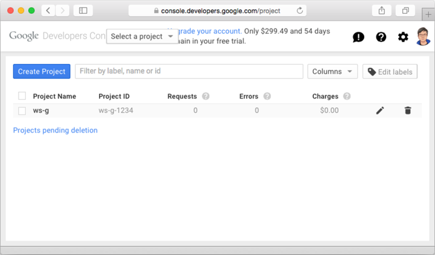
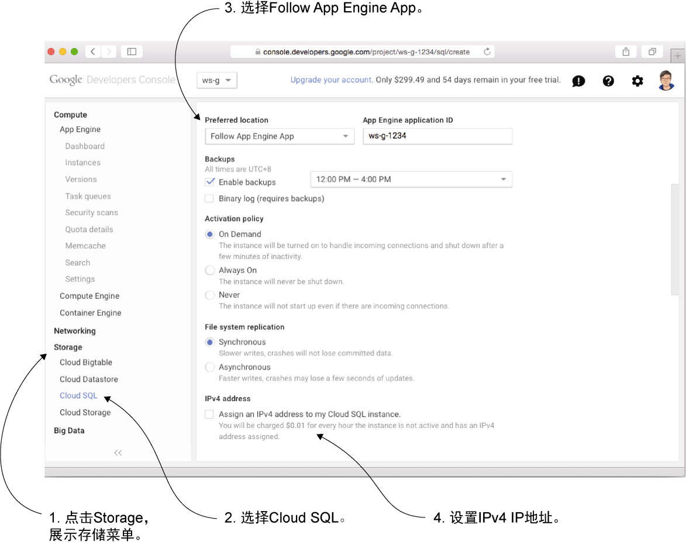

### 10.3　将应用部署到Google App Engine

Google App Engine（GAE）是另一个流行的Go Web应用PaaS部署平台。Google公司在它的云平台产品套件中包含了App Engine（应用引擎）和Compute Engine（计算引擎）等多种服务，其中App Engine为PaaS服务，而Compute Engine则跟AWS的EC2和Digital Ocean的Droplets一样，是一个IaaS服务。使用EC2和Droplets这样的服务跟使用自有的虚拟机或者服务器并没有太大区别，并且我们已经在上一节学习过如何在类似的平台上进行部署，因此在这一节，我们要学习如何使用GAE这款由Google公司提供的强大的PaaS服务。

人们选择使用GAE而不是包括Heroku在内的其他PaaS服务的原因通常会有好几种，但其中最主要的原因还是跟性能和可扩展性有关。GAE能够让用户构建出可以根据负载自动进行性能扩展和负载平衡的应用，并且Google公司除为GAE提供了大量的工具之外，还在GAE内部构建了大量的功能。比如，GAE允许用户的应用通过身份验证功能登录Google账号，并且GAE还提供了发送邮件、创建日志、发布和管理图片等多种服务。除此之外，GAE用户还可以非常简单直接地在自己的应用中集成其他Google API。

虽然GAE拥有如此多的优点，但天下并没有免费的午餐——GAE在拥有众多优点的同时，也拥有不少限制和缺点，其中包括：用户只拥有对文件系统的读权限，请求时长不能超过60 s（否则GAE将强制杀死该请求），无法进行直接的网络访问，无法创建其他类型的系统调用，等等。这些限制意味着用户将不能（至少是无法轻易地）访问Google应用环境沙箱（sandbox）之外的其他大量服务。

图10-2展示了在GAE上部署Web应用的大致步骤。


<center class="my_markdown"><b class="my_markdown">图10-2　在GAE上部署应用的大致步骤</b></center>

跟其他所有Google服务一样，使用GAE也需要一个Google账号。跟Heroku大量使用命令行界面的做法不同，在GAE上，对Web应用的大部分管理和维护操作都是通过名为Google Developer Console（开发者控制台）的Web界面完成的。虽然GAE也拥有与开发者控制台具有同等功能的命令行接口，但Google公司的命令行工具并没有像Heroku那样集成这些接口。图10-3展示了Google开发者控制台的使用界面。

除了注册账号之外，使用GAE需要做的另一件事就是访问https://cloud.google.com/appengine/ downloads下载相应的SDK（Software Development Kit，软件开发工具包）。在这个例子中，我们将下载GAE为Go语言提供的SDK。


<center class="my_markdown"><b class="my_markdown">图10-3　使用Google开发者控制台创建GAE Web应用</b></center>

GAE与其他Google服务

> GAE和Google Cloud SQL这样的Google服务并不是免费的。Google公司会为新注册的用户提供60天的试用期以及价值300美元的试用额度，因此读者应该可以免费实践本节介绍的内容，但是当试用期到期或者试用额度耗尽时，读者就需要付费才能继续使用这些服务了。

在安装完SDK之后，我们接下来要做的是对GAE的数据存储（datastore）进行配置。正如前所说，Google公司对直接的网络访问有严格的限制，用户是无法直接连接外部的PostgreSQL服务器的。为此，在这一节中，我们将使用Google公司提供的Google Cloud SQL服务来代替PostgreSQL。Google Cloud SQL是一个基于MySQL的云端数据库服务，用户可以通过 `cloudsql` 包直接在GAE中使用该服务。

为了使用Google Cloud SQL，我们需要先通过开发者控制台创建一个数据库实例，具体步骤如图10-4所示。用户首先需要在控制台上点击自己创建的项目（在这个例子中，我创建的项目名为 `ws-g-1234` ），接着在左侧的导航面板中点击“Storage”（存储），然后再选择其中的“Cloud SQL”，从而进入Cloud SQL的设置页面。在点击“New Instance”（新实例）按钮之后，用户将会看到一些与创建数据库实例有关的选项。这些选项中的大部分已经预先设置好了，需要改动的地方不多，我们唯一要做的就是将“Preferred location”（首选位置）选项设置为“Follow App Engine App”（与App Engine的应用保持一致），并让项目的应用ID保持默认值不变。在进行了上述设置之后，我们的GAE应用就能够正常访问数据库实例了。

需要注意的是，因为Google公司默认会为用户的数据库实例提供一个免费的IPv6地址，但是却不会提供IPv4地址，所以如果你的台式计算机、笔记本电脑、服务器或者你正在使用的网络供应商并没有使用IPv6连接，那么你还需要花一点额外的钱去获取一个IPv4地址，并将这个地址添加到设置页面。


<center class="my_markdown"><b class="my_markdown">图10-4　通过开发者控制台创建一个Google Cloud SQL数据库实例</b></center>

除以上提到的少数几个选项之外，其他选项只需要保留默认即可。在最后，用户只需要为自己的实例设置一个名字，一切就大功告成了。

也许你已经预料到了，因为GAE平台是如此地别具一格，所以为了将Web应用部署到这个平台上，对代码的修改自然也变得无法避免了。下面从高层次的角度列出了将简单 Web 服务部署到GAE所需要做的一些事情：

+ 修改包名，不再使用 `main` 作为包名；
+ 移除 `main` 函数；
+ 把处理器的注册语句移到 `init` 函数里面；
+ 使用MySQL数据库驱动代替PostgreSQL数据库驱动；
+ 把SQL查询修改为MySQL格式。

因为GAE将接管被部署的整个应用，所以用户将无法控制应用何时被启动或者运行在哪个端口之上。实际上，用户编写的将不再是一个独立的应用，而是一个部署在GAE上的包。这样导致的结果是，用户将不能再使用 `main` 这个为独立的Go程序预留的包名，而是要将包名修改为 `main` 以外的其他名字。

接下来，用户还需要移除程序中的 `main` 函数，并将该函数中的代码移到 `init` 函数。对简单Web服务来说，我们需要将原来的 `main` 函数：

```go
func main() {
　server := http.Server{
　　Addr: ":8080",
　}
　http.HandleFunc("/post/", handlePost)
　server.ListenAndServe()
}
```

修改为以下 `init` 函数：

```go
func init() {
　http.HandleFunc("/post/", handlePost)
}
```

注意，在新的 `init` 函数里，原本用于指定服务器地址以及端口号的代码已经消失，同样消失的还有用于启动Web服务器的相关代码。

考虑到我们还需要将简单Web服务使用的数据库驱动从PostgreSQL切换至MySQL，因此我们需要在 `data.go` 中导入MySQL数据库驱动，并设置正确的数据连接字符串：

```go
import (
　"database/sql"
　_ "github.com/ziutek/mymysql/godrv"
)
func init() {
　var err error
　Db, err = sql.Open("mymysql", "cloudsql:<app ID>:<instance name>*<database
　➥name>/<user name>/<password>")
　if err != nil {
　　panic(err) 
　}
}
```

除了上述修改之外，我们还需要将相应的SQL查询修改为MySQL格式。尽管这两种数据库使用的语法非常相似，但并不完全相同，所以程序是无法在不做修改的情况下直接运行的。比如，对于以下代码中加粗显示的SQL查询语句：

```go
func retrieve(id int) (post Post, err error) {
　post = Post{}
　err = Db.QueryRow("select id, content, author from posts where id =
　➥$1", id).Scan(&post.Id, &post.Content, &post.Author)
　return
}
```

我们将不再使用诸如 `$1` 、 `$2` 这样的标识，而是使用 `?` 来表示被替换的变量，就像这样：

```go
func retrieve(id int) (post Post, err error) {
　post = Post{}
　err = Db.QueryRow("select id, content, author from posts where id = ?",
　➥id).Scan(&post.Id, &post.Content, &post.Author) ❶
　return
}
```

❶ 根据MySQL 的查询格式，将原来的$n 标识修改为?标识

在对代码做完必要的修改之后，我们接下来还要创建一个对应用进行描述的 `app.yaml` 文件，如代码清单10-6所示。

代码清单10-6　用于GAE部署的app.yaml文件

```go
application: ws-g-1234
version: 1
runtime: go
api_version: go1
handlers:
- url: /.*
　script: _go_app
```

这个文件非常简单，一目了然，读者在进行测试时，唯一需要做的就是在这个文件中修改应用的名字，然后一切就大功告成了！以上就是将简单Web服务部署到GAE上所需要做的全部工作，接下来，是时候对这个将要运行在GAE之上的简单Web服务做一些测试了！

因为我们在前面对应用做了大量的修改，所以可能会有读者觉得自己已经无法在本地的机器上运行这个应用了，不过这种担心是不必要的——开发者只需要使用Google公司提供的GAE SDK，就可以在本地运行自己的GAE应用了。

在按照下载页面提供的指示安装了GAE SDK之后，我们只需要在应用的根目录下使用终端执行以下命令，就可以运行自己的GAE Web应用了：

```go
goapp serve
```

GAE SDK提供了在本地运行GAE应用所需的环境，从而使用户可以在本地测试自己的应用。除此之外，GAE SDK还提供了一个本地运行的管理网站（admin site），用户只需访问http://localhost:8000/，就可以通过该网站检视自己编写的代码。遗憾的是，在撰写本书的时候，开发环境还不支持Cloud SQL，所以我们还无法直接在本地测试简单Web服务。解决这个问题的一种方法是在本地使用MySQL服务器进行测试，然后在生产环境中继续使用Cloud SQL数据库。

在确保应用一切正常之后，用户就可以通过执行以下命令，将应用部署到Google公司的服务器上了：

```go
goapp deploy
```

在执行以上命令之后，SDK将把应用的代码推送到Google公司的服务器，然后由服务器对其进行编译和部署。如果一切正常，被推送的应用将如期地出现在互联网上。比如，我们可以通过http://ws-g-1234.appspot.com/访问名为 `ws-g-1234` 的应用。

为了测试这个刚刚部署完毕的简单Web服务，我们可以使用以下命令，让curl向服务器发送一个创建数据库记录的 `POST` 请求：

```go
curl -i -X POST -H "Content-Type: application/json" -d '{"content":"My first 
　　 post","author":"Sau Sheong"}' http://ws-g-1234.appspot.com/post/
HTTP/1.1 200 OK
Content-Type: text/html; charset=utf-8
Date: Sat, 01 Aug 2015 06:46:59 GMT
Server: Google Frontend
Content-Length: 0
Alternate-Protocol: 80:quic,p=0
```

现在再次使用curl去获取刚刚创建的数据库记录：

```go
curl -i -X GET http://ws-g-1234.appspot.com/post/1
HTTP/1.1 200 OK
Content-Type: application/json
Date: Sat, 01 Aug 2015 06:44:29 GMT
Server: Google Frontend
Content-Length: 69
Alternate-Protocol: 80:quic,p=0
{
　　"id": 1,
　　"content": "My first post",
　　"author": "Sau Sheong"
}
```

GAE非常强大，它拥有许许多多的功能，这些功能可以帮助开发者在互联网上创建和部署可扩展的Web应用，但因为GAE是Google公司开发的平台，所以如果用户想要使用这个平台，就必须遵守这个平台的规则。

